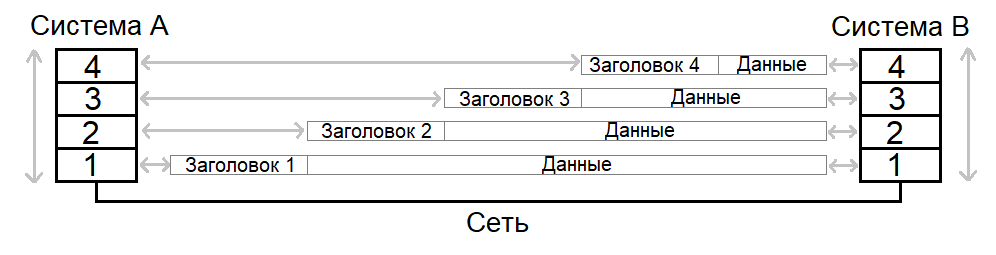

# 1. Введение

**Сетевой протокол** - набор правил, определяющих способ передачи информации по сети. **Интернет** - сеть компьютерных сетей. Включает в себя различные физические сети и предоставляет всем подключенным компьютерам унифицированную сетевую архитектуру. Интернет функционирует на основе набора протоколов: TCP, UDP, ARP, ICMP, TELNET, FTP, IP, HTTP и другие. Общепринятое название данного набора - **семейство протоколов TCP/IP**.

Протоколы интернета имеют *стандарты*, описанные в общедоступных документах **Request for comments (RFC)**.

Набор протоколов *разделяется на уровни*, выполняющие свои собственные задачи и наслаивающиеся на более низкие уровни, расширяя их функционал дополнительными возможностями. Код, реализующий уровни набора протоколов, называется **стеком протоколов**. Основное назначение каждого уровня данной системы - это взаимодействие с аналогичным уровнем другой системы. Сложность всех нижележащих уровней инкапсулирована в смежном нижнем по отношении к данному уровне, предоставляющем ему свой интерфейс. В процессе отправки данные спускаются сверху вниз по стеку протоколов, и каждый уровень, получая информацию от вышележащего уровня, добавляет к ней свой управляющий заголовок и передаёт ниже. А при приёме данные поднимаются снизу вверх, и каждый уровень получает информацию от нижележащего уровня, извлекает из неё и обрабатывает свой заголовок, а оставшиеся данные передаёт выше.

Семейство протоколов TCP/IP имеет 4 ярко выраженных уровня:

+ **Прикладной уровень** - функционирование приложения;
+ **Транспортный уровень** - сквозной канал взаимодействия приложений;
+ **Сетевой уровень** - доставка и маршрутизация данных;
+ **Канальный уровень** - сопряжение с физической средой.

Описание основных функций уровней протоколов TCP/IP:

- *Уровень сопряжения с физической средой (канальный)* обеспечивает физическую передачу данных внутри сети и состоит из *физического интерфейса (сетевой карты)*, соединённого с сетевыми коммуникациями, и его драйвера. Данный уровень решает задачи физической адресации (в противоположность логической адресации), топологии сети, линейной дисциплины (способ использования канала конечной системой), уведомления о неисправностях канала. Упаковывает получаемые с сетевого уровня данные в блоки, называемые *кадрами*, добавляя к ним заголовок, содержащий *физический адрес* устройства. Важной характеристикой данного уровня являтся *максимальный размер кадра* - *Maximum Transmission Unit (MTU)*. Протоколами канального уровня являются, например, **Ethernet**, **Token Ring**, **FDDI**, **PPP**, **ISDN**. Протоколы **ARP** и **RARP** являются связующим звеном между канальным и сетевым уровнями и обеспечивают *трансляцию физических и логических адресов* друг в друга.

+ *Сетевой уровень* - занимается доставкой данных от исходного узла к конечному. Основным протоколом сетевого уровня является **IP**, который: 
a. *разбивает данные* на фрагменты, способные уместиться в кадре канального уровня; 
b. *маршрутизирует* данные в сети. 
Протокол IP оперирует *датаграммами* - блоками данных, полученными с транспортного уровня, к которым добавлен заголовок, содержащий *логический адрес* устройства (IP-адрес). Протокол **ICMP** собирает информацию о работе сети и уведомляет о её ошибках. Протоколы **RIP**, **EGP**, **BGP**, **OSPF** определяют оптимальные маршруты через последовательности соединённых подсетей.

+ *Транспортный уровень* предоставляет сквозной канал, позволяющий взаимодействовать приложениям на различных устройствах. Он избавляет прикладной уровень от необходимости вникать в детали транспортировки данных и отвечает за надёжную и достоверную доставку, обслуживание соединений, обнаружение ошибок передачи, управление информационным потоком. Основными протоколами транспортного уровня являются:
    1. **User Datagram Protocol (UDP)** - предназначен для *датаграммных сокетов* и только пересылает пакеты между различными сервисами, различаемыми по *номерам портов*, и обнаруживает ошибки при их возникновении;
    2. **Transmission Control Protocol (TCP)** - предназначен для *потоковых сокетов*, устанавливает постоянное соединение между различными сервисами (тоже использует *номера портов*) и обеспечивает надежность и достоверность доставки, управление потоком данных и контроль над перегрузкой сети.

+ *Прикладной уровень* идентифицирует и устанавливает наличие предполагаемых партнёров для связи, синхронизирует совместно работающиее программы, обеспечивает читаемость информации на различных системах, управляет сеансами взаимодействия. Данный уровень включает в себя широкий спектр протоколов:
    1. **DNS** - сервис разрешения имен, соотносящий логические адреса сервисом и их символьные названия;
    2. **SMTP**, **POP3**, **IMAP4** - протоколы электронной почты;
    3. **HTTP** - протокол сервиса *World Wide Web*, позволяющий формировать запросы, передавать содержимое интернет-страниц, выполнять аутентификацию и т.д.;
    4. **TELNET** - позволяет прозрачно работать в терминале на удалённом компьютере;
    5. **NFS** - протокол сетевой файловой системы, позволяющий прозрачно работать с файлами удаленного компьютера;
    6. **SNMP** - простой протокол управления сетью;
    7. **RPC** - протокол выполнения процедур на удалённом компьютере.

# 2. Семейство протоколов TCP/IP

Рабочее пространство TCP/IP построено по принципу цепной сети: существует большое количество независимых, гетерогенных подсетей, соединенных между собой шлюзами. Каждая подсеть должна уметь принять через шлюз информационную датаграмму и доставить её по конкретному адресу в этой конкретной подсети, но от неё не требуется гарантия обязательной доставки и надёжный сквозной протокол. Когда нужно передать датаграмму между двумя произвольными подключенными к сети компьютерами, то отправитель посылает её в шлюз собственной подсети, из него датаграмма двигается по определённому маршруту через систему промежуточных шлюзов и подсетей в шлюз конечной подсети, откуда передаётся конечному получателю. Датаграмма содержит адреса отправителя и получателя, причем зачастую последний определяется по символьному имени при помощи службы DNS. Каждая датаграмма идёт независимо от остальных и по своему собственному маршруту. Транспортный уровень отвечает за разбиение отправляемого сообщения на датаграммы, обратный процесс восстановления исходного сообщения из датаграмм в нужном порядке, повторную отправку недоставленных или поврежденных датаграмм. Сетевой уровень отвечает за маршрутизацию и достаку по адресу отдельных датаграмм.

## 2.1. Адресация в IP-сетях

IP-адресация компьютеров в интернете построена на концепции сети, состоящей из *хостов* и *других сетей*. **Хост** - объект, способный отправлять и принимать IP-датаграммы. Хосты соединены друг с другом через одну или несколько сетей. Длина **IP-адреса** состоявляет 32 бита (4 байта) и разделяется на две или три части: *адрес сети*, *адрес подсети* (если он задан) и *адрес конечного узла* (сетевого интерфейса, т.к. машина может иметь их несколько). Под адрес сети отводятся старшие биты, а под адрес узла - младшие. Длины каждой из частей являются переменными величинами. Для представления IP-адреса используется запись из четырёх десятичных чисел, разделенных точками: `X.X.X.X`.

Адресация IP обеспечивает пять различных *классов сетей*: **A**, **B**, **C**, **D**, **E** (подробнее см. **RFC-1466** и **RFC-1597**).

Адреса **класса D** зарезервированы для групповой адресации **RFC-1112**, адреса **класса E** зарезервированы на будущее. Очевидно, все классы имеют непересекающиеся диапазоны адресов:

| Класс | Диапазон адресов сети | Диапазон адресов узла |
| :---: | :-------------------: | :-------------------: |
|   A   |        1 - 126        |  0.0.1 - 255.255.254  |
|   B   |    128.0 - 191.255    |     0.1 - 255.254     |
|   C   | 192.0.0 - 223.255.255 |        1 - 254        |

Некоторые IP-адреса являются выделенными и трактуются особым образом:

+ **(все нули)**, `0.0.0.0` - данный узел;
+ **(все единицы)**, `255.255.255.255` - все узлы в данной сети;
+ **(все нули).(номер узла)**, например `0.0.78.92` - указанный узел в данной сети;
+ **(номер сети).(все нули)**, например `168.54.0.0` - указанная сеть;
+ **(номер сети).(все единицы)**, например `168.54.255.255` - все узлы в указанной сети;
+ **(127).(что угодно)**, зачастую `127.0.0.1` - *петля*: данные не передаются в сеть, а сразу возвращаются как принятые.
