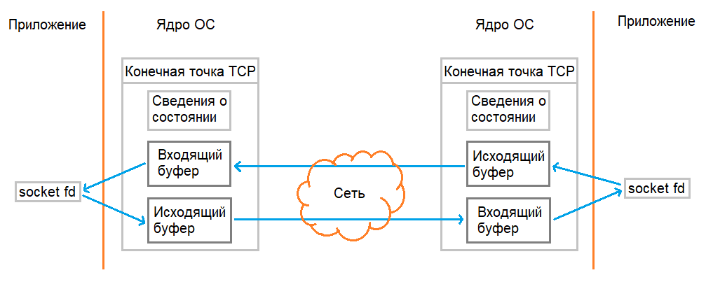
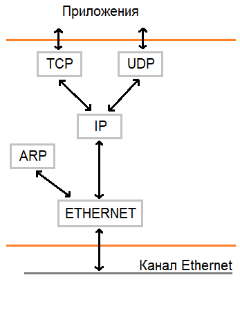

# 1. Введение

Компьютерная сеть состоит из **хостов**, также называемых **конечными системами (end system)**. Между собой хосты соединены **каналами связи (communication link)** и **свитчами (switch)**. Каналы связи имеют различную физическую природу: *радио*, *оптоволокно*, *металлические кабели*. Информация по каналам передаётся структурироваными фрагментами, называемыми **пакетами (packet)**. Коммутатор принимает пакеты через один канал и перенаправляет в другой. Последовательность каналов связи и коммутаторов, через которые прошел пакет при движении от одного хоста к другому, называется **путем (route, path)**. **Интернет** - это сеть компьютерных сетей, а также набор сервисов, предоствляемый распределенными приложениями. Интернет включает в себя различные физические сети и предоставляет всем подключенным устройствам унифицированную сетевую архитектуру. Конечные хосты получают доступ к интернету через **интернет провайдеров (ISP)**, упорядоченных в иерархию от локальных до интернациональных. Все участники сетевого общения реализуют протоколы. **Сетевой протокол** - набор правил, определяющих формат и порядок сообщений, которыми обмениваются два или более участника сетевого общения, а также действия, выполняемые при получении или отправке сообщения.  Интернет функционирует на основе набора протоколов: *TCP*, *UDP*, *ARP*, *ICMP*, *TELNET*, *FTP*, *IP*, *HTTP* и других. Общепринятое название данного набора - **семейство протоколов TCP/IP**.

Протоколы интернета имеют *стандарты*, описанные в общедоступных документах **Request for comments (RFC)** и разрабатываемые организациями *Internet Engineering Task Force (IETF)* и *Institute of Electrical and Electronics Engineers (IEEE)*.

## 1.1. Доступ хостов в интернет

### 1.1.1. Физические среды

Среда передачи - это физический путь, по которому сигнал движется от передатчика к приемнику. Среды передачи деляется на 2 типа:

+ **Guided medium** - сигнал заключен в пределах некоторой твёрдой среды и распространяется в заданном направлении;
+ **Unguided medium** - сигнал распространяется во всех направлениях.

Для построения физических каналов связи компьютерных сетей используются металлические провода, передающие электрические сигналы, световоды, передающие оптические сигналы, и радиоканалы:

+ **Витая пара** - два изолированных медных кабеля миллиметрового диаметра, скрученных вместе для уменьшения электромагнитных помех. Один провод может состоять из множества витых пар (например, кабель Ethernet). Является самым дешевым видом кабеля. Используется для построения локальных сетей внутри зданий и предоставляет скорость передачи данных `10 Мбит/c - 10 Гбит/c` в зависимости от диаметра и длины кабеля.
+ **Коаксильный кабель** - два соосных медных кабеля, распложенных один внутри другого. Используется в кабельном телевидении и интернете (требующем модем).
+ **Оптоволоконо** - нить из стекла либо пластика, способная распространять внутри себя без рассеивания импульсы света, представляющие биты информации. Невосприимчиво к электромагнитным помехам и обеспечивает низкое затухание сигнала. Обеспечивает скорость `50 Мбит/c - 40 Гбит/c` на расстояних в тысячи километров. Сопутствующее оборудование (передатчики, приёмники, свитчи) имеет высокую стоимость, поэтому в основном используется на магистральных линиях связи.
+ **Наземные радиоканалы** - построены на основе радиоволн, распространяющихся в пределах земной атмосферы и излучаемых наземными радиопередатчиками. Используются на коротких (несколько метров) расстояниях - наушники и прочая периферия, средних (сотни метров) - беспроводные точки доступа, дальних (десятки километров) - вышки сотовой связи.
+ **Спутниковые радиоканалы** - используются для связи расположенных на земле передатчика и приёмника радиоволн микроволнового диапазона через спутник, выполняющий роль репитера. Спутники связи обычно находятся на геостационарной (от 30 тыс. км) или околоземной орбите и позволяют предоставлять связь в районы, где не установлены наземные станции.

### 1.1.2. Сеть доступа

Первой сетью, к которой непосредственно подключается *клиентский* хост при обращении к некоторому интернет сервису (*серверный* хостом), является **сеть доступа (Access Network)**: домашняя сеть, сеть предприятия, мобильная сеть. Наиболее распространёнными типами сетей доступа являются:

+ **Digital Subscriber Line (DSL)** - использует существующую *телефонную линию*. Пользователь на своём конце устанавливает *DSL модем*, преобразующий цифровые данные в набор высокочастотных тонов, и *сплиттер*, разделяющий телефонные- и интернет-сигналы. На стороне провайдера устанавливается *мультиплексор (digital subscriber line access multiplexer, DSLAM)*, собирающий траффик от всех пользователей и перенаправляющий его либо в интернет (преобразуя обратно в цифру), либо в телефонную линию. Единовременно по телефонной линии могут передаваться телефонные сигналы (полоса 0-4 кГц), загружаемый (*downstream*) интернет-траффик (полоса 50 кГц - 1 МГц), отправляемый (*upstream*) интернет-траффик (полоса 4-50 кГц) - DSL-канал является *ассиметричным*. Различные стандарты DSL определяют скорости загрузки в пределах `24-52 Мбит/c` и скорости отправки - `3.5-16 Мбит/c`. Технология DSL используется на коротких расстояниях: `5-10 миль` от клиента до оборудования провайдера.


+ **Гибридная оптоволоконно-коаксиальная сеть (hybrid fiber coax, HFC)** - *оптоволокно* доходит до узлов на уровне района, с которым через *коаксиальные кабели* соединяются клиентские *модемы*. Провайдер также должен иметь у себя *мультиплексор (cable modem termination system, CMTS)*, собирающий траффик от всех пользователей. Данная сеть аналогично предоставляет *ассиметричный* доступ: `40 Мбит/c - 1.2 Гбит/c` скорость загрузки и `30-100 Мбит/с` скорость отправки. Особенностью данной сети является то, что клиенты разделяют общую среду передачи: каждый загружаемый пакет из узла попадёт ко всем клиентам. Следствием этого является разделение общей полосы пропускания канала, а также необходимость наличия протокола доступа к среде, обеспечивающего координацию всех передач и избежание их коллизий.


+ **Оптоволоконная сеть (fiber to home, FTH)** - *оптоволокно* приходит в дом клиента: у каждого клиента может быть свой собственный кабель до провайдера - *direct fiber*, либо несколько клиентов могут разделять один кабель через *сплиттер* - *active optical networks (AONs)* и *passive optical networks (PONs)*. При использовании несколькими клиентами единого оптоволокна до провайдера, каждый загружаемый пакет из сплиттера будет попадать ко всем клиентам. В данной сети клиентам и провайдеру необходимо устанавливать оборудование преобразующее оптические сигнали в электрические - *optical network terminator (ONT)* и *optical line terminator (OLT)*. Оптоволокно позволяет достись `гигабитной` скорости отправки/загрузки.


+ **Ethernet** - клиенты подсоединены к своему локальному предоставленному провайдером *коммутатору(ам) Ethernet* через *витую пару*, а сам коммутатор уже имеет выход в интернет. Ethernet предоставляет `гигабитную` скорость отправки/загрузки.


+ **WiFi** - клиенты по *радиоканалу* подсоединены к *точке доступа*, которая имеет выход в интернет (наиболее часто через Ethernet). Точка доступа способна покрыть зону радиусом в пару сотен метров. WiFi позволяет достичь скорость отправки/загрузки `свыше сотни Мбит/c`.


+ **Сотовые сети: 3G, 4G, 5G** - клиенты получают доступ в интернет, подключаясь по *радиоканалу* к *базовой станции* своего сотового оператора. Базовые станции покрывают до сотни километров в радиусе. Сотовые сети предоставляют скорость загрузки/отправки в `несколько десятков Мбит/c`.

### 1.1.3. Ядро сети

Ядро сети состоит из множества различных *каналов связи* и *свитчей (switch, коммутатор)*, соединящих хосты друг с другом. Существует 2 типа сетей: с **коммутацией пакетов (packet switching**) и **коммутацией каналов (circuit switching)**. В сетях с коммутацией каналов для пары взаимодействующих конечных систем устанавливается физическое соединение, для которого на всём протяжении его жизни *резервируются ресурсы сети* (например, *пропуская способность канала связи*). В сетях с коммутацией пакетов данные передаются независимыми структурированными фрагментами - пакетами, ресурсы для отправки которых выделяются по требованию.  

Интернет является сетью с коммутацией пакетов. Два основных типа свитча, используемых в его ядре - это **маршрутизатор (router)**, действующий на *сетевом* уровне, и **коммутатор (link-layer switch)**, действующий на *канальном* уровне. При передаче пакет использует **всю пропускную способность канала**, т.е. время $t$, затрачиваемое на передачу пакета размером $l$ по каналу с пропускной способностью $r$:

$$t = {\frac{l}{r}}$$

При получении пакета в одном канале свитч перенаправляет его в *другой* канал, используя для этого таблицу (*forwarding table*), соотносящую диапазоны адресов назначения, передающихся в заголовке каждого пакета, с его каналами. Большинство свитчей используют **store-and-forward transmission** во входном канале, т.е. пакет должен быть получен целиком, перед тем как он сможет быть записан в выходной канал.


Данная техника вводит дополнительную задержку (**queuing delay**). Рассмотрим заданный канал связи, содержащий $N$ сегментов с одинаковой пропускной способностью $r$, разделенных свитчами, каждый из которых выполняет только **store-and-forward transmission**. Время $t$, затрачиваемое на передачу пакета размером $l$ по данной цепочке:

$$t = N {\frac{l}{r}}$$

Если же по данной цепочке передаётся $P$ пакетов, то общее время $t$ будет:

$$t = (N + P - 1) {\frac{l}{r}} $$

Для каждого выходного канала у свитча есть *выходная очередь*, в которую помещаются пакеты, ожидающие своей записи. Нахождение пакета в очереди также вводит дополнительную задержку, а её переполнение приводит к отбрасыванию нового входящего либо одного из хранящихся пакетов - *потере пакетов*.

К сетям с коммутацией каналов относится, например, телефонная сеть. В них для каждого соединения резервируется постоянная и гарантированная часть пропускной способности канала - устанавливается выделенное соединение.


Соединение реализуется через **мультиплексирование с разделением по частоте (frequency-division multiplexing, FDM)** либо **мультиплексирование с разделением по времени (time-division multiplexing, TDM)**. В первом случае для каждого соединения выделяется своя собственная полоса заданной ширины (*bandwidth*) из диапазона частот канала. Во втором случае время делится на кадры, состоящие из фиксированного количества слотов, и каждое соединение получает свой слот в каждом кадре.


Коммутация пакетов позволяет достичь *большей производительности*, чем коммутация каналов.

### 1.1.4. Сеть сетей

Конечные хосты могут достичь друг друга благодаря тому, что интернет обладает связной иерархической структурой. Конечные хосты подсоединены к своим **сетям доступа**, которые подсоединены к **региональным** интернет-провайдерам, которые, в свою очередь подсоединены к **глобальным** интернет-провайдерам (**Tier 1 ISP**). На каждом стыке уровней осуществляются отношения заказчик-постащик, и клиент оплачивает доступ к предоставляемой сети пропорционально количеству сгенерированного им траффика. Клиентская сеть подсоединяется к сети провайдера через узлы коммутаторов пакетов, называемые **points of presense**. Клиентская сеть может быть одновременно подсоединена к нескольким сетям провайдеров - **multi-homing**. Две сети могут объединиться на безвозмездной основе - **peering**. Третьи стороны могут создавать узлы обмена информацией (**Internet Exchange Points, IXP**), через которые сети могут оказаться связаны друг с другом. Помимо интернет провайдеров **поставщики контента** - крупные корпорации наподобие Amazon, Microsoft, Google - могут создавать свои собственные закрытые сети и предоставлять к ним доступ на собственных условиях.


### 1.1.5. Задержка, потери, пропускная способность

При движении пакетов по сети в *каждом её узле* (хосте или коммутаторе пакетов) они успытывают несколько типов задержек:


+ **Processing Delay** - время, затрачиваемое на обработку заголовка пакета: чтение адресов отправления/назначения, вычисление контрольной суммы; на роутерах занимает `микросекунды`;
+ **Queuing Delay** - ожидание пакетом в очереди возможности его передачи в соответствующий канал связи; на практике занимает `от микросекунд до миллисекунд`;
+ **Transmission Delay** - время, затрачиваемое на запись всех битов пакета в канал связи; на практике занимает `от микросекунд до миллисекунд`;
+ **Propagation Delay** - время, необходимое на прохождение всех битов пакета по каналу связи и сохранение их в приёмнике; в частности определяется скоростью распространения сигналов в канале (порядки скорости света); в протяженных сетях на практике занимает `до миллисекунд`;

Все вместе они образуют **Total Nodal Delay**.

Пусть коммутатор пакетов обладает входной очередью с бесконечной вместимостью. Пусть $a$ - скорость, с которой пакеты пребывают в очередь, выражаемая в *пакетах/с*. Для простоты обозначим $L$ - длина приходящего пакета в *битах*. $R$ *бит/c* - скорость передачи, т.к. скорость, с которой пакет извлекается из очереди. Отношение $La/R$ называется **интенсивностью траффика**. Если $La/R > 1$, то это означает, что пакеты пребывают быстрее, чем удаётся их переслать - задержка нахождения в очереди в конечном счете станет бесконечной. *Интенсивность траффика никогда не должна больше 1!* Если же $La/R \le 1$, то задержка нахождения в очереди определяется природой траффика: периодические одиночные пакеты не будут испытывать задержек, а приходящая единовременно группа пакетов будет обладать существенной средней задержкой. В реальности время прихода пакета является случайной величиной, и задержка нахождения очереди зависит от интенсивности траффика экспоненциально:


Сумма всех задержек на всех узлах, расположенных по пути следования пакета, образует **End-to-End Delay**. В реальности входные очереди имеют ограниченную емкость, поэтому при их переполнении приходящие пакеты начинают отбрасываться - происходит **потеря пакетов**. Количество потерянных пакетов возрастает с увеличением интенсивности траффика.

**Мгновенная пропускная способность** - скорость в *бит/c*, с которой хост получает данные из канала связи. **Средняя пропускная способность** - скорость в *бит/c*, с которой были получены данные заданного размера, принимаемые в течение подсчитанного количества секунд: $Length/Time$. Пропускная способность всего пути, преодолеваемого пакетом, ограничена минимальной пропускной способностью среди всех его участков.

## 1.2. Уровни протоколов

Семейство протоколов *разделяется на уровни*, выполняющие свои собственные задачи и наслаивающиеся на более низкие уровни, расширяя их функционал дополнительными возможностями. Код, реализующий уровни набора протоколов, называется **стеком протоколов**. Основное назначение каждого уровня данной системы - это взаимодействие с аналогичным уровнем другой системы. Сложность всех нижележащих уровней инкапсулирована в смежном нижнем по отношении к данному уровне, предоставляющем ему свой интерфейс. В процессе отправки данные спускаются сверху вниз по стеку протоколов, и каждый уровень, получая информацию от вышележащего уровня, добавляет к ней свой управляющий заголовок и передаёт ниже. А при приёме данные поднимаются снизу вверх, и каждый уровень получает информацию от нижележащего уровня, извлекает из неё и обрабатывает свой заголовок, а оставшиеся данные передаёт выше.

Семейство протоколов TCP/IP имеет 4 ярко выраженных уровня:

+ **Прикладной уровень** - функционирование приложения;
+ **Транспортный уровень** - сквозной канал взаимодействия приложений;
+ **Сетевой уровень** - доставка и маршрутизация данных;
+ **Канальный уровень** - сопряжение с физической средой.


Описание основных функций уровней протоколов TCP/IP:

+ *Уровень сопряжения с физической средой (канальный)* обеспечивает физическую передачу данных внутри сети и состоит из *физического интерфейса (сетевой карты)*, соединённого с сетевыми коммуникациями, и его драйвера. Данный уровень решает задачи физической адресации (в противоположность логической адресации), топологии сети, линейной дисциплины (способ использования канала конечной системой), уведомления о неисправностях канала. Упаковывает получаемые с сетевого уровня данные в блоки, называемые *кадрами*, добавляя к ним заголовок, содержащий *физический адрес* устройства. Важной характеристикой данного уровня являтся *максимальный размер кадра* - *Maximum Transmission Unit (MTU)*. Протоколами канального уровня являются, например, **Ethernet**, **Token Ring**, **FDDI**, **PPP**, **ISDN**. Протоколы **ARP** и **RARP** являются связующим звеном между канальным и сетевым уровнями и обеспечивают *трансляцию физических и логических адресов* друг в друга.

+ *Сетевой уровень* - занимается доставкой данных от исходного узла к конечному. Основным протоколом сетевого уровня является **IP**, который занимается маршрутизацией *датаграмм*, а также их фрагментацией/дефрагментацией. Протокол **ICMP** собирает информацию о работе сети и уведомляет о её ошибках. Протоколы **RIP**, **EGP**, **BGP**, **OSPF** определяют оптимальные маршруты через последовательности соединённых подсетей.

+ *Транспортный уровень* предоставляет сквозной канал, позволяющий взаимодействовать приложениям на различных устройствах. Он избавляет прикладной уровень от необходимости вникать в детали транспортировки данных и отвечает за надёжную и достоверную доставку, обслуживание соединений, обнаружение ошибок передачи, управление информационным потоком. Основными протоколами транспортного уровня являются:
    1. **User Datagram Protocol (UDP)** - предназначен для *датаграммных сокетов* и только пересылает пакеты между различными сервисами, различаемыми по *номерам портов*, и обнаруживает ошибки при их возникновении;
    2. **Transmission Control Protocol (TCP)** - предназначен для *потоковых сокетов*, устанавливает постоянное соединение между различными сервисами (тоже использует *номера портов*) и обеспечивает надежность и достоверность доставки, управление потоком данных и контроль над перегрузкой сети.

+ *Прикладной уровень* идентифицирует и устанавливает наличие предполагаемых партнёров для связи, синхронизирует совместно работающиее программы, обеспечивает читаемость информации на различных системах, управляет сеансами взаимодействия. Данный уровень включает в себя широкий спектр протоколов:
    1. **DNS** - сервис разрешения имен, соотносящий логические адреса сервисом и их символьные названия;
    2. **SMTP**, **POP3**, **IMAP4** - протоколы электронной почты;
    3. **HTTP** - протокол сервиса *World Wide Web*, позволяющий формировать запросы, передавать содержимое интернет-страниц, выполнять аутентификацию и т.д.;
    4. **TELNET** - позволяет прозрачно работать в терминале на удалённом компьютере;
    5. **NFS** - протокол сетевой файловой системы, позволяющий прозрачно работать с файлами удаленного компьютера;
    6. **SNMP** - простой протокол управления сетью;
    7. **RPC** - протокол выполнения процедур на удалённом компьютере.

# 2. Семейство протоколов TCP/IP

Рабочее пространство TCP/IP построено по принципу цепной сети: существует большое количество независимых, гетерогенных подсетей, соединенных между собой шлюзами. Каждая подсеть должна уметь принять через шлюз информационную датаграмму и доставить её по конкретному адресу в этой конкретной подсети, но от неё не требуется гарантия обязательной доставки и надёжный сквозной протокол. Когда нужно передать датаграмму между двумя произвольными подключенными к сети компьютерами, то отправитель посылает её в шлюз собственной подсети, из него датаграмма двигается по определённому маршруту через систему промежуточных шлюзов и подсетей в шлюз конечной подсети, откуда передаётся конечному получателю. Датаграмма содержит адреса отправителя и получателя, причем зачастую последний определяется по символьному имени при помощи службы DNS. Каждая датаграмма идёт независимо от остальных и по своему собственному маршруту. Транспортный уровень отвечает за разбиение отправляемого сообщения на датаграммы, обратный процесс восстановления исходного сообщения из датаграмм в нужном порядке, повторную отправку недоставленных или поврежденных датаграмм. Сетевой уровень отвечает за маршрутизацию и достаку по адресу отдельных датаграмм.

## 2.1. IP-адресация

IP-адресация компьютеров в интернете построена на концепции сети, состоящей из *хостов* и *других сетей*. **Хост** - объект, способный отправлять и принимать IP-датаграммы. Хосты соединены друг с другом через одну или несколько сетей. Длина **IP-адреса** состоявляет 32 бита (4 байта) и разделяется на две или три части: *адрес сети*, *адрес подсети* (если он задан) и *адрес конечного узла* (сетевого интерфейса, т.к. машина может иметь их несколько). Под адрес сети отводятся старшие биты, а под адрес узла - младшие. Длины каждой из частей являются переменными величинами. Для представления IP-адреса используется запись из четырёх десятичных чисел, разделенных точками: `X.X.X.X`.

Адресация IP обеспечивает пять различных *классов сетей*: **A**, **B**, **C**, **D**, **E** (подробнее см. **RFC-1466** и **RFC-1597**).


Адреса **класса D** зарезервированы для групповой адресации **RFC-1112**, адреса **класса E** зарезервированы на будущее. Очевидно, все классы имеют непересекающиеся диапазоны адресов:

| Класс | Диапазон адресов сети | Диапазон адресов узла |
| :---: | :-------------------: | :-------------------: |
|   A   |        1 - 126        |  0.0.1 - 255.255.254  |
|   B   |    128.0 - 191.255    |     0.1 - 255.254     |
|   C   | 192.0.0 - 223.255.255 |        1 - 254        |

Некоторые IP-адреса являются выделенными и трактуются особым образом:

+ **(все нули)**, `0.0.0.0` - данный узел;
+ **(все единицы)**, `255.255.255.255` - все узлы в данной сети;
+ **(все нули).(номер узла)**, например `0.0.78.92` - указанный узел в данной сети;
+ **(номер сети).(все нули)**, например `168.54.0.0` - указанная сеть;
+ **(номер сети).(все единицы)**, например `168.54.255.255` - все узлы в указанной сети;
+ **(127).(что угодно)**, зачастую `127.0.0.1` - *петля*: данные не передаются в сеть, а сразу возвращаются как принятые.

### 2.1.1. Подсети

Адресное пространство сети может быть разделено на более мелкие непересекающиеся подпространства - *подсети*. Они позволяют создавать объединения компьютеров строго требуемого размера в рамках выделенного диапазона адресов сети и гибко изменять их состав. Для выделения номера подсети из IP-адреса используется **маска подсети**. Маска подсети использует тот же формат, что и IP-адрес: биты, определяющие номер сети, приравниваются 1, а биты, определяющие номер узла - 0.


### 2.1.2. Групповая адресация

Для обращения к группе хостов по одному IP-адресу может использоваться **групповой IP-адрес**. Групповые адреса принадлежат *классу D* и лежат в промежутке от `224.0.0.1` до `239.255.255.244`, причем адрес `224.0.0.1` является зарезервированным и используется для обращения к группе, состоящей из *всех хостов данной сети*. Группу адресации хостов класса D называют **multicast-группой**. Multicast-группа не является закрытой: обращение к ней может быть сделано не её членом, а само членство является динамическим, и хосты могу свободно входить и выходить из её состава. Multicast-группа не накладывает никаких ограничений на количество и расположение своих членов. Хост может быть членом нескольких групп одновременно.

Multicast-группы деляется на 2 типа:

+ **постоянные** - имеют определённые адреса и могут быть пустыми;
+ **динамические** - занимают адреса, не зарезервированные за постоянными группами, и существуют до тех пор, пока существует хотя бы один их член.

*Multicast-группа рассылки* определяет набор сетей, содержащих члены данной multicast-группы. Пакет, адресованный такой группе, дублируется в каждую сеть, а затем передаётся членам группы внутри сети. Для выполнения этих функций *маршрутизатор* должен поддерживать следующие расширения работы с IP:

+ *Таблица маршрутизации multicast-группы* с информацией о ближайшем шлюзе для каждой сети;
+ *Таблица членов multicast-группы сети*, содержащая для каждой multicast-группы *данной сети* список *других сетей*, в которые также входят члены этой группы;
+ *Таблица членов multicast-группы хоста*, содержащая список multicast-групп в *данной сети*.

Механизм групповой адресации обеспечивается протоколом **IGMP (Internet Group Management Protocol)**: он позволяет создавать группы хостов и управлять их составом. Маршрутизация групповых пакетов не входит в список обязательно реализуемых стандартов маршрутизатора, поэтому для работы с адресами класса D необходимо расширение программных модулей вплоть до протокола локальной сети. Подробнее о групповой адресации смотреть в **RFC-966**, **RFC-988**, **RFC-1054**, **RFC-1112**.

## 2.2. Протокол IPv4

**Internet Protocol** является главным на сетевом уровне семейства TCP/IP и предназначен для передачи данных между хостами. Его основные функции:<br>
a. **фрагментация**/**дефрагментация** данных;<br>
b. **маршрутизация** данных в сети;<br>
c. **логическая адресация** хостов.<br>

Протокол IP **не поддерживает** постоянного **соединения** и является **ненадёжным**:<br>
a. *не гарантирует доставку* пакета;<br>
b. *не гарантирует* сохранения *порядка* отправленных пакетов;<br>
c. допускает *дублирование* пакетов;<br>
d. *не восстанавливает* пакеты при *повреждении*;<br>
e. *не предоставляет* механизмов *подтверждения* доставки.<br>

Протокол IP оперирует *датаграммами* - блоками данных, полученными с транспортного уровня, к которым добавлен заголовок, содержащий *логический адрес* устройства (*IP-адрес*). Датаграммы передаются через интерфейсы локальных сетей (канальный и физический уровени), а выбор пути осуществляется на основе *IP-адреса получателя пакета*.

### 2.2.1. Адресация

IP-датаграмма содержит два основных адреса - *отправителя* и *получателя*. Эти адреса являются *статическими* (не меняются) на протяжении всего пути пакета. Кроме них датаграмма *может* также содержать адреса шлюзов, которые она должна пройти по пути к получателю - структуры *LSRR* (*Loose Source and Record Route*) и *SSRR* (*Strict Source and Record Route*) поля *Options*, которые представляют собой пару из массива промежуточных адресов и указателя на текущий элемент в данном массиве. При отправке такой датаграммы учитывается не адрес получателя, а адрес указанного промежуточного хоста, при посещении которого указатель будет передвинут на следующий адрес, и датаграмма отправится по нему, пока не будут пройдены все хосты массива, или не будет достигнут получатель. Если массив исчерпан, а датаграмма еще не доставлена, то она отправляется по адресу получателя. Адреса SSRR представляют собой точный путь и должны проходиться последовательно и быть расположенными в *прямой видимости* друг от друга - если передачу осуществить невозможно, то датаграмма уничтожается. Адреса LSRR просто являются списком, который нужно посетить - способ прохода может быть любым.

### 2.2.2. Маршрутизация

Центральной частью маршрутизации IP является **таблица маршрутизации датаграмм**, которая устанавливается на каждом хосте и используется при выборе следующей сети, куда будет направлена датаграмма. Таблица содержит записи, которые состоят из следующего набора полей:

+ **Netmask** - маска сети назначения;
+ **Network Address** - IP-адрес сети назначения;
+ **Gateway** - IP-адрес шлюза сети назначения;
+ **Interface** - IP-адрес сетевого интерфейса хоста, содержащего таблицу;
+ **Metric** - количество участков пересылки или сегментов сети до указанного шлюза.

Если при отправке датаграммы *получатель* расположен *в той же ветке сети*, что и отправитель, то датаграмму отправляется ему *напрямую*. Иначе в таблице маршрутизации ищется запись, соответствующая IP-адресу назначения:

1. через побитное произведение адреса назначения датаграммы и поля Netmask извлекается адрес сети назначения датаграммы;
2. адрес сети назначения датаграммы сравнивается со значением поля Network Address;
3. если адреса сетей совпали, то датаграмма отправляется на шлюз сети назначения Gateway через сетевой интерфейс данного хоста Interface.

В соответствии с описанным алгоритмом выделяется два типа маршрутизации - *прямая* и *косвенная*. Прямая маршрутизация применяется, когда отправитель и получатель расположены в одной ветке сети, т.е. находятся в прямой видимости - в этом случае таблица маршрутизации не используется. Косвенная маршрутизация применяется, когда отправитель и получатель расположены не в пределах прямой видимости друг от друга (различные ветки одной сети, различные сети), и использует таблицу маршрутизации.

При маршрутизации *отправляемых* пакетов, получаемых от *модулей верхнего уровня*, IP-модуль должен определить способ доставки - прямой или косвенный - и выбрать сетевой интерфейс. Для *принимаемых* от *сетевых драйверов* пакетов IP-модуль должен решить, нужно ли ретранслировать IP-пакет по другой сети или передать его на верхний уровень. Входящий IP-пакет никогда не ретранслируется *обратно через принявший* его сетевой интерфейс. Работа с ретранслируемыми пакетами осуществляется так же, как и с обычными отправляемыми пакетами.

Для примера рассмотрим сеть следующей конфигурации, состоящую из трёх веток с их хостами и шлюза G, подсоединённого к интернету:


Таблицы маршрутизации на каждом хосте будут иметь следующий вид:

*Хост A*:
| Network Address | Netmask         | Gateway      | Interface   |
| :-------------- | :-------------- | :----------- | :---------- |
| 0.0.0.0         | 0.0.0.0         | 210.20.30.10 | 210.20.30.1 |
| 210.20.30.0     | 255.255.255.192 | 210.20.30.1  | 210.20.30.1 |

*Хост B*:
| Network Address | Netmask         | Gateway      | Interface   |
| :-------------- | :-------------- | :----------- | :---------- |
| 0.0.0.0         | 0.0.0.0         | 210.20.30.10 | 210.20.30.2 |
| 210.20.30.0     | 255.255.255.192 | 210.20.30.2  | 210.20.30.2 |

*Хост C*:
| Network Address | Netmask         | Gateway      | Interface    |
| :-------------- | :-------------- | :----------- | :----------- |
| 0.0.0.0         | 0.0.0.0         | 210.20.30.70 | 210.20.30.81 |
| 210.20.30.64    | 255.255.255.192 | 210.20.30.81 | 210.20.30.81 |

*Хост D*:
| Network Address | Netmask         | Gateway      | Interface    |
| :-------------- | :-------------- | :----------- | :----------- |
| 0.0.0.0         | 0.0.0.0         | 210.20.30.70 | 210.20.30.82 |
| 210.20.30.64    | 255.255.255.192 | 210.20.30.82 | 210.20.30.82 |

*Хост E*:
| Network Address | Netmask         | Gateway       | Interface     |
| :-------------- | :-------------- | :------------ | :------------ |
| 0.0.0.0         | 0.0.0.0         | 210.20.30.254 | 210.20.30.200 |
| 210.20.30.0     | 255.255.255.192 | 210.20.30.10  | 210.20.30.10  |
| 210.20.30.64    | 255.255.255.192 | 210.20.30.70  | 210.20.30.70  |
| 210.20.30.192   | 255.255.255.192 | 210.20.30.200 | 210.20.30.200 |

*Хост G*:
| Network Address | Netmask       | Gateway       | Interface     |
| :-------------- | :------------ | :------------ | :------------ |
| 210.20.30.0     | 255.255.255.0 | 210.20.30.200 | 210.20.30.254 |

Нулевой адрес `0.0.0.0` указывает на *шлюз маршрутизации по умолчанию*. *Метрика* для шлюза по умолчанию *всегда меньше или равна 1*.

### 2.2.3. Фрагментация

Поскольку датаграммы могут достигать размера вплоть до 65КБайт, что намного премышает распространённые значения *MTU* (*Maximum Transmission Unit*) канального уровня (1500 Байт), то протокол IP разбивает датаграммы на фрагменты меньшего размера, способные уместиться в *кадре канального уровня*, а затем выполняет обратную *сборку*. Можно запретить фрагметацию датаграммы, установив для неё флаг *not fragment*. Если подобная датаграмма не может быть доставлена в точку назначения без фрагментации, то она будет *уничтожена*. Каждый фрагмент датаграммы имеет уникальный *идентификатор*, однозначно определяющий его *принадлежность исходному пакету* и являющийся уникальным для пары адресов отправитель-получатель всё время жизни датаграммы в сети. Поля *смещения и длины* фрагмента определяют его положение в исходной датаграмме, а *флаг "следующего фрагмента"* указывает, что у данной порции есть продолжение, либо она финальная.

При фрагментации IP-модуль:

1. разбивает данные исходной датаграммы на несколько более коротких порций, выравнивая их по 64-битной границе;
2. добавляет к каждой порции содержание IP-заголовка исходной датаграммы;
3. заполняет в каждой новой датаграмме поля смещения и длины;
4. устанавливает в каждой датаграмме флаги "следующего фрагмента", причем последняя датаграмма получает значения флага исходной датаграммы (на случай, если она тоже была частью еще более длинной датаграммы).

При дефрагментации IP-модуль комбинирует датаграммы которые имеют одинаковые значения полей:

1. идентификатора принадлежности;
2. адреса отправителя;
3. адреса назначения
4. типа протокола.

### 2.2.4. Формат заголовка IPv4-пакета


Заголовок IPv4 имеет следующие поля (см. **RFC-791**):

+ **Version** - 4 бита; поле *версии*, устанавливающее формат заголовка; принимает значения `4` и `6`;
+ **IHL** - *Internet Header Length*; 4 бита; поле *длины заголовка* в 32-битных блоках; не может принимать значения меньше `5`;
+ **TOS** - *Type of Service*; 8 бит; поле *типа сервиса*, используемое для определения принадлежности датаграммы к одному из предусмотренных видов IP-пакетов, что определяет способ её обработки; данное поле может содержать категорию срочности и важности пакета, возможную задержку передачи, уровень обеспечения достоверной доставки и т.д.; поле используется шлюзами IP-пакетов для выбора параметров передачи датаграммы по данной сети;
+ **Total Length** - 16 бит; поле *суммарной длины датаграммы*, учитывающее заголовок и данные; может принимать значение до `65535`, но на практике, как правило, не превышает `575` байт (заголовок 64 байта и тело 512 байт);
+ **Identification** - 16 бит; поле *идентификатора датаграммы*, устанавливаемого при её фрагментации на части;
+ **Flags** - поле *управляющих флагов*:
  + *Бит 0* - зарезервирован и должен равняться `0`;
  + *Бит 1* - **DF**; бит фрагментации: `0` - можно фрагментировать, `1` - нельзя фрагментировать;
  + *Бит 2* - **MF**; бит следующего фрагмента: `0` - последний фрагмент, `1` - есть следующий фрагмент;
+ **Fragment Offset** - 13 бит; поле *смещения фрагмента датаграммы* в 64-битных блоках;
+ **TTL** - *Time to Live*; 8 бит; поле *времени жизни датаграммы*, устанавливаемое отправителем и уменьшаемое при каждом прохождении датаграммы через шлюз; измеряется в *секундах*; максимальное значение равно `255`, а его уменьшение шлюзом должно выполняться *хотя бы* на `1`, даже если обработка пакета заняла меньшее время;
+ **Protocol** - 8 бит; поле *типа протокола*, находящегося над сетевым уровнем и использующего данную датаграмму: TCP, UDP и т.д.;
+ **Header Checksum** - 16 бит; поле *контрольной суммы заголовка*; при несоответствии контрольной суммы датаграмма уничтожается; значение контрольной суммы пересчитывается в каждой точке обработки датаграммы (т.к. меняется TTL); для вычисления контрольной суммы необходимо просуммировать с дополнением до единиц (*ones' complement sum*) все 16-битные слова заголовка (поле чексуммы при этом полагается нулевым) и для результата найти его дополнение до единиц; для проверки нужно вычислить сумму с дополнением до единиц всех 16-битных слов заголовка - она должна состоять только из единиц (равняться `-0` в данном представлении);
+ **Source Address** - 32 бита; поле с *IP-адресом отправителя*;
+ **Destination Address** - 32 бита; поле с *IP-адресом получателя*;
+ **Options** - опциональное поле переменной длины, содержащее *дополнительные контрольные параметры*: сведения о безопасности (уровень безопасности, группа изоляции, ограничения передачи и т.д.), структуры LSRR и SSRR, метки времени пройденных шлюзов.
+ **Padding** - поле *выравнивания* размера заголовка по 32-битной границы, заполненное нулями.

---

> **Ones' complement** - дополнение единиц, *обратный код*. В этой форме записи *старший бит* числа является *знаковым*: `0` - положительное, `1` - отрицательное. Запись положительного числа в обратном коде совпадает с его двоичным представлением.
>
> > Для нахождения противоположного по знаку числа необходимо проинвертировать все биты (как знаковый, так и информационные) текущего числа.
>
> Пример записи: `+5` - `0000 0101`, `-5` - `1111 1010`.
>
> При *сложении* чисел в обратном коде необходимо выполнять **end-around carry** - прибавление старшего бита переноса в младший бит результата:
>
> ```text
>   1111 1110     −1
> + 0000 0010     +2
> ===========    ===
> 1 0000 0000      0
> +         1     +1    - Add carry
> ===========    ===
>   0000 0001      1    - Result
> ```
>
>При *вычитании* чисел в обратном коде необходимо выполнять **end-around borrow** - вычитание старшего заимствованного бита из младшего бита результата:
>
> ```text
>   0001 0011     19
> − 1111 1100     −3
> ===========    ===
> 1 0001 0111     23
> − 0000 0001      1    - Subtract borrow
> ===========    ===
>   0001 0110     22    - Result
> ```
>
> Данная форма записи получила своё название, поскольку инвертирование также может быть произведено вычитанием числа из всех единиц (`1111 1111`, представление `-0`).

---

> **Two's complement** - дополнение двойки, *дополнительный код*. В этой форме записи *старший бит* числа является *знаковым*: `0` - положительное, `1` - отрицательное. Запись положительного числа в обратном коде совпадает с его двоичным представлением.
>
> > Для нахождения противоположного по знаку числа необходимо:
> >
> > 1. проинвертировать все биты текущего числа (как знаковый, так и информационные);
> > 2. прибавить к полученному результату `1`, игнорируя любые переполнения.
>
> Пример записи: `+5` - `0000 0101`, `-5` - `1111 1011`. Данная форма записи получила своё название, поскольку инвертирование также может быть произведено вычитанием числа из *N+1* степени двойки - эквивалетна нулю (<code>2<sup>8</sup></code> - `1 0000 0000` - `0000 0000`).

## 2.3. Протоколы нижнего уровня

IP-адрес является логическим выражением, которое никак не связано с конкретной физической реализацией сети. Можно сказать, что универсальность TCP/IP заканчивается на сетевом уровне. Следующий уровень - *канальный* - обеспечивает транзит данных через физический канал связи: занимается физической адресацией, топологией сети, линейной дисциплиной (каким образом конечной системе использовать сетевой канал), управлением о неисправностях, упорядоченной доставкой блоков данных.

### 2.3.1. Физический адрес - MAC. Пакеты Ethernet

Адреса канального уровня, называемые также *физическими* или *MAC-адресами*, уникальны для каждого сетевого соединения. У большинства локальных сетей адреса канального уровня зашиты в железо фирмой-производителем (как, например, у *Ethernet*) или назначены той организацией, которая определяет стандарт протокола канала связи. Физические адреса представляют собой так называемые *плоские* адреса: они ничего не говорят о структуре используемой сети. Компьютерная система имеет столько адресов канального уровня, сколько у неё физических сетевых интерфейсов.

Рассмотрим структуру канального уровня на примере сети *Ethernet*. Изначально конкретная технология Ethernet была разработана в Исследовательском центре в Пало Альто (PARC) корпорации Xerox в 1970 году, но сегодня этот термин используется для описания всех локальных вычислительных сетей (*ЛВС*), работающих по принципу *Carrier Sense Multiple Access/Collision Detection* (*CSMA/CD*) - множественный доступ с прослушиванием несущей частоты и обнаружением коллизий. Метод CSMA/CD предполагает, что все устройства взаимодействуют в одной среде и в каждый момент времени может *передавать только одно устройство*, а *принимать могут все одновременно*. Если 2 устройства пытаются передавать одновременно, то происходит *столкновение передач*, и оба устройства после случайного короткого периода ожидания пытаются выполнить передачу вновь.

Каждый Ethernet-адаптер имеет свой собственный уникальный адрес: он присваивается сетевой плате при её изготовлении. Адрес представляет собой *последовательность байтов длиною в 48 бит*: `XX:XX:XX:XX:XX:XX`. Каждая машина в Ethernet-сети обращает внимание только на те пакеты, которые адресованы лично ей или всем пакетам в сети - *широковещательный адрес*, состоящий из всех единиц.

Ethernet-пакет содержит 14-байтный заголовок и имеет следующий формат (см. **RFC-894**, **RFC-895**, **RFC-948**, **RFC-1042**):


+ **Destination MAC Address** - физический адрес получателя;
+ **Source MAC Address** - физический адрес отправителя;
+ **Type code** - поле типа Ethernet-пакета; позволяет одновременно использовать в сети различные стеки протоколов (TCP/IP, DECnet и т.д.); для IP значение равно `0x0800`;
+ **Checksum** - поле контрольной суммы *всего* пакета, *включая данные*; при несоответствии чексуммы пакет уничтожается;

### 2.3.2. Отображение MAC на IP-адрес. Протоколы ARP и RARP

Для отображения IP-адресов на Ethernet-адреса используется протокол **ARP** - **Address Resolution Protocol**. Это отображение выполняется только для отправляемых IP-пакетов, т.к. заголовки IP и Ethernet создаются только при отправке. Для отображения Ethernet-адресов в IP-адреса используется протокол **RARP** - **Reverse Address Resolution Protocol**. Ни ARP, ни RARP *не используют протокол IP*: они являются самостоятельными и независимыми протоколами на основе кадров Ethernet.

Основным инструментом работы протокола **ARP** является **таблица разрешения адресов** или **ARP-таблица**, хранящаяся на хосте и содержащая *для каждого узла сети* записи с его *IP-адресом и Ethernet-адресом*. Прямое преобразование IP-адреса в MAC выполняется поиском в таблице записи с соответствующим IP-адресом. Для *каждого сетевого интерфейса* машины существует *собственная ARP-таблица*. Пример ARP-таблицы:

|  IP-адрес  |  Ethernet-адрес   |
| :--------: | :---------------: |
| 220.20.2.1 | 08:00:39:00:2F:C3 |
| 220.20.2.2 | 08:00:5A:21:AB:22 |
| 220.20.2.3 | 08:00:10:91:AC:54 |

Заполнение ARP-таблицы происходит автоматически модулем ARP по мере необходимости. Когда с помощью существующей ARP-таблицы не удаётся преобразовать IP-адрес, то:

1. По сети передаётся *широковещательный* (на канальном уровне) *ARP-запрос*;
2. Исходящий *IP-пакет* ставится в *очередь*.

ARP-запрос содержит просьбу получателю сообщить свой Ethernet-адрес отправителю, если его собственный IP-адрес совпадает с указанным в запросе. Сам *ARP-пакет* имеет следующий формат:


Описание полей:

+ **Hardware Type (HTYPE)** - поле типа сети; значение равно `1` для Ethernet;
+ **Protocol Type (PTYPE)** - поле типа протокола, для адреса которого сформирован ARP-запрос; значение равно `0x0800` для IPv4 (значения совпадают с полем типа Ethernet-пакета);
+ **Hardware Length (HLEN)** - поле длины аппаратного адреса; значение равно `6` для Ethernet;
+ **Protocol Length (PLEN)** - поле длины адреса указанного сетевого протокола; значение равно `4` для IPv4;
+ **Operation code (OPER)** - поле выполняемого действия: `1` - запрос, `2` - ответ;
+ **Sender Hardware Address (SHA)** - поле аппаратного адреса отправителя; содержит *результирующий MAC* при *ARP-ответе*;
+ **Sender Protocol Address (SPA)** - поле сетевого адреса отправителя;
+ **Target Hardware Address (THA)** - поле аппаратного адреса получателя; *игнорируется* при *ARP-запросе*;
+ **Target Protocol Address (TPA)** - поле сетевого адреса получателя.

Широковещательная передача принимается каждым сетевым адаптером. Далее Ethernet-драйвер, обнаружив в *поле типа* принятого Ethernet-пакета метку ARP `0x0806`, передаёт его модулю ARP. Модуль ARP сравнивает IP-адрес хоста с указанным в запросе и при их совпадении посылает ответ прямо по Ethernet-адресу отправителя запроса. Модуль ARP отправителя, получив ответ, достраивает имеющуюся на своём хосте ARP-таблицу. Весь описанный процесс обычно занимает пару миллисекунд.

После построения ARP-таблицы при получении ответа хранящийся в очереди IP-пакет будет успешно отправлен адресату. Если в сети нет машины с искомым IP-адресом, то ARP-ответ никогда не придёт, и таблица никогда не будет заполнена - протокол IP будет уничтожать IP-пакеты, направляемые по этому адресу. Некоторые реализации IP и ARP не ставят в очередь IP-пакеты, пока они ждут ARP-ответ - IP-пакеты просто уничтожаются, а их восстановление и повторная отправка возлагаются на модуль TCP либо на прикладной процесс (при использовании UDP). Повторная отправка происходит успешно, т.к. первая попытка уже вызвала заполнение ARP-таблицы.

ARP-таблица необходима, потому что IP- и Ethernet-адреса выбираются независимо, и не существует какого-либо алгоритма перевода их друг в друга: IP-адрес выбирается пользователем с учетом положения машины в сети и может быть изменён в любое время, Ethernet-адрес присваивается производителем сетевого интерфейса из выделенного ему по лицензии адресного пространства.

Протокол **RARP** использует такой же формат пакета, что и ARP. Единственное отличие - поле **Operation code** принимает значения `3` - *Request Reverse* и `4` - Reply Reverse. Особенностью RARP является необходимость наличия в сети *отдельного сервера(ов)*, который хранил бы базу соответствий Ethernet-IP и отвечал бы на клиентские RARP-запросы. Данная схема работы необходима, т.к. более низкий протокол, Ethernet, не может специфицировать запрос к протоколу более высокого уровня, IP, и ему требуется дополнительное программное обеспечение. Протокол ARP, в свою очередь, предполагает, что *каждый* хост хранит информацию об IP-Ethernet соответствии *для всех узлов сети* - в этой структуре все хосты умеют *одинаковый статус* и работают *симметрично*.

Описание протоколов ARP и RARP даётся в **RFC-826**, **RFC-903**, **RFC-1027**.

### 2.3.3. Групповая адресация в локальных сетях Ethernet

Диапазон Ethernet-адресов с `01:00:5E:00:00:00` по `01:00:5E:7F:FF:FF` зарезервирован для их использования в качестве *групповых multicast-адресов*. Они позволяют маршрутизаторам не задавать список членов каждой группы, а просто ставить *групповой IP-адрес в соответствие с групповым Ethernet-адресом*. При соотнесении адресов *23 младших бита IP-адреса* помещаются в *23 младших бита Ethernet-адреса*. Поскольку у группового IP-адреса класса D значащими являются 28 бит, то одному Ethernet-адресу могут соответствовать <code>2<sup>5</sup> = 32</code> различныe IP-группы.


Описание групповой Ethernet-адресации даётся в **RFC-1112**.

## 2.4. Протоколы TCP, UDP, ICMP

Протоколы **TCP** и **UDP** относятся к транспортному уровню, который предоставляет канал взаимодействия для двух конечных приложений:

+ **Transmission Control Protocol** (**TCP**) - предназначен для потоковых сокетов.
+ **User Datagram Protocol** (**UDP**) - предназначен для датаграммных сокетов;

Оба указанных протокола различают приложения по *двубайтовым номерам портов*. Распределением портов с `0` по `1023` занимается *IANA* - *Internet Assigned Numbers Authority*. Порты в данном диапазоне привязаны к *определённым сервисам* (*ssh*, *http* и т.д.), и могут быть заняты только привилегированными процессами хоста. Если приложение самостоятельно не *привязывается* (bind) к выбранному номеру порта, то ему системой *динамически назначается* произвольный номер порта из диапазона, определяемого файлом `/proc/sys/net/ipv4/ip_local_port_range`.

### 2.4.1. Протокол TCP

**TCP** устанавливает поверх протокола IP *надёжный двунаправленный* канал взаимодействия двух точек (приложений), основанный на *соединении* и реализованный в виде *байтового потока*. Протокол TCP обеспечивает:

1. *установку соединения*, которые может пребывать в различных состояниях;
2. *разбиение* потока данных на *сегменты*, содержащие *контрольную суму*;
3. отправку *подтверждения доставки*, *повторную отправку* недоставленных сообщений и её корректируемый таймер;
4. сохранение *порядка передаваемых сегментов*: каждому *байту* в передаваемом потоке присваивается *порядковый номер*, каждый *сегмент* содержит *номер первого байта* своих данных;
5. *управление потоком данных*: оба участника соединения сообщают друг другу размер своего принимающего буфера, при заполнении которого отправка будет приостановлена до получения отправителем подтверждения доставки - *механизм скользящего окна*;
6. *контроль на перегрузкой сети*: *алгоритм замедленного старта* (постепенное увеличение объёма передаваемых данных) и *алгоритм предотвращения перегрузки* (ограничение скорости передачи данных в соответствии с рассчитываемой пропускной способностью сети).

TCP взаимодействует как с прикладными протоколами пользовательского приложения, так и с сетевым протоколом IP. В операционной системе реализация TCP представляет собой отдельный драйвер, через который проходят все вызовы функций протокола. Интерфейс между прикладными процессом и TCP представляет собой библиотеку вызовов, такую же как библиотека системных вызовов. При передаче данных пользовательский процесс вызывает соответствующую функцию TCP, указывая на буфер с данными в пользовательском пространстве. TCP упаковывает эти данные в свои сегменты и вызывает функцию передачи протокола нижнего уровня - IP. При приёме TCP группирует поступающие от протокола нижнего уровня данные в свои сегменты внутри принимающего буфера, проверяет целостность данных, передаёт их пользовательскому процессу и уведомляет отправителя об их получении.



Пользовательский интерфейс TCP позволяет выполнять *открытие* (OPEN) и *закрытие* (CLOSE) *соединения*, *отправку* (SEND) и *получение* (RECEIVE) *данных*, получение *статуса соединения* (STATUS). Взаимодействие TCP и протоколов нижнего уровне не специфицировано, за исключением того, что должен существовать механизм, который бы обеспечивал асинхронную передачу информации от одного уровня к другому. Такой механизм реализуется через интерфейс вызовов между TCP и IP и обеспечивает вложение TCP-пакетов в IP-датаграммы.

Логическая структура сетевого программного обеспечения, реализующего семейство протоколов TCP/IP в каждом узле сети, имеет следующий вид:



#### 2.4.1.1. Потоки данных, стек протоколов, механизм сокетов и мультиплексирование соединений

Для установки соединения между двумя процессами на различных компьютерах в сети требуется знать не только их IP-адреса, но и *номера портов*, используемых этими процессами. IP-адреса и номера портов вместе образуют систему **сокетов**. Пара сокетов со своими собственными адресами и портами *уникальным образом идентифицирует* каждое соединение. Несколько процессов на компьютере могут использовать один и тот же TCP-порт, но с точки зрения удалённого процесса между ними не будет никакой разницы. Один сокет на компьютере может быть задействован в соединениях с несколькими сокетами на удалённых компьютерах. Таким образом, на одном компьютере одновременно могут работать несколько приложений со своими собственными потоками данных - это называется *мультиплексированием соединений*. Модули TCP, UDP и драйвер Ethernet являются *мультиплексорами типа `n x 1`*: они переключают несколько входов на один выход. Они также являются *демультиплексорами типа `1 x n`*: они переключают один вход на множество выходов в соответствии с полем типа в заголовке протокольного блока данных. Например, когда Ethernet-кадр попадает в драйвер сетевого интерфейса Ethernet, он может быть направлен либо в модель ARP, либо в модуль IP - это определяется значением поля *Type code* заголовка кадра. Далее если пакет попал в модуль IP, то он может быть передан либо модулю TCP, либо модулю UDP - это определяется значением поля *Protocol* заголовка датаграммы. В обратную же сторону у каждого модуля существует только один путь вниз по иерархии протоколов. Если машина снабжена несколькими сетевыми интерфейсами, тогда описанные модули осуществуют *мультиплексирование типа `n x m`*.

Набор протоколов, который используется пользовательским приложением, определяет его собственный стек протоколов. Например, служба FTP (File Transfer Protocol) имеет стек `FTP/TCP/IP/ENET`. А для службы SNMP (Simple Network Management Protocol) стек выглядит как `SNMP/UDP/IP/ENET`.

#### 2.4.1.2. Установление соединения и передача данных
