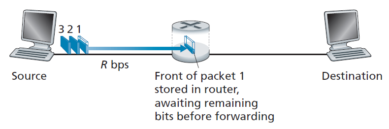
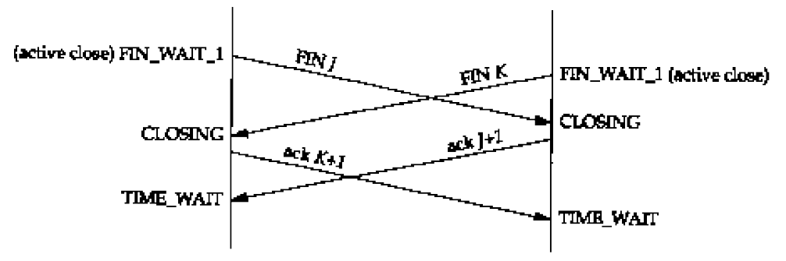

# 1. Введение

Компьютерная сеть состоит из **хостов**, также называемых **конечными системами (end system)**. Между собой хосты соединены **каналами связи (communication link)** и **свитчами (switch)**. Каналы связи имеют различную физическую природу: *радио*, *оптоволокно*, *металлические кабели*. Информация по каналам передаётся структурироваными фрагментами, называемыми **пакетами (packet)**. Коммутатор принимает пакеты через один канал и перенаправляет в другой. Последовательность каналов связи и коммутаторов, через которые прошел пакет при движении от одного хоста к другому, называется **путем (route, path)**. **Интернет** - это сеть компьютерных сетей, а также набор сервисов, предоствляемый распределенными приложениями. Интернет включает в себя различные физические сети и предоставляет всем подключенным устройствам унифицированную сетевую архитектуру. Конечные хосты получают доступ к интернету через **интернет провайдеров (ISP)**, упорядоченных в иерархию от локальных до интернациональных. Все участники сетевого общения реализуют протоколы. **Сетевой протокол** - набор правил, определяющих формат и порядок сообщений, которыми обмениваются два или более участника сетевого общения, а также действия, выполняемые при получении или отправке сообщения.  Интернет функционирует на основе набора протоколов: *TCP*, *UDP*, *ARP*, *ICMP*, *TELNET*, *FTP*, *IP*, *HTTP* и других. Общепринятое название данного набора - **семейство протоколов TCP/IP**.

Протоколы интернета имеют *стандарты*, описанные в общедоступных документах **Request for comments (RFC)** и разрабатываемые организациями *Internet Engineering Task Force (IETF)* и *Institute of Electrical and Electronics Engineers (IEEE)*.

## 1.1. Физические среды

Среда передачи - это физический путь, по которому сигнал движется от передатчика к приемнику. Среды передачи деляется на 2 типа:

+ **Guided medium** - сигнал заключен в пределах некоторой твёрдой среды и распространяется в заданном направлении;
+ **Unguided medium** - сигнал распространяется во всех направлениях.

Для построения физических каналов связи компьютерных сетей используются металлические провода, передающие электрические сигналы, световоды, передающие оптические сигналы, и радиоканалы:

+ **Витая пара** - два изолированных медных кабеля миллиметрового диаметра, скрученных вместе для уменьшения электромагнитных помех. Один провод может состоять из множества витых пар (например, кабель Ethernet). Является самым дешевым видом кабеля. Используется для построения локальных сетей внутри зданий и предоставляет скорость передачи данных `10 Мбит/c - 10 Гбит/c` в зависимости от диаметра и длины кабеля.
+ **Коаксильный кабель** - два соосных медных кабеля, распложенных один внутри другого. Используется в кабельном телевидении и интернете (требующем модем).
+ **Оптоволоконо** - нить из стекла либо пластика, способная распространять внутри себя без рассеивания импульсы света, представляющие биты информации. Невосприимчиво к электромагнитным помехам и обеспечивает низкое затухание сигнала. Обеспечивает скорость `50 Мбит/c - 40 Гбит/c` на расстояних в тысячи километров. Сопутствующее оборудование (передатчики, приёмники, свитчи) имеет высокую стоимость, поэтому в основном используется на магистральных линиях связи.
+ **Наземные радиоканалы** - построены на основе радиоволн, распространяющихся в пределах земной атмосферы и излучаемых наземными радиопередатчиками. Используются на коротких (несколько метров) расстояниях - наушники и прочая периферия, средних (сотни метров) - беспроводные точки доступа, дальних (десятки километров) - вышки сотовой связи.
+ **Спутниковые радиоканалы** - используются для связи расположенных на земле передатчика и приёмника радиоволн микроволнового диапазона через спутник, выполняющий роль репитера. Спутники связи обычно находятся на геостационарной (от 30 тыс. км) или околоземной орбите и позволяют предоставлять связь в районы, где не установлены наземные станции.

## 1.2. Сеть доступа

Первой сетью, к которой непосредственно подключается *клиентский* хост при обращении к некоторому интернет сервису (*серверный* хостом), является **сеть доступа (Access Network)**: домашняя сеть, сеть предприятия, мобильная сеть. Наиболее распространёнными типами сетей доступа являются:

+ **Digital Subscriber Line (DSL)** - использует существующую *телефонную линию*. Пользователь на своём конце устанавливает *DSL модем*, преобразующий цифровые данные в набор высокочастотных тонов, и *сплиттер*, разделяющий телефонные- и интернет-сигналы. На стороне провайдера устанавливается *мультиплексор (digital subscriber line access multiplexer, DSLAM)*, собирающий траффик от всех пользователей и перенаправляющий его либо в интернет (преобразуя обратно в цифру), либо в телефонную линию. Единовременно по телефонной линии могут передаваться телефонные сигналы (полоса 0-4 кГц), загружаемый (*downstream*) интернет-траффик (полоса 50 кГц - 1 МГц), отправляемый (*upstream*) интернет-траффик (полоса 4-50 кГц) - DSL-канал является *ассиметричным*. Различные стандарты DSL определяют скорости загрузки в пределах `24-52 Мбит/c` и скорости отправки - `3.5-16 Мбит/c`. Технология DSL используется на коротких расстояниях: `5-10 миль` от клиента до оборудования провайдера.


+ **Гибридная оптоволоконно-коаксиальная сеть (hybrid fiber coax, HFC)** - *оптоволокно* доходит до узлов на уровне района, с которым через *коаксиальные кабели* соединяются клиентские *модемы*. Провайдер также должен иметь у себя *мультиплексор (cable modem termination system, CMTS)*, собирающий траффик от всех пользователей. Данная сеть аналогично предоставляет *ассиметричный* доступ: `40 Мбит/c - 1.2 Гбит/c` скорость загрузки и `30-100 Мбит/с` скорость отправки. Особенностью данной сети является то, что клиенты разделяют общую среду передачи: каждый загружаемый пакет из узла попадёт ко всем клиентам. Следствием этого является разделение общей полосы пропускания канала, а также необходимость наличия протокола доступа к среде, обеспечивающего координацию всех передач и избежание их коллизий.


+ **Оптоволоконная сеть (fiber to home, FTH)** - *оптоволокно* приходит в дом клиента: у каждого клиента может быть свой собственный кабель до провайдера - *direct fiber*, либо несколько клиентов могут разделять один кабель через *сплиттер* - *active optical networks (AONs)* и *passive optical networks (PONs)*. При использовании несколькими клиентами единого оптоволокна до провайдера, каждый загружаемый пакет из сплиттера будет попадать ко всем клиентам. В данной сети клиентам и провайдеру необходимо устанавливать оборудование преобразующее оптические сигнали в электрические - *optical network terminator (ONT)* и *optical line terminator (OLT)*. Оптоволокно позволяет достись `гигабитной` скорости отправки/загрузки.


+ **Ethernet** - клиенты подсоединены к своему локальному предоставленному провайдером *коммутатору(ам) Ethernet* через *витую пару*, а сам коммутатор уже имеет выход в интернет. Ethernet предоставляет `гигабитную` скорость отправки/загрузки.


+ **WiFi** - клиенты по *радиоканалу* подсоединены к *точке доступа*, которая имеет выход в интернет (наиболее часто через Ethernet). Точка доступа способна покрыть зону радиусом в пару сотен метров. WiFi позволяет достичь скорость отправки/загрузки `свыше сотни Мбит/c`.


+ **Сотовые сети: 3G, 4G, 5G** - клиенты получают доступ в интернет, подключаясь по *радиоканалу* к *базовой станции* своего сотового оператора. Базовые станции покрывают до сотни километров в радиусе. Сотовые сети предоставляют скорость загрузки/отправки в `несколько десятков Мбит/c`.

## 1.3. Ядро сети

Ядро сети состоит из множества различных *каналов связи* и *свитчей (switch, коммутатор)*, соединящих хосты друг с другом. Существует 2 типа сетей: с **коммутацией пакетов (packet switching**) и **коммутацией каналов (circuit switching)**. В сетях с коммутацией каналов для пары взаимодействующих конечных систем устанавливается физическое соединение, для которого на всём протяжении его жизни *резервируются ресурсы сети* (например, *пропуская способность канала связи*). В сетях с коммутацией пакетов данные передаются независимыми структурированными фрагментами - пакетами, ресурсы для отправки которых выделяются по требованию.  

Интернет является сетью с коммутацией пакетов. Два основных типа свитча, используемых в его ядре - это **маршрутизатор (router)**, действующий на *сетевом* уровне, и **коммутатор (link-layer switch)**, действующий на *канальном* уровне. При передаче пакет использует **всю пропускную способность канала**, т.е. время $t$, затрачиваемое на передачу пакета размером $l$ по каналу с пропускной способностью $r$:

$$t = {\frac{l}{r}}$$

При получении пакета в одном канале свитч перенаправляет его в *другой* канал, используя для этого таблицу (*forwarding table*), соотносящую диапазоны адресов назначения, передающихся в заголовке каждого пакета, с его каналами. Большинство свитчей используют **store-and-forward transmission** во входном канале, т.е. пакет должен быть получен целиком, перед тем как он сможет быть записан в выходной канал.



Данная техника вводит дополнительную задержку (**queuing delay**). Рассмотрим заданный канал связи, содержащий $N$ сегментов с одинаковой пропускной способностью $r$, разделенных свитчами, каждый из которых выполняет только **store-and-forward transmission**. Время $t$, затрачиваемое на передачу пакета размером $l$ по данной цепочке:

$$t = N {\frac{l}{r}}$$

Если же по данной цепочке передаётся $P$ пакетов, то общее время $t$ будет:

$$t = (N + P - 1) {\frac{l}{r}} $$

Для каждого выходного канала у свитча есть *выходная очередь*, в которую помещаются пакеты, ожидающие своей записи. Нахождение пакета в очереди также вводит дополнительную задержку, а её переполнение приводит к отбрасыванию нового входящего либо одного из хранящихся пакетов - *потере пакетов*.

К сетям с коммутацией каналов относится, например, телефонная сеть. В них для каждого соединения резервируется постоянная и гарантированная часть пропускной способности канала - устанавливается выделенное соединение.


Соединение реализуется через **мультиплексирование с разделением по частоте (frequency-division multiplexing, FDM)** либо **мультиплексирование с разделением по времени (time-division multiplexing, TDM)**. В первом случае для каждого соединения выделяется своя собственная полоса заданной ширины (*bandwidth*) из диапазона частот канала. Во втором случае время делится на кадры, состоящие из фиксированного количества слотов, и каждое соединение получает свой слот в каждом кадре.


Коммутация пакетов позволяет достичь *большей производительности*, чем коммутация каналов.

## 1.4. Интернет как сеть сетей

Конечные хосты могут достичь друг друга благодаря тому, что интернет обладает связной иерархической структурой. Конечные хосты подсоединены к своим **сетям доступа**, которые подсоединены к **региональным** интернет-провайдерам, которые, в свою очередь подсоединены к **глобальным** интернет-провайдерам (**Tier 1 ISP**). На каждом стыке уровней осуществляются отношения заказчик-постащик, и клиент оплачивает доступ к предоставляемой сети пропорционально количеству сгенерированного им траффика. Клиентская сеть подсоединяется к сети провайдера через узлы коммутаторов пакетов, называемые **points of presense**. Клиентская сеть может быть одновременно подсоединена к нескольким сетям провайдеров - **multi-homing**. Две сети могут объединиться на безвозмездной основе - **peering**. Третьи стороны могут создавать узлы обмена информацией (**Internet Exchange Points, IXP**), через которые сети могут оказаться связаны друг с другом. Помимо интернет провайдеров **поставщики контента** - крупные корпорации наподобие Amazon, Microsoft, Google - могут создавать свои собственные закрытые сети и предоставлять к ним доступ на собственных условиях.


## 1.5. Задержка, потери, пропускная способность

При движении пакетов по сети в *каждом её узле* (хосте или коммутаторе пакетов) они успытывают несколько типов задержек:


+ **Processing Delay** - время, затрачиваемое на обработку заголовка пакета: чтение адресов отправления/назначения, вычисление контрольной суммы; на роутерах занимает `микросекунды`;
+ **Queuing Delay** - ожидание пакетом в очереди возможности его передачи в соответствующий канал связи; на практике занимает `от микросекунд до миллисекунд`;
+ **Transmission Delay** - время, затрачиваемое на запись всех битов пакета в канал связи; на практике занимает `от микросекунд до миллисекунд`;
+ **Propagation Delay** - время, необходимое на прохождение всех битов пакета по каналу связи и сохранение их в приёмнике; в частности определяется скоростью распространения сигналов в канале (порядки скорости света); в протяженных сетях на практике занимает `до миллисекунд`;

Все вместе они образуют **Total Nodal Delay**.

Пусть коммутатор пакетов обладает входной очередью с бесконечной вместимостью. Пусть $a$ - скорость, с которой пакеты пребывают в очередь, выражаемая в *пакетах/с*. Для простоты обозначим $L$ - длина приходящего пакета в *битах*. $R$ *бит/c* - скорость передачи, т.к. скорость, с которой пакет извлекается из очереди. Отношение $La/R$ называется **интенсивностью траффика**. Если $La/R > 1$, то это означает, что пакеты пребывают быстрее, чем удаётся их переслать - задержка нахождения в очереди в конечном счете станет бесконечной. *Интенсивность траффика никогда не должна больше 1!* Если же $La/R \le 1$, то задержка нахождения в очереди определяется природой траффика: периодические одиночные пакеты не будут испытывать задержек, а приходящая единовременно группа пакетов будет обладать существенной средней задержкой. В реальности время прихода пакета является случайной величиной, и задержка нахождения очереди зависит от интенсивности траффика экспоненциально:


Сумма всех задержек на всех узлах, расположенных по пути следования пакета, образует **End-to-End Delay**. В реальности входные очереди имеют ограниченную емкость, поэтому при их переполнении приходящие пакеты начинают отбрасываться - происходит **потеря пакетов**. Количество потерянных пакетов возрастает с увеличением интенсивности траффика.

**Мгновенная пропускная способность** - скорость в *бит/c*, с которой хост получает данные из канала связи. **Средняя пропускная способность** - скорость в *бит/c*, с которой были получены данные заданного размера, принимаемые в течение подсчитанного количества секунд: $Length/Time$. Пропускная способность всего пути, преодолеваемого пакетом, ограничена минимальной пропускной способностью среди всех его участков.

## 1.6. Уровни протоколов

Семейство протоколов *разделяется на уровни*, выполняющие свои собственные задачи и наслаивающиеся на более низкие уровни, расширяя их функционал дополнительными возможностями. Код, реализующий уровни набора протоколов, называется **стеком протоколов**. Основное назначение *каждого уровня данной системы* - это взаимодействие с *аналогичным уровнем другой системы*. Каждый уровень использует в своей работе интерфейс смежного нижнего уровня, который инкапсулирует в себе сложность всех остальных лежащих до основания уровней. При этом каждый уровень, в свою очередь, предоставляет интерфейс для более верхнего уровня. В процессе отправки данные спускаются сверху вниз по стеку протоколов, и каждый уровень, получая информацию от верхнего уровня, добавляет к ней свой управляющий заголовок и передаёт ниже. При приёме данные поднимаются снизу вверх, и каждый уровень получает информацию от нижнего уровня, извлекает и обрабатывает свой заголовок, а оставшиеся данные передаёт выше. Уровень протоколов может быть реализован в софте, железе или в них обоих: уровни, отвечающие за физическу среду, реализуются как в картах сетевого интерфейса (Ethernet, Wifi, Bluetooth), так и в их драйверах; уровни, предназначенные для явного использования в программе, реализуются в виде модулей операционной системы.

Семейство протоколов TCP/IP имеет следующие ярко выраженные уровня:

+ **Прикладной уровень** - функционирование сетевого приложения;
+ **Транспортный уровень** - сквозной канал взаимодействия приложений;
+ **Сетевой уровень** - доставка и маршрутизация данных;
+ **Канальный уровень** - сопряжение с физической средой;
+ **Физический уровень** - описание принципов передачи сигналов в данной среде.


Описание основных функций уровней протоколов TCP/IP:

+ **Физический уровень** описывает способ формирования сигнала, представляющего биты информации, его физические характеристики, требования к среде, приёмнику и передатчику.

+ **Канальный уровень** обеспечивает физическую передачу данных между хостами и состоит из *физического интерфейса (сетевой карты)*, соединённого с сетевыми коммуникациями, и его драйвера. Данный уровень решает задачи физической адресации (в противоположность логической адресации), топологии сети, линейной дисциплины (способ использования канала конечной системой), уведомления о неисправностях канала. Упаковывает получаемые с сетевого уровня данные в блоки, называемые **кадрами (frame)**, добавляя к ним заголовок, содержащий *физический адрес* устройства. Важной характеристикой данного уровня являтся *максимальный размер кадра* - *Maximum Transmission Unit (MTU)*. Протоколами канального уровня являются, например, **Ethernet**, **WiFi**, **Token Ring**, **FDDI**, **PPP**, **ISDN**. Протоколы **ARP** и **RARP** являются связующим звеном между канальным и сетевым уровнями и обеспечивают *трансляцию физических и логических адресов* друг в друга.

+ **Сетевой уровень** соединяет *различные хосты* в сети: определяет маршруты между конечными системами и обеспечивает их прохождение пакетами, предназначенными для этих систем. Построением оптимальных маршрутов через последовательности соединенных между собой сетей занимаются протоколы **RIP**, **EGP**, **BGP**, **OSPF**. *Маршрутизацию* сетевых пакетов, называемых **датаграммами (datagram)**, выполняет протокол **IP**, который и является основным протоколом данного уровня. Он также ответственен за сопряжение с канальным уровнем, а именно выполняет *фрагментацию/дефрагментацию* датаграмм, чтобы их размер не превышал *MTU*. Протокол **ICMP** собирает сервисную информацию о функционировании сети и уведомляет хосты о возникающих в ней неисправностях.

+ **Транспортный уровень** соединяет *заданные конечные точки на различных хостах* в сети: предоставляет сквозной канал для обмена сообщениями *конкретным приложениям, а не машинам в целом*. Он избавляет прикладной уровень от необходимости вникать в детали транспортировки данных и отвечает за надёжную и достоверную доставку, обслуживание соединений, обнаружение ошибок передачи, управление информационным потоком. Основными протоколами транспортного уровня являются:
    1. **User Datagram Protocol (UDP)** - предназначенный для *датаграммных сокетов* протокол, который реализует минимальные требования, предъявляемые к транспортному уровню: способен различать отдельные сервисы в рамках конечных хостов, для чего использует *номера портов*, а также может с помощью *контрольных сумм* обнаруживать (но не исправлять) ошибки, возникающие в отдельных пакетах;
    2. **Transmission Control Protocol (TCP)** - предназначен для *потоковых сокетов* и предоставляет гарантии надежности передачи пакетов между отдельными сервисами (использует *номера портов*), для чего устанавливает постоянные *соединения*, применяет *контрольные суммы* и *повторную отправку* недошедших пакетов. Также стремится поддерживать здоровое состояние сети, для чего следит за объемом отправляемого траффика и при необходимости его ограничивает. При этом старается использовать максимульно доступную долю пропускной способности канала, но следит за её справедливым распределением между всеми участниками.

  Пакет транспортного уровня называют **сегментом (segment)**.

+ *Прикладной уровень* идентифицирует и устанавливает наличие предполагаемых партнёров для связи, синхронизирует совместно работающиее программы, обеспечивает читаемость информации на различных системах, управляет сеансами взаимодействия. Данный уровень включает в себя широкий спектр протоколов:
    1. **DNS** - сервис разрешения имен, соотносящий логические адреса сервисом и их символьные названия;
    2. **SMTP**, **POP3**, **IMAP4** - протоколы электронной почты;
    3. **HTTP** - протокол сервиса *World Wide Web*, позволяющий формировать запросы, передавать содержимое интернет-страниц, выполнять аутентификацию и т.д.;
    4. **TELNET** - позволяет прозрачно работать в терминале на удалённом компьютере;
    5. **NFS** - протокол сетевой файловой системы, позволяющий прозрачно работать с файлами удаленного компьютера;
    6. **SNMP** - простой протокол управления сетью;
    7. **RPC** - протокол выполнения процедур на удалённом компьютере.

  Пакет прикладного уровня называют **сообщением (message)**.


# 2. Прикладной уровень

Существует 2 типа архитектуры сетевых приложений:

+ **Клиент-серверная архитектура** - существует 2 типа хостов: *клиент* и *сервер*. Сервер имеет *постоянный* и *общеизвестный адрес*, благодаря которому клиент может обратиться к нему с запросом, на который сервер даст ответ. Зачастую предполагается, что *сервер доступен в любое время*. Клиенты напрямую не взаимодействуют друг с другом - любое общение осуществляется с/через сервер. В нагруженных приложениях серверный софт располагается не на одной физической машине, а на десятках тысяч, объединённых в единый датацентр. Крупные корпорации (поисковики, интернет магазины, социальные сети) имеют десятки датацентров, объединённых в единую сеть.
+ **Peer-to-Peer (P2P), одноранговая архитектура** - все хосты являются *равнозначными участниками* общения - *peer*, а отдельных выделенных серверных мощностей, принадлежащих поставщику услуги, не существует. Данный подход является самомасштабируемым: каждый новый участник добавляет собственные вычислительные мощности в систему. Однако из-за их распределённой структуры перед P2P-приложениями особо остро встают вопросы безопасности, производительности и надёжности.

Конкретными участниками сетевого общения являются *процессы*. В контексте взаимодействия пары процессов процесс, инициировавший общение, называется *клиентским*, а процесс, ожидающий обращения, называется *серверным*. Процессы посылают и принимают сообщения из сети через программный интерфейс **сокетов (socket)**, реализуемый операционной системой. Сокеты являются посредниками между прикладным и транспортным уровнем хоста. Сокеты скрывают от приложения реализацию транспортного уровня, предоставляя только возможность выбора транспортного протокола и некоторых его параметров, например, размеры буферов и сегментов. Также сокеты позволяют указывать **IP-адрес**, представляющий конкретного хоста-адресата сообщения, и **номер порта**, представляющий конкретный процесс (*точнее, конкретный сокет*) на этом хосте.

> **Подробнее об интерфейсе сокетов смотреть в конспекте по Linux API.**


Транспортный уровень может предоставлять приложениям 4 различных типа гарантий:

+ *Надёжная доставка данных* - процесс может быть уверен, что если он записал информацию в сокет, то она будет получена процессом-адресатом в неизменном виде; является критичным требованием в приложениях электронной почты, передачи файлов, обслуживании финансов;
+ *Пропускная способность* - транспортный протокол может гарантировать, что приложению будет предоставлена возможность записывать и получать данные с определенной скоростью; приложения, для которых данное требование является критичным, называются *чувствительными к ширине канала*: интернет телефония, которой необходимо кодировать голос и видео с заданной частотой, различные приложения реального времени; приложения, на которых пропускная способность канала не оказывает особого влияния, называются *эластичными приложениями*;
+ *Тайминги* - приложение может быть уверено, что данные будут получены не позднее заданного промежутка времени; важно для приложений реального времени: телефония, онлайн игры;
+ *Безопасность* - приложение может быть уверено, что в момент нахождения в сети данные защищены от просмотра третьими лицами (*sniffing*), а получаемая информация является подлинной (*spoofing*).

Современные основные транспортные протоколы - TCP и UDP - не могут предоставить гарантии пропускной способности и таймингов.


## 2.1. Web и HTTP

**World Wide Web** - сетевое приложение c клиент-серверной архитектурой, позволяющее пользователям по запросу загружать либо самим предоставлять для всеобщего обозрения гипертекстовые (текст со ссылками) документы, называемые *web-страницами*. Приложение Web состоит из языка разметки **HTML (Hypertext Markup Language)**, протокола взаимодействия **HTTP (Hypertext Transfer Protocol)**, описывающего формат и принципы передачи сообщений, веб-браузера, реализующего клиентскую часть, и веб-сервера.

*Web-страница* - это документ, состоящий из *объектов*. *Объект* - это некоторый файл (текст, мультимедиа, скрипт), доступный по *URL-ссылке*. *URL-ссылка* на объект состоит из *имени хоста*, хранящего объект, и *имени самого объекта*: `www.site.com/category/img.gif`. Имя хоста **не чувствительно** к регистру, остальная часть ссылки - **чувствительна**. Web-страница включает в себя базовый HTML-файл и дополнительные объекты, на которые присутствуют ссылки в его тексте.  Клиент может запросить web-страницу по её ссылке, и тогда web-сервер вернёт ему полный набор объектов. *HTTP использует TCP* в качестве транспорта. При запросе клиент сначала устанавливает TCP-соединение с сервером, а затем по нему отправляет своё сообщение и получает ответ. Сервер отвечает клиенту, не сохраняя о нём никакой информации - HTTP является **stateless-протоколом**. Оригинальная версия протокола называется HTTP/1.0 и описана в **RFC-1945**, а самой распространенной на 2020 год версией является HTTP/1.1, описанная в **RFC-7230**. Новыми версиями являются HTTP/2 (**RFC-7540**) и HTTP/3.

При общении пары запрос-ответ могут посылаться по единственному долговременному TCP-соединению - *persistent connection*. Либо для каждой пары запрос-ответ будет существовать своё собственное отдельные соединение - *non-persistent connection*. В контексте получения web-страницы это означает, что для загрузки каждого связанного объекта будет происходить установка-разрыв нового соединения, а сам объект будет отправляться своим собственным http-ответом - загрузка каждого объекта будет занимать 2 **round-trip time** (занимает tcp-рукопожатие syn-ack) + время на передачу самого файла. *HTTP/1.0* использует *кратковременные* соединения, а *HTTP/1.1* добавляет и использует *по умолчанию долговременные* соединения, которые позволяют пересылать целые последовательности запросов и последовательности ответов на них (*back-to-back*) и закрываются сервером спустя *период бездействия*.

### 2.1.1. Формат HTTP-сообщений

Http-сообщения представляют собой читаемый ASCII-текст, разделенный на строки, и передаваемые в дополнение к нему бинарные данные. Существует 2 типа http-сообщений: *запрос* и *ответ*.

#### 2.1.1.1. HTTP-запрос

Http-запрос имеет следующий формат:


Пример http-запроса:

```http
GET /somedir/page.html HTTP/1.1
Host: www.someschool.edu
Connection: close
User-agent: Mozilla/5.0
Accept-language: fr
```

Первой строкой является **строка запроса**, содержащая 3 поля:

+ название *http-метода*, образующего запрос;
+ *URL объекта*, к которому происходит обращение;
+ используемая *версия протокола http*.

За ней могут следовать несколько **строк заголовков**, содержащих заданные названия переменных (рассматриваются далее) и их значений. В конце, отделенные пустой строкой, могут идти дополнительные пользовательские (бинарные) данные, прикрепленные к запросу - **тело запроса/сущности/сообщения**. Стандартом не накладываются ограничения ни на длину строк, ни на длину данных.

#### 2.1.1.2. HTTP-ответ

Http-ответ имеет следующий формат:


Пример http-ответа:

```http
HTTP/1.1 200 OK
Connection: close
Date: Mon, 20 Jan 2020 10:00:00 GMT
Server: Apache/2.2.3 (CentOS)
Last-Modified: Mon, 20 Jan 2020 10:00:00 GMT
Content-Length: 6821
Content-Type: text/html

...data...
```

Ответ имеет сходный формат: **строка статуса**, опциональные **строки заголовков**, опциональные прикрепленные возвращаемые (бинарные) данные - **тело ответа/сущности/сообщения**. Строка статуса описывает результат выполнения операции сервером и содержит следующие 3 поля:

+ используемая *версия протокола http*;
+ *числовой код* результата операции: успех или тип ошибки;
+ *словесная расшифровка кода* (рассматривается далее).

#### 2.1.1.3. HTTP-методы

Название http-метода **чувствительно** к регистру. Существуют следующие http-методы:

+ `GET` - получение указанного объекта; не содержит тело запроса;
+ `HEAD` - аналог `GET`, возвращающий только http-заголовки ответа без тела самого объекта;
+ `POST` - запрос на выполнение определённых действий с содержащимся в теле объектом (например, создание соответствующей записи в базе данных);
+ `PUT` - *полная* замена текущего представления объекта новым содержищимся в теле содержимым;
+ `PATCH` - *частичная* замена текущего представления объекта новым содержищимся в теле содержимым;
+ `DELETE` - удаление указанного объекта, хранящегося на сервере; обычно не содержит тела запроса;
+ `CONNECT` - создание туннеля до указанного хоста; не содержит тела запроса;
+ `OPTIONS` - запрос у сервера его параметров взаимодействия (будут возвращены в соответствующих заголовках);
+ `TRACE` - заставляет конечного адресата отразить сообщение обратно отправителю, предоставляя тем самым механизм отладки, позволяющий увидеть, в каком виде запросы достигают сервера; не содержит тела запроса.

#### 2.1.1.4. Строки заголовков

Заголовки http по контексту применения делятся на *используемые в запросах*, *используемые в ответах*, заголовки *общего назначения*.
По воздействию на промежуточные узлы пути, преодолеваемого пакетом, заголовки делятся на **еnd-to-end** и **hop-by-hop**. *End-to-end* заголовки должны доставляться *конечному адресату* пакета, а промежуточные узлы должны *оставлять их без изменений* и при необходимости *сохранять в кэшах*. *Hop-by-hop* заголовки распространяются только на *текущий участок пути* и должны *отбрасываться или модифицироваться* промежуточными узлами, а также *игнорироваться кэшами*. Заголовки http **НЕ чувствительны** к регистру.

Существуют следующие категории заголовков:

+ **Аутентификация:**
  + `WWW-Authenticate` - способ аутентификации, который должен использоваться для доступа к защищенному ресурсу;
  + `Authorization` - учетные данные (*credentials*) для доступа к защищенному ресурсу;
  + `Proxy-Authenticate` - способ аутентификации, который должен использоваться для доступа к промежуточному прокси-серверу;
  + `Proxy-Authorization` - учетные данные для доступа к промежуточному прокси-серверу;
+ **Кэширование:**
  + `Age` - количество секунд, которое объект находился в кэше прокси-сервера;
  + `Cache-Control` - директивы, управляющие кешированием сообщения;
  + `Expires` - время, после которого сообщение считается просроченным;
+ **Условные:**
  + `Last-Modified` - время последней модификации объекта на сервере;
  + `ETag` - идентификатор, представляющий версию объекта на сервере;
  + `If-Match` - применяет запрос, только если объект на сервере имеет `ETag` из указанных;
  + `If-None-Match` - применяет запрос, только если объект на сервере НЕ имеет `ETag` из указанных;
  + `If-Modified-Since` - применяет запрос, только если объект на сервере изменялся после указанного времени;
  + `If-Unmodified-Since` - применяет запрос, только если объект на сервере НЕ изменялся после указанного времени;
+ **Соединение:**
  + `Connection` - управляет закрытием соединения после завершения транзакции;
  + `Keep-Alive` - определяет, насколько долго может существовать постоянное соединение;
+ **Согласование содержимого:**
  + `Accept` - предпочтительные для клиента *MIME-типы* получаемых от сервера объектов;
  + `Accept-Encoding` - распознаваемые клиентом алгоритмы сжатия или шифрования, которые могут применяться к получаемым от сервера объектам;
  + `Accept-Language` - предпочтительные для клиента язык и локаль запрашиваемого объекта;
+ **Cookies:**
  + `Set-Cookie` - http-cookies, отправляемые клиенту от сервера;
  + `Cookie` - предварительно полученные http-cookies, отправляемые серверу от клиента;
+ **Управление**:
  + `Expect` - логика работы, которой, как ожидает клиент, должен обладать сервер, чтобы быть в состоянии успешно выполнить его запрос;
  + `Max-Forwards` - максимальное количество промежуточных узлов, которые запрос `TRACE` может преодолеть на своём пути к конечному адресату;
+ **Загрузки:**
  + `Content-Disposition` - определяет, должен ли получаемый от сервера объект быть частью отображаемой браузером страницы, либо он должен загружаться отдельно через диалоговое окно "Save As";
+ **Описание содержимого:**
  + `Content-Length` - размер пересылаемого объекта в байтах;
  + `Content-Type` - *MIME-тип* пересылаемого объекта;
  + `Content-Encoding` - алгоритмы сжатия или шифрования, примененные к отправленному сервером объекту;
  + `Content-Language` - язык и локаль отправленного сервером ресурса;
  + `Content-Location` - URL с расположением отправленного сервером ресурса;
+ **Проксирование:**
  + `Forwarded` - изначальные адреса хостов, добавленные в сообщение промежуточными прокси-серверами, чтобы сохранить их от перезаписи;
  + `Via` - адреса промежуточных прокси-серверов, добавленные ими в сообщение;
+ **Перенаправление:**
  + `Location` - URL страницы, на который должен перейти клиент;
  + `Refresh` - предписание клиенту обновить страницу или перейти на указанную;
+ **Контекст запроса:**
  + `From` - email клиента для связи с ним;
  + `Host` - имя/адрес хоста сервера, к которому обращается клиент;
  + `Referer` - URL страницы, с которой было выполнено перенаправление на текущую;
  + `Referrer-Policy` - определяет, в каких случаях и в каком объёме заполняется заголовок `Referer`;
  + `User-Agent` - информация о софте - *юзер-агент* (браузер, утилита curl и т.д.) - клиента;
+ **Контекст ответа:**
  + `Allow` - список http-методов, поддерживаемых сервером;
  + `Server` - информация о софте сервера;
+ **Запросы с диапазоном:**
  + `Accept-Ranges` - определяет, поддерживает ли сервер запросы с диапазоном на частичную загрузку объектов;
  + `Range` - определяет запрашиваемый диапазон байт объекта;
  + `If-Range` - применяет частичный запрос, только если объект не изменялся с указанного времени, либо имеет указанный `ETag`;
  + `Content-Range` - определяет возвращаемый диапазон байт объекта;
+ **Безопасность:**
  + `Content-Security-Policy` - директивы, описывающие источники, с которых может загружаться содержимое данной страницы;
  + `Strict-Transport-Security` - предписание клиенту использовать HTTPS вместо HTTP для доступа к данному сайту;
  + `Upgrade-Insecure-Requests` - выражает готовность клиента использовать защищенную версию сайта через HTTPS;
+ **Другие:**
  + `Alt-Svc` - альтернативные адреса/имена, по которым можно обращаться к данному ресурсу;
  + `Alt-Used` - уведомление серверу, об используемом клиентом альтернативном ресурсе;
  + `Date` - время создания сообщения;
  + `Retry-After` - указание клиенту, через какое время он может попытаться повторить свой запрос;
  
#### 2.1.1.5. Коды HTTP-ответов

Существуют следующие категории кодов результатов выполнения http-методов:

+ `1xx` : *Информационные* - запрос распознан сервером, и его обработка выполняется;
  + `100 Continue` - клиент может продолжать отправку сообщений;
  + `101 Switching Protocols` - сервер меняет протокол взаимодействия с клиентом (например, с HTTP на HTTPS);
+ `2xx` : *Успех* - запрос распознан сервером и обработан;
  + `200 OK` - запрос выполнен;
  + `201 Created` - объект создан на сервере;
  + `202 Accepted` - запрос принят, но его обработка еще не завершена;
  + `203 Non-Authoritative Information` - исходный успешный ответ сервера был преобразован промежуточным прокси-сервером;
  + `204 No Content` - запрос выполнен, но у сервера нету новых дополнительных данных для отправки клиенту;
  + `205 Reset Content` - запрос выполнен, но сервер просит клиент сбросить в исходное состояние документ, вызвавший отправку запроса;
  + `206 Partial Content` - сервер посылает запрошенную в частичном запросе порцию данных;
+ `3xx` : *Перенаправление* - запрос распознан сервером, но со стороны клиента требуются дополнительные действия, чтобы он смог быть обработан;
  + `300 Multiple Choices` - на запрос существует несколько вариантов ответов;
  + `301 Moved Permanently` - запрошенный объект был *окончательно* перемещен и теперь доступен по новой URL;
  + `302 Found` - запрошенный объект был *временно* перемещен и теперь доступен по новой URL;
  + `303 See Other` - сервер переводит клиента на новую URL, по которой доступен *косвенный* ответ на изначальный запрос;
  + `304 Not Modified` - связанный с запросом объект не изменил бы своё представление при выполнении запроса;
  + `307 Temporary Redirect` - запрошенный объект был *временно* перемещен и теперь доступен по новой URL, причем новый запрос к нему *должен* использовать *тот же http-метод и тело сущности*;
  + `308 Permanent Redirect` - запрошенный объект был *окончательно* перемещен и теперь доступен по новой URL, причем новый запрос к нему *должен* использовать *тот же http-метод и тело сущности*;
+ `4xx` : *Клиентская ошибка* - запрос, составленный клиентом, является недействительным;
  + `400 Bad Request` - запрос поврежден (например, имеет неверный синтаксис);
  + `401 Unauthorized` - клиент не предоставил учетные данные для доступа к ресурсу;
  + `403 Forbidden` - несмотря на предоставленные учетные данные, у клиента нет прав доступа к ресурсу;
  + `404 Not Found` - запрошенный ресурс не найден;
  + `405 Method Not Allowed` - запрошенный ресурс не допускает использования данного метода;
  + `406 Not Acceptable` - сервер не может предоставить поддерживаемое клиентом представление ресурса;
  + `407 Proxy Authentication Required` - клиент не предоставил учетные данные для промежуточного прокси-сервера;
  + `408 Request Timeout` - сервер не получил запрос от клиента в течение определенного промежутка времени и теперь закрывает соединение;
  + `409 Conflict` - запрос несовместим с текущим состоянием ресурса;
  + `410 Gone` - запрошенный ресурс больше не доступен на сервере, а внешние ссылки на него должны быть удалены;
  + `411 Length Required` - запрос не содержит требуемый заголовок `Content-Length`;
  + `412 Precondition Failed` - условие запроса не выполнено;
  + `413 Content Too Large` - запрошенный ресурс не может быть возвращен, т.к. его размеры превышает установленные сервером пределы;
  + `414 URI Too Long` - URL из клиентского запроса имеет длину, превышающую максимально распознаваемую сервером;
  + `415 Unsupported Media Type` - содержимое тела клиентского запроса имеет неподдерживаемый сервером тип;
  + `416 Range Not Satisfiable` - неверный диапазон байт в запросе на частичную загрузку;
  + `417 Expectation Failed` - сервер не обладает ожидаемой клиентом и указанной в заголовке `Expect` логикой работы;
  + `421 Misdirected Request` - клиент перепутал адресата запроса и ошибочно отправил его серверу, который не может дать на него ответ;
  + `422 Unprocessable Content` - тело клиентского запроса верно распознано сервером, но он не может его обработать;
  + `428 Precondition Required` - сервер требует, чтобы для доступа к данному ресурсу клиент использовал условный запрос;
  + `429 Too Many Requests` - клиент послал слишком много запросов за последнее время;
+ `5xx` : *Серверная ошибка* - сервер не смог выполнить верно составленный запрос;
  + `500 Internal Server Error` - при обработке запроса произошла ошибка;
  + `501 Not Implemented` - сервер не обладает функционалом, необходимым для выполнения запроса;
  + `502 Bad Gateway` - промежуточный сервер получил недопустимый ответ от сервера, к которому он обратился;
  + `503 Service Unavailable` - в настоящий момент сервер не может выполнить запрос;
  + `504 Gateway Timeout` - промежуточный сервер не получил в течение заданного времени ответ от сервера, к которому он обратился;
  + `505 HTTP Version Not Supported` - используемая в запросе версия HTTP не поддерживается сервером.

### 2.1.2. Cookies

Хотя http является stateless-протоколом, и веб-сервера не хранят дополнительную информацию об активных сессиях, сервисам, работающим на основе http, зачастую требуется идентифицировать, различать и отслеживать своих клиентов. Для этих целей они используют *cookies* - небольшие уникальные порции данных, выдаваемые сервером каждому клиенту, чтобы он в дальнейшем использовал их для маркировки собственных запросов. Cookies передаются в заголовках `Set-Cookie` ответа и `Cookie` запроса, и на клиентской стороне сохраняются и обрабатываются браузером (или соответствующим юзер-агентом), а на серверной стороне имеют связанные с ними сущности в используемом хранилище - зачастую в базе данных.


### 2.1.3. Web-кэши

**Веб-кеш**, называемый также **прокси-сервером** - это узел сети, поддерживающий протокол http и отвечающий на клиентские запросы от имени оригинального сервера. Веб-кеш содержит в своем хранилище копии всех недавно запрошенных и прошедших через него объектов. Браузер клиента может быть сконфигурирован таким образом, что все запросы сначала будут попадать на прокси-сервер, и при отсутствии на нем требуемых документов, он будет перенаправлять их исходному серверу, получать от него ответ, запоминать у себя и пересылать клиенту.


Зачастую веб-прокси устанавливаются интернет провайдером, и существует основных 2 причины их использования в интернете:

+ веб-кеш может существенно уменьшить время получения ответа на http-запрос, если ширина канала между ним и клиентом больше таковой между исходным сервером и клиентом; то же самое относится к длине пути и сумме всех задержек на промежуточных узлах;
+ веб-кеш существенно снижает нагрузку на канал до исходного сервера, повышая тем самым производительность других сетевых приложений.


Веб-прокси используются сетях распространения контента - **Content Distribution Network (CDN)**. Такие сети содержат множество географически распределенных прокси-серверов, к которым подключаются местные сети доступа, что позволяет разгрузить магистральные каналы и уменьшить время ожидания. CDN могут быть *разделяемыми*, т.е. управляться сторонней компанией и обслуживать траффик всех её абонентских компаний - Akamai, Limelight, либо *эксклюзивно* использоваться некоторой компанией для её собственных нужд - например, Google, Netflix.

Проблема, к которой приводит использование прокси-серверов - копии документов, хранящиеся в кешах, могут протухать (*stale*), т.е. долгое время оставаться без изменений, хотя объект на исходном сервере уже был обновлен. Для проверки актуальности запрашиваемого клиентом документа прокси-кеш выполняет **условные GET-запросы** исходному серверу, содержащие заголовки `If-Match` или `If-Modified-Since` (и подобные) и используемые для анализа заголовков `ETag` или `Last-Modified` хранящегося объекта.

### 2.1.4. HTTP/2

HTTP/2 (2015) - это развитие прошлой версии протокола, появившейся в 1997 году, которое добавило мультиплексирование запросов в одном TCP-соединении, приоритезацию запросов и эффективное сжатие http-заголовков. HTTP/2 *НЕ изменяет* методы, статусы и заголовки.

Хотя HTTP/1.1 уже использовал долговременное TCP-соединение для загрузки всего содержимого веб-страницы, на свет вышла проблема блокировки начала очереди **(Head of Line blocking, HOL blocking)**, заключающаяся в том, что долгая загрузка тяжелого объекта в некотором месте страницы, значительно откладывала загрузку всех следующих за ним объектов. Браузеры обычно решали эту проблему параллельной загрузкой всех объектов страницы поверх нескольких TCP-соединенияй. Однако такой подход в некоторой степени обманывал *механизм контроля за перегрузкой сети* протокола TCP: данный механизм выделяет каждому соединению равную долю ширины канала, а браузер, обладая несколькими соединениями, присваивал себе сразу несколько порций и получал большую пропускную способность, чем приложения с одним соединением. Одна из основных целей создания HTTP/2 закличалась в отказе от множества параллельных соединений, загружающих единственную страницу, и решении проблемы блокировки с использованием одного соединения, что позволило бы механизму контроля за перегрузкой работать так, как он был задуман.

Самое важное улучшение HTTP/2 - это разбиение сообщений на фрагменты, называемые *кадрами*, выполняемое специальным подуровнем HTTP (*framing layer*). При отправке веб-страницы кадры всех её объектов чередуются между собой по круговой cхеме (сначала первые кадры всех объектов, затем все вторые и т.д.) и передаются по очереди поверх одного соединения. Данная техника позволяет создать несколько независимых логических потоков данных и одновременно загружать множество элементов страницы, что снижает *ощущаемую пользователем* задержку. Фрагментирующий подуровень также двоично кодирует все кадры, уменьшая при этом их размер.

При отправке запросов клиент может назначить каждому из них *приоритет* от `1` до `256`, а также перечислить *идентификаторы сообщений, от которых зависит* данное. Сервер будет использовать эту информацию, чтобы в первую очередь отправлять наиболее приоритетные ответы.

Также сервер, проанализировав запрошенную у него базовую html-страницу, может сразу послать серию ответов со всеми содержащимися на странице объектами до того, как получит от клиента явные запросы на них. Данная техника называется *server pushing* и убирает задержки, вызванные ожиданием дополнительных запросов, дополнительно ускоряя загрузку страницы.

### 2.1.5. HTTP/3

HTTP/3 в качестве транспорта использует **QUIC (Quick UDP Internet Connections)** - прикладной протокол, работающий поверх UDP и самостоятельно реализующий необходимые ему функции и учитывающий особенности реализации веб-приложений:

+ устанавливает собственное логическое *соединение*, дополнительно комбинируя в его *рукопожатии* аутентификацию и шифрование, что позволит отказаться от отдельного *TLS-рукопожатия* и обмена лишними сервисными пакетами;
+ предполагает создание в рамках *единственного соединения* множества параллельных надежных двухсторонних *потоков* данных, заменяющих собой несколько физически различных TCP-соединений и позволяющих независимо загружать различные элементы страницы;
+ использует аналогичные TCP механизмы обнаружения потерь пакетов и *контроля за перегрузкой сети* на основе *подтверждений* и *окон*, что позволит справедливо распределять траффик в канале между всеми участниками, использующими *сходный механизм контроля потока* - QUIC дружит с TCP;

Также QUIC уже содержит в своём составе функции HTTP/2, что способствует упрощению логики HTTP/3.


## 2.2. Электронная почта

Электронная почта является одним из самых используемых сетевых приложений со времен появления интернета. Ключевыми компонентами электронной почты являются **юзер-агенты**, **почтовые сервера** и протокол **SMTP (Simple Mail Transfer Protocol)**.

*Юзер-агенты* реализуют клиентский функционал и позволяют создавать, сохранять, посылать, скачивать и читать сообщения. Примерами юзер-агентов являются Microsoft Outlook, Mozilla Thunderbird, веб-версия или приложение Gmail.

*Почтовые сервера* образуют ядро инфраструктуры электронной почты. Каждый пользователь имеет **почтовый ящик** на почтовом сервере, хранящий и управляющий всеми посылаемыми или получаемыми клиентом сообщениями. При отправке пользователем сообщения его юзер-агент сначала посылает созданное сообщение на почтовый сервер отправителя, где оно сохраняется в почтовом ящике, а затем попадает в **исходящую очередь сообщений** сервера. Из головы очереди сообщение пересылается на почтовый сервер получателя - для этого может потребоваться несколько попыток, если получатель по какой-то причине недоступен. Когда получатель захочет проверить свой почтовый ящик, то его юзер-агент подключится к почтовому серверу получателя и скачает запрошенные письма.

*SMTP* является главным протоколом прикладного уровня для электронной почты и применяется для *пересылки сообщений между почтовыми серверами*. На каждом почтовом сервере имеются *клиентская* и *серверная* реализации SMTP: сервер-отправитель выступает в роли клиента, а сервер-получатель - в роли сервера. SMTP является **push-протоколом**, т.к. он реализует только операцию отправки сообщения.

Для загрузки сообщения на почтовый сервер также может использоваться протокол SMTP, но в веб юзер-агентах обычно используется HTTP. Для скачивания сообщения с почтового сервера в веб юзер-агент используется HTTP, а в десктопное приложение почтовый-клиент (например, Microsoft Outlook) - **Internet Mail Access Protocol (IMAP)**.


### 2.2.1. SMTP

SMTP является старым *текстовым протоколом*: первый стандарт принят еще в 1982 году, современная же версия описывается в **RFC-5321** (2008 год).  По этой причине он тянет некоторые исторические ограничения: например, *заголовки и тело* сообщения должны представлять из себя *7-битный ASCII-текст*, поэтому все прикрепленные двоичные медиа должны быть соответствующим образом перекодированы. Для обеспечения надёжного транспорта SMTP **применяет TCP** и занимает **25 порт**. SMTP обычно не использует промежуточные сервера: TCP-соединение устанавливается напрямую между серверами отправителя и получателя. Если в настоящий момент установка соединения невозможна, то попытка повторяется позднее (ожидание до 30 мин). После установления соединения клиентский сервер посылает последовательность **команд**, представляющих его самого, описывающих отправителя и получателя, а также текст сообщения - выполняет *рукопожатие*.

Команды SMTP:

1. `HELO` - клиентский сервер представляет себя;
2. `MAIL FROM` - адрес электронной почты пользователя-отправителя;
3. `RCPT TO` - адрес электронной почты пользователя-получателя;
4. `DATA` - начало отправки текста сообщения; в течение одного сеанса можно передать сразу несколько сообщений - каждому должна предшествовать данная команда;
5. `CRLF.CRLF` - новая строка с точкой, обозначающая конец отправки текста сообщения; если передаётся несколько сообщений, то за каждым должна следовать данная последовательность;
6. `QUIT` - клиентский сервер желает закончить сеанс и закрыть соединение.

Отправка каждой команды должна сопровождаться получением ответа от сервера-получателя, после чего отправитель может послать новую команду:

```text
S: 220 hamburger.edu
C: HELO crepes.fr
S: 250 Hello crepes.fr, pleased to meet you
C: MAIL FROM: <alice@crepes.fr>
S: 250 alice@crepes.fr ... Sender ok
C: RCPT TO: <bob@hamburger.edu>
S: 250 bob@hamburger.edu ... Recipient ok
C: DATA
S: 354 Enter mail, end with ”.” on a line by itself
C: Do you like ketchup?
C: How about pickles?
C: .
S: 250 Message accepted for delivery
C: QUIT
S: 221 hamburger.edu closing connection
```

Сообщение состоит из полей **заголовков** и **тела**, отделенных друг от друга **пустой строкой** `CRLF`. Каждое сообщение должно иметь заголовки `From` и `To`, описывающие адреса электронной почты отправителя и получателя. Также могут присутствовать дополнительные заголовки, например: `Subject` - тема сообщения, `Cc` - *carbon copy*, получатели копии сообщения. Заголовки описываются в **RFC-5322**.

```text
From: alice@crepes.fr
To: bob@hamburger.edu
Subject: Searching for the meaning of life.

Hello there!
```

## 2.3. Система доменных имён DNS

Хосты в сети обладают двумя типами идентификаторов: **имя хоста** - словесный псевдоним, удобный для запоминания и используемый людьми; **ip-адрес** - числовой идентификатор фиксированной длины (*4 байта* либо *16 байт*), позволяющий определить местоположение хоста в сети и используемый машинами и софтом. Для преобразования имен хостов в адреса (*и наоборот*) используется **Domain Name System (DNS)**. DNS - это *распределённая* по иерархии **DNS-серверов** *база данных*, а также *протокол прикладного уровня*, позволяющий хосту сделать к ней запрос. Наиболее распространенной реализацией системы DNS является пакет **Berkeley Internet Name Domain (BIND)** для *Unix-машин*, содержащий в себе серверную часть - демон **named**, и клиентскую часть - так называемый *resolver*, библиотека **libresolv**. Для транспорта DNS **использует UDP** и занимает **53 порт**. **TCP** *может использоваться между клиентом и сервером*, если ответ DNS-сервера не поместился в UDP-сегмент; между собой *сервера* синхронизируют данные по TCP (вследствие большого объема данных). Об

Когда пользовательскому приложению, например браузеру, требуется определить ip-адрес удаленного хоста по его имени, оно обращается к resolver-у через заданный интерфейс - например, API Linux `getaddrinfo()`/`getnameinfo()`. Resolver делает запрос, содержащий интересующее имя хоста, к dns-серверу, расположенному по указанному пользователем (например, в настройках ОС) публично известному ip-адресу. В случае успеха *через некоторое время* resolver получит от сервера ответ, содержащий требуемый ip-адрес хоста. *Resolver* является *частью клиентского приложения*, а НЕ частью ядра операционной системы.

Помимо преобразования имен хостов DNS также предоставляет следующие функции:

+ **Host aliasing** - хост может иметь псевдонимы для своего основного имени (называется *каноническим*); DNS позволяет получать каноническое имя хоста по любому его псевдониму; например, `enterprise.com` - псевдоним, а `relay1.west-coast.enterprise.com` - каноническое имя;
+ **Mail server aliasing** - DNS позволяет получить каноническое имя *почтового сервера* по любому его псевдониму; например, для почтового адреса `bob@yahoo.com`, использующего псевдоним `yahoo.com`, каноническим именем будет `relay1.west-coast.yahoo.com`;
+ **Распределение нагрузки** - DNS-сервер способен ставить в соответствие одному имени хоста несколько ip-адресов и возвращать в каждом ответе один некоторый адрес из набора; например, данный подход может использоваться для распределения трафика по нескольким копиям исходного веб-сервера.

Послать запрос к DNS-серверу можно с помощью утилиты `nslookup`. Регистрация собственного доменного имени и добавление его на DNS-сервера осуществляется коммерческими организациями, называемыми *регистраторами*, которые были аккредитованны *Internet Corporation for Assigned Names and Numbers (ICANN)*: клиент предоставляет адреса и имена хостов своих *авторитативных* DNS-серверов, а регистратор обеспечивает их добавление на *DNS-сервера верхнего уровня*. DNS описывается в **RFC-1034** и **RFC-1035**.

### 2.3.1. Иерархия имен

Все имена в пространстве имен DNS упорядочены в иерархическую структуру:


Каждый узел структуры представляет собой *буквенную метку*, длиной *до 63 символов*. *Корнем* является узел не имеющий названия. **Доменным именем** некоторого узла называется список меток от данного узла до корня, разделенных точкой. Доменное имя, заканчивающееся точкой, называется *абсолютным доменным именем* или *полным доменным именем* **(fully qualified domain name, FQDN)**, например `sun.tuc.noao.edu.`. Любое **неполное** доменное имя **дополняется до FQDN**.

Домены верхнего уровня делятся на 3 группы:

+ `arpa` - специальный домен, используемый для разрешения ip-адресов в имена хостов;
+ *Домены организаций* - трёхсимвольные имена: `net`, `org` и т.д.;
+ *Географические домены* - двухсимвольные коды стран из ISO 3166: `en`, `fr` и т.д.

**Зона** - это отдельно администрируемое поддерево исходной структуры; обычно это домен второго уровня. Организация, которой делегированы полномочия на управление зоной, предоставляет для неё несколько независимых *серверов имен* (DNS-серверов), из которых один является *главным*, а остальные - *второстепенными*. Избыточность количества сервером обеспечивает отказоусточивость системы. Второстепенные сервера запрашивают и получают информацию от главного - данный процесс называется **передача зоны (zone transfer)**.

### 2.3.2. Распределенная база данных

Ни один DNS-сервер не содержит полную базу отображений между именами и ip-адресами, вместо этого они также организованы в иерархическую структуру:

+ **Корневой DNS-сервер** - хранит и предоставляет ip-адреса *DNS-серверов верхнего уровня*, каждый из которых отвечает за собственное множество имен - *домен*; на 2020 год по всему миру существовало 1000 корневых серверов, являющихся копиями исходных 13 серверов, каждый из которых управлялся своей собственной организацией, а за их общую координацию отвечала *Internet Assigned Numbers Authority*; данные серверы имеют *общеизвестные* ip-адреса;
+ **DNS-сервер верхнего уровня (Top Level Domain, TLD)** - хранят и предоставляют ip-адреса *авторитативных DNS-серверов* из собственного домена, выполняющих преобразование имени хоста в его адрес; управлением серверами в каждом домене осуществляет собственная организация, например, Verisign Global Registry Services - в *com*, Educause - в *edu*;
+ **Авторитативный (authoritative) DNS-сервер** - хранят и предоставляют ip-адреса конечных хостов; любая организация, которая хочет иметь публично доступные по имени хосты, должна внести записи с соответствующим отображением в таблицу DNS-сервера данного типа; организация может иметь собственный авторитативный DNS-сервер (так поступают крупные корпорации, например Google) либо платить третьей стороне за возможность размещать свои записи на её сервере.

В дополнение к описанным также существуют **локальные DNS-сервера**, располагающиеся географически недалеко от конечного пользователя (расстояние порядка нескольких шлюзов) и снижающие нагрузку на сервера во главе иерархии. Локальные сервера распределены по всему миру и зачастую управляются региональными интернет-провайдерами. При подключении клиента к сети провайдера, тот сообщает ему (например, по протоколу *DHCP*) адрес подходящего локального сервера - *DNS-сервер по умолчанию*.


Когда конечному хосту необходимо узнать ip-адрес другого хоста по его имени, он делает *DNS-запрос* к своему *локальному* DNS-серверу. *Локальный* сервер перенаправляет запрос корневому *DNS-серверу*, который, проанализировав верхний домен имени, возвращает список отвечающих за него *TLD-серверов*. При обращении к корневому серверу данной зоны локальный обычно перебирает их по кругу, оценивая скорость получения ответов. *Локальный* сервер повторяет запрос к *TLD-серверам*, которые, проанализировав домен более низкого уровня, возвращают список *промежуточных* или *авторитативных серверов*. В конечном счете *локальный* сервер делает запрос к подходящему *авторитативному* серверу, и тот успешно разрешает имя в ip-адрес. После этого *локальный* сервер возвращает искомый адрес своему клиенту. Запрос *от клиента локальному серверу*, который *вызывает серию последующих спускающихся по иерархии запросов* между серверами, называется **рекурсивным**. Каждый из запросов от локального сервера другому серверу на некотором уровне иерархии называется **итеративным**.


Чтобы уменьшить задержку получения ответа для клиента и снизить нагрузку на сервера в иерархии и каналы связи до них, локальные DNS-сервера выполняют **кеширование** проходящих через них **DNS-ответов** на *определенные промежутки времени*. В результате локальный сервер способен разрешать запросы своих клиентов от имени авторитативных серверов. На практике благодаря кешированию большинство запросов удовлетворяется локальными серверами, а до корневых доходит только небольшая доля.

### 2.3.3. DNS-записи

DNS-сервера содержат таблицы c **ресурсными записями (resource record, RR)**. Ресурсная запись представляет собой *кортеж* из нескольких полей.


Для интернет-адресов класс записи всегда `Class = IN`. Интерес представляют поля `(Name, Value, Type, TTL)`. Поле `TTL` определяет *время* в секундах, в течение которого *запись является действительной* - *по истечении* данного промежутка запись должна *быть убрана из DNS-кеша*. Значения остальных полей определяются типом записи `Type`:

+ `A` - предоставляет отображение имени хоста в *IPv4*-адрес; `Name` - имя хоста, `Value` - IPv4-адрес;
+ `AAAA` - предоставляет отображение имени хоста в *IPv6*-адрес; `Name` - имя хоста, `Value` - IPv6-адрес;
+ `NS` - используется для маршрутизации DNS-запросов по иерархии серверов; `Name` - имя домена, `Value` - имя хоста авторитативного DNS-сервера, отвечающего за данный домен;
+ `CNAME` - используется для *host aliasing*; `Name` - псевдоним хоста, `Value` - каноническое имя хоста;
+ `MX` - используется для *mail server aliasing*; `Name` - псевдоним почтового сервера, `Value` - каноническое имя почтового сервера; данная запись также имеет целочисленное поле `Priority`, что позволяет упорядочить канонические имена по приоритету использования (меньший приоритет главнее);
+ `PTR` - предоставляет обратное отображение IPv4 или IPv6-адреса и имя хоста; `Name` - соответствующий ip-адрес в форме имени в домене `arpa`, `Value` - имя хоста;
+ `HINFO` - справочная информация о хосте в текстовом формате, например ОС и железо; `Name` - имя хоста, `Value` - информация;

Для записей, возвращающих имя хоста, на данном сервере должна существовать соответствующая запись, возвращающая ip-адрес.

### 2.3.4. DNS-сообщения

Существует 2 вида сообщений протокола DNS: *запрос* и *ответ*. Оба вида имеют одинаковый формат:


+ **Header** - занимает первые `12 байт` и объединяет следующие поля:
  + **Identification** - порядковый номер запроса и соответствующего ему ответа; занимает `2 байта`;
  + **Flags** - набор битовых флагов; занимает `2 байта`;
    + *QR* - является ли сообщение запросом/ответом;
    + *Opcode* - выполняемая операция: стандартный запрос, обратный запрос, запрос статуса сервера;
    + *AA, authoritative answer* - ответ был дан авторитативным сервером;
    + *TR, truncated* - ответ сервера превысил размер 512 байт и был обрезан при помещении в UPD-датаграмму;
    + *RD, recursion desired* - просьба серверу выполнить рекурсивный запрос при отсутствии у него ответа; возвращается без изменения;
    + *RA, recursion available* - устанавливается в ответе, если сервер поддерживает рекурсивные запросы;
    + *rcode* - код возврата операции: успех или ошибки (возвращается только авторитативными серверами, если запрошенное имя не существует);
  + **Number of ...** - количество элементов в соответствующей секции пакета; каждое поле занимает `2 байта`;
+ **Questions** - содержит данные запроса: доменное имя `Name` и тип запроса `Type`. Исходный запрос возвращается в ответе.

  Тип запроса в большинстве случаев совпадает с типом записи, но есть дополнительные значения: `AXFR` - запрос на передачу зоны, `*` - запрос на отправку всех записей сервера.

  

+ **Answers** - содержит ресурсные записи (*RR*) соответствующего типа, возвращаемые сервером в ответ;
+ **Authority** - содержит ресурсные записи (*RR*), описывающие другие авторитативные сервера;
+ **Additional** - ресурсные записи (*RR*) других типов, которые могут быть полезны в контексте возвращаемого ответа (например, ip-адрес в дополнение к возвращаемому каноническому имени).

Поскольку доменное имя в ответе может встретиться несколько раз (когда возвращается несколько записей), то для него используется сжатие: вместо повторяющихся частей имени помещаются числовые указатели на аналогичное место в доменном имени, содержащимся в запросе.

### 2.3.5. Pointer queries

Для обратного преобразования ip-адреса в имя хоста используются так называемые **pointer queries (PTR)**, использующие специальный домен `arpa`, а именно `in-addr.arpa` для ipv4 и `ip6.arpa` для ipv6. Когда организация регистрируется свое имя в некотором обыкновенном домене (географическом или организаций), то ей выделяется часть пространства имен данного специального домена, соответствующая ее публичным ip-адресам. Имена в домене `arpa` формируются инвертированием порядка октетов в ip-адресе: например, ipv4-адрес `140.252.13.33` будет иметь имя `33.13.252.140.in-addr.arpa`. Это вызвано тем, что в имени хоста наиболее общая часть находится в конце, а в адресе - в начале. Pointer-запросы обращаются к *ресурсным записям* DNS-сервера, имеющим тип **PTR**.

Преобразование целочисленного ip-адреса в текст и обращение порядка его октетов выполняется *резолвером*, вызываемым, например, через api `getaddrinfo*()`. Некоторые резолверы автоматически производят проверку для защиты от **подмены (spoofing) имени хоста** (**hostname spoofing**), и при PTR-запросе автоматически следом делают A-запрос для получения от DNS-сервера ip-адреса возвращенного имени и сравнения с адресом в исходном запросе.

## 2.4. Потоковое видео

Около 80% траффика по состоянию на 2020 год приходилось на потоковую передачу видео (например, YouTube, Apple, Amazon, Disney, Netflix). Потоковая передача оперирует с заранее записанными и хранящимися на серверах компании видеофайлами, представляющими собой особым образом закодированные (например, *в спектральной области*) последовательности изображений, которые сменяют друг друга с фиксированной скоростью, например, 30/50 кадров/сек. Пользователь отправляет запрос серверу на получение видео (*video on demand*), и тот отслылает его заданными порциями, а клиентское приложение начинает на ходу воспроизводить принимаемый файл. Видеофайлы хранятся в форматах, использующих сжатие, которое позволяет обеспечить компромисс между размером одной секунды видео (*битрейт*) и качеством картинки. Битрейт является ключевой характеристикой видео с точки зрения сети, т.к. для непрерывного просмотра канал связи должен обеспечивать пропускную способность не меньшую, чем битрейт передаваемого файла.

Продвинутым протоколом для стриминга видео является **DASH (Dynamic Adaptive Streaming over HTTP)**. На сервере хранится несколько версий исходного видео c битрейтами от низкого (100 кбит/c) до высокого (10 Мбит/c для 4К видео), доступных по собственной URL-ссылке в каждом случае, а также *файл манифеста*, описывающий все доступные версии. Клиент с помощью *http-метода GET* сначала запрашивает манифест, а затем файл версии в выбранном качестве. Передача файла осуществляется последовательно фрагментами длительностью в несколько секунд в *отдельных http-ответах* на каждый *отдельный http-запрос*. На клиентской стороне байты накапливаются в буфере, и при достижении их необходимого количества начинается воспроизведение видео. В процессе приема клиент анализирует пропускную способность канала и динамически определяет, из версии с каким битрейтом он запросит следующий фрагмент: при достаточном количестве накопленных в буфере данных и достаточной ширине канала  запрашиваются файлы с максимальным битрейтом, при опустошении буфера и перегрузке канала - файлы с минимальным битрейтом. Данная техника призвана обеспечить воспроизведение без задержек и крайне полезна на мобильных устройствах, для которых пропускная способность сети может меняться при движении от одной базовой станции к другой.

### 2.4.1. Сети CDN

Сети распространения контента **(Content Distribution Networks, CDN)** обеспечивают качество процесса стриминга и решают проблемы:

+ удаленности сервера от конечного клиента, что повышает шанс появления медленного участка, ограничивающего общую пропускную способность пути;
+ существования единственной точки отказа в виде одного сервера, хранящего файл;
+ нагрузки на канал связи сервера, вынужденного обслуживать всех клиентов;
+ неоптимального использования пропускной способности канала связи сервера, вызванного тем, что в случае популярных файлов по сети многократно будут передаваться одни и те же байты.

CDN функционируют по принципу веб-кешей и состоят из множества географически распределенных серверов, которые хранят копии запрашиваемых через них файлов и обслуживают своих локальных пользователей. CDN могут быть *приватными* - управляться и использоваться одной компанией (например, Google) для своих собственных нужд, или *публичными* - управляться некой сторонней компанией (Akamai, Limelight, Level-3) и предоставлять контент пользователям от имени компаний, являющихся её коммерческими клиентами.

Существует 2 философии построения CDN:

+ **Enter Deep** - сервера помещаются *в глубине сетей провайдеров*, близко к сетям доступа конечных пользователей; целью данной стратегии является уменьшение расстояния между пользователем и сервером, положительно сказывающееся ощущаемой пользователем задержке; данный подход использует Akamai;
+ **Bring Home** - сервера помещаются в фиксированном количестве узлов обмена интернета (IXP), к которым и так уже проложены коммуникации провайдеров - CDN-компания *приводит провайдеров к себе домой*; данная стратегия позволяет снизить затраты на обслуживание, но не всегда может обеспечить максимальную производительность для клиентов; данный подход использует Limelight.

Ведущие корпорации, такие как Google и Netflix, комбинируют оба подхода для построения своих приватных сетей.

CDN в своей работе должна уметь:

+ *перехватить пользовательский запрос* к серверу исходного производителя контента;
+ *выбрать* в своей сети *наиболее подходящий* для клиента *сервер c копией контента*;

Для перехвата и перенаправления пользовательских запросов CDN активно использует систему DNS. Часто ссылки на конечный контент помимо идентификатора самого файл содержат в имени хоста специальное ключевое слово, характеризующее тип контента и обозначающее, что он располагается на серверах CDN. Например, в ссылке `http://video.netcinema.com/6Y7B23V` таким ключевым словом является `video`. *Локальный DNS-сервер пользователя*, получив запрос на разрешение такой ссылки, отправит его *авторитативному DNS-серверу* для имени `netcinema.com`. *Авторитативный DNS-сервер*, увидев ключевое слово в имени хоста, перенаправит локальный DNS-сервер на *авторитативный DNS-сервер CDN-компании*. И именно *DNS-сервер распространителя контента* разрешит исходный запрос, вернув ip-адрес *наиболее подходящего* для пользователя сервера с копией контента.


Стратегии выбора наиболее подходящих пользователю серверов с контентом обычно являются проприетарными решениями, но обычно применяют следующие подходы, использующие ip-адрес пользовательского локального DNS-сервера:

+ **Наиболее географически-близкий сервер** - CDN использует коммерческие базы данных геолокации (Quova, MaxMind), соотносящие ip-адреса с географическими координатами, для определения местоположения пользовательского локального DNS-сервера и нахождения собственного максимально близкого к нему сервера; географическая близость НЕ гарантирует минимальность количества промежуточных узлов;
+ **Замеры траффика** - CDN-сервера могут периодически замерять отклик до локальных DNS-серверов, и пользователю будет рекомендоваться CDN-сервер с наилучшим качеством канала.

# 3. Транспортный уровень

*Транспортный уровень* предоставляет средство для коммуникации *конкретных процессов приложений*, расширяя возможности *сетевого уровня*, предоставляющего средство для коммуникации *конечных хостов*. Протоколы транспортного уровня обеспечивают *логический канал* между двумя процессами, создавая для них впечатление, что они соединены напрямую. Протоколы транспортного уровня *реализуются на конечных системах*, но *НЕ реализуются на промежуточных коммутаторах пакетов* - маршрутизаторах и коммутаторах. Транспортный уровень помещает пользовательские сообщения в свои собственные пакеты, называемые **сегментами**, при необходимости разбивая исходное сообщение на фрагменты и добавляя к каждому сегменту свой заголовок. Далее сегменты передаются на сетевой уровень, на который и возлагаются надежды по обеспечению доставки. Маршрутизаторы анализируют только поля заголовка сетевого уровня - поля транспортного уровня в путешествии пакета по сети не участвуют. *Транспортные протоколы* в своей работе *ограничены возможностями сетевого уровня*: они не в состоянии повлиять на функционирование сети (например, не могут обеспечить определенные время доставки и задержку, если сетевой протокол не предоставляет таких гарантий), но могут предлагать дополнительные сервисы (например, гарантировать сохранность данных или выполнять шифрование).

Основными транспортными протоколами интернета являются **TCP** и **UDP** (также существуют ***SCTP*** и ***DCCP***):

+ **User Datagram Protocol (UDP)** - предназначен для датаграммных сокетов;
+ **Transmission Control Protocol (TCP)** - предназначен для потоковых сокетов.

## 3.1. (Де)мультиплексирование и номера портов

Сетевые приложения взаимодействуют через предоставляемый операционной системой интерфейс **сокетов**, каждый из которых имеет *уникальный идентификатор*.

> **Подробнее об интерфейсе сокетов смотреть в конспекте по Linux API.**

Данные уникальные идентификаторы также содержатся в каждом передаваемом сетевом пакете. Транспортный протокол, принимая пакеты от сетевого уровня, распределяет их по сокетам, для которых они предназначены - выполняет *демультиплексирование*. При отправке транспортный протокол собирает данные с различных сокетов, формирует набор пакетов и передаёт их все на сетевой уровень - выполняет *мультиплексирование*.

*Частью* идентификатора сокета является **номер порта**, идентифицирующий *конечного получателя* пакета на хосте *в рамках данного транспортного протокола* и являющийся 16-битным целым числом. Порты в диапазоне с `0` по `1023` называются *общеизвестными* и привязаны к определенным сетевым приложениям: *http*, *ssh*, *ftp*, *dns*, *smtp* и т.д. Их распределением занимается *IANA* - *Internet Assigned Numbers Authority*. Порты в данном диапазоне могут быть заняты только *привилегированными процессами* хоста. Порты с `1024` по `65535` являются *динамическими* - *любой процесс* может *привязать (bind)* сокет к произвольному номеру в данном диапазоне, либо это автоматически сделает операционная система. **Пространства номеров портов TCP и UDP независимы**. В Linux диапазоны портов определяются файлом `/proc/sys/net/ipv4/ip_local_port_range`. Отображение общеизвестных номеров портов на текстовые названия использующих их служб описывается в файле `/etc/services`.

**UDP-сокет** на хосте полностью **идентифицируются парой** `(ip назначения, порт назначения)`: если несколько источников с различным ip и/или портом послали сетевые пакеты, каждый из которых содержит одинаковые ip и порт получателя, но на хосте-получателе все эти пакеты будут направлены в *единственный UDP-сокет*.

**TCP-сокет** (также встречается термин *TCP-соединение*) на хосте полностью **идентифицируется четверкой** `(ip источника, порт источника, ip назначения, порт назначения)`: если несколько источников с различным ip и/или портом послали сетевые пакеты, каждый из которых содержит одинаковые ip и порт получателя, то для определения результирующего TCP-сокета на хосте-получателе будут использованы *все 4 значения*, и в результате каждый пакет попадёт в свой соответствующий сокет. Например, два различных клиента случайно могут при подключении к веб-серверу, занимающему 80 порт, указать одинаковый исходный номер порта. Принимая каждое соединение на *слушающем сокете*, сервер создаст 2 *различных клиентских сокета*, разделяющих заданный серверный ip и 80 порт, но имеющих различные клиентские ip (клиентский порт волею случая будет совпадать). Т.к. при приёме клиентских пакетов будет анализироваться полная четверка значений, то благодаря различию клиентских адресов каждый пакет будет направлен в правильный клиентский сокет.

## 3.2. UDP

**User Datagram Protocol** предназначен для пересылки пользовательских сообщений в виде независимых пакетов, называемых *датаграммами*. UDP *НЕ устанавливает устойчивое соединение* между двумя конечными точками и является *ненадежным*:

+ не гарантирует доставку пакета;
+ не борется с дублированием пакетов;
+ не гарантирует сохранение порядка пакетов при их приеме;
+ не восстанавливает пакеты при их повреждении.

Единственным функционалом, добавляемым UDP поверх IP являются:

+ **номера портов** для осуществления (де)мультиплексирования пакетов на хостах;
+ **контрольная сумма** пакета, используемая для обнаружения ошибок передачи.

UDP реализует минимально возможный набор функций, которые должен обеспечивать транспортный протокол - он гарантирует только сохранение порядка байт в данном пакете, если тот был успешно принят. UDP не обладает никакими механизмами по контролю потока данных, которые бы заботились об общем состоянии сети, а также относится к передаваемым данным с минимальной ответственностью: поврежденные пакеты просто отбрасываются.

UDP используется в тех случаях, когда:

+ необходим контроль механизма передачи - UDP просто упаковывает передаваемые ему данные в *единственную датаграмму* и мгновенно передаёт её сетевому уровню. Он не задерживает отправку данных при возникновении перегрузок сети и не выполняет повторные отправки потерянных пакетов в течение неопределенного промежутка времени до получения подтверждения доставки. UDP подходит приложениям, которым важно осуществить как можно более быструю передачу данных, и которые могут пренебречь потерей некоторой порции данных - например, приложениям интернет-телефонии и видеозвонков;
+ необходимо отсутствие дополнительных задержек, появляющихся в случае установления соединения - выполнение TCP-рукопожатия замедлило бы функционирование системы DNS, т.к. сейчас при отсутствии ответа клиент просто переключается на следующий сервер, а не ждёт полный таймаут. Также TCP-рукопожатие вносит вклад в общую задержку загрузки веб-страниц - для ускорения процесса был разработан протокол QUIC, самостоятельно реализующий необходимые гарантии поверх UDP;
+ необходимо отсутствие затрат ресурсов на сопровождение соединений - TCP-соединение характеризуется наличием состояния, которое обеспечивается набором переменных, буферов и программной логикой. UDP позволяет не тратить память и процессорное время на все эти вещи;
+ необходим минимальный размер сервисной части пакета - UDP добавляет всего несколько полей, что благоприятствует его использованию в сетях с низкой пропускной способностью.

### 3.2.1. Формат UDP-пакета

UDP-пакет описывается в **RFC-768** и имеет следующий формат:


+ **Source port** - порт отправителя; занимает `2 байта`;
+ **Destination port** - порт получателя; занимает `2 байта`;
+ **Length** - общая длина пакета в байтах, включая заголовок и данные; занимает `2 байта`; минимальная длина UDP-датаграммы, состоящей только из заголовка, равняется `8 байт`;
+ **Checksum** - контрольная сумма всего пакета; при её несоответствии *поврежденный пакет отбрасывается*; для вычисления поля контрольной суммы необходимо просуммировать с дополнением до единиц (*ones' complement sum*) все 16-битные слова предшествующего *IP-псевдозаголовка* (в частности, содержит ip-адреса отправителя и получателя), *UDP-заголовка* (поле чексуммы полагается нулевым) и *данных* (для выравнивания могут добавляться нулевые байты) и для результата найти его дополнение до единиц; для проверки нужно вычислить сумму с дополнением до единиц всех 16-битных слов описанных частей пакета - она должна состоять только из единиц (равняться `-0` в данном представлении); занимает `2 байта`.

---

> **Ones' complement** - дополнение единиц, *обратный код*. В этой форме записи *старший бит* числа является *знаковым*: `0` - положительное, `1` - отрицательное. Запись положительного числа в обратном коде совпадает с его двоичным представлением.
>
> > Для нахождения противоположного по знаку числа необходимо проинвертировать все биты (как знаковый, так и информационные) текущего числа.
>
> Пример записи: `+5` - `0000 0101`, `-5` - `1111 1010`.
>
> При *сложении* чисел в обратном коде необходимо выполнять **end-around carry** - прибавление старшего бита переноса в младший бит результата:
>
> ```text
>   1111 1110     −1
> + 0000 0010     +2
> ===========    ===
> 1 0000 0000      0
> +         1     +1    - Add carry
> ===========    ===
>   0000 0001      1    - Result
> ```
>
>При *вычитании* чисел в обратном коде необходимо выполнять **end-around borrow** - вычитание старшего заимствованного бита из младшего бита результата:
>
> ```text
>   0001 0011     19
> − 1111 1100     −3
> ===========    ===
> 1 0001 0111     23
> − 0000 0001      1    - Subtract borrow
> ===========    ===
>   0001 0110     22    - Result
> ```
>
> Данная форма записи получила своё название, поскольку инвертирование также может быть произведено вычитанием числа из всех единиц (`1111 1111`, представление `-0`).

---

> **Two's complement** - дополнение двойки, *дополнительный код*. В этой форме записи *старший бит* числа является *знаковым*: `0` - положительное, `1` - отрицательное. Запись положительного числа в обратном коде совпадает с его двоичным представлением.
>
> > Для нахождения противоположного по знаку числа необходимо:
> >
> > 1. проинвертировать все биты текущего числа (как знаковый, так и информационные);
> > 2. прибавить к полученному результату `1`, игнорируя любые переполнения.
>
> Пример записи: `+5` - `0000 0101`, `-5` - `1111 1011`. Данная форма записи получила своё название, поскольку инвертирование также может быть произведено вычитанием числа из *N+1* степени двойки - эквивалетна нулю (<code>2<sup>8</sup></code> - `1 0000 0000` - `0000 0000`).

---

### 3.2.2. Влияние IP-фрагментации на UDP-транспорт

Поскольку IP может осуществлять фрагментацию IP-датаграмм, если их размер превышает значение *MTU* канального уровня, и при этом является *ненадежным* протоколом, то потеря/повреждение хотя бы одного фрагмента приводит к невозможности восстановить всю исходную IP-датаграмму и, следовательно, содержащуюся в ней UDP-датаграмму. Если приложение, использующее UDP-транспорт, хочет снизить вероятность потери пакетов, то ему самому следует озаботиться формированием блоков данных подходящего размера, который бы не допускал дополнительного разбиения со стороны IP.

Также следует избегать *совместного использования* UDP-транспорта и **Path MTU Discovery** - механизма протокола IP по нахождению *минимального MTU* на пути между хостами. Данный механизм заставляет IP-отправителя периодически выставлять в передаваемых IP-датаграммах бит `DF` (*Don't fragment*), что приводит к получению им *ICMP-ошибки "Can't fragment"* в случае, если какой-либо участок пути не может переслать датаграмму целиком. Если такая запрещающая фрагментацию IP-датаграмма переносит в себе UDP-пакет, то он будет потерян без особых на то оснований, т.к. в реальности хост-получатель достижим из хоста-отправителя.

## 3.3. Надежный транспортный протокол

Надежный транспортный протокол, функционирующий поверх ненадежного канала, должен обеспечивать передачу информации в ее исходном, неизменном виде. Ненадежный канал может иметь различную природу: **изменение значений битов пакета**, **потеря пакетов** или оба фактора вместе. Для противодействия ошибкам надежные протоколы применяют следующие механизмы:

1. **контрольная сумма пакета** - используется для обнаружения получателем ошибок в принятом пакете. При достаточном уровне избыточности (количество дополнительно добавляемой в пакет информации) даже возможно восстановление поврежденных данных.
2. **подтверждение доставки** - обратная связь от получателя, сообщающая отправителю, в каком состоянии был принят пакет. Подтверждения делятся на *позитивные (ACK)* и *негативные (NAK)*. Негативные подтверждения являются опциональными и могут быть заменены другими средствами.

    Т.к. отправитель не в состоянии повлиять на канал связи, то в случае приёма получателем поврежденного пакета он может либо предоставлять чексумму, достаточно большую для восстановления информации - однако она не страхует от полной потери пакета. Либо давать получателю шанс принять данные еще раз:

3. **повторная передача** - вызывается либо явным получением негативного подтверждения (подвержено потере/порче подтверждений), либо отсутствием положительного подтверждения в течение заданного времени. Если отправитель применяет только положительные подтверждения, то он использует *таймеры повторной передачи*.

    Надежные протоколы, реализующие *обнаружение ошибок*, *обратную связь* и *повторную передачу*, называются **Automatic Repeat Request (ARQ) protocols**.

    *Таймаут* таймера повторной передачи должен равняться времени прохождения пакета до получателя и обратно - *round trip time (RTT)*. Однако ожидание полного RTT сильно бы замедлило обмен данными, поэтому в реальности для таймаута используются меньшие оценочные значения, что приводит к новой проблеме - **дублированию пакетов**. Дублирование, а заодно и потеря/порча подтверждений, могут быть решены еще одним механизмом:

4. **порядковые номера** - уникальным образом идентифицируют пакеты (или же более мелкую порцию данных) и их соответствующие подтверждения.

Если протокол отправляет по одному пакету за раз, т.е. блокирует отправителя, пока *находится в состоянии* ожидания получения подтверждения, то он называется **stop-and-wait protocol**. Протоколы данного типа предоставляют крайне скудную производительность, даже если функционируют поверх каналов с отличной пропускной способностью, т.к. до момента получения подтверждения почти 100% времени находятся в заблокированном состоянии: работа по записи пакета в канал обычно занимает на порядок меньше, чем все задержки распространения пакета по сети.


Более развитым типом протоколов, эффективно использующим пропускную способность канала, являются **протоколы с конвейеризацией (pipelined protocols)**, допускующие отправку некоторого ограниченного числа пакетов во время ожидания их подтверждений. Это позволяет с пользой использовать время RTT, тратя его на запись последующих данных вместо простоя.


Для борьбы с ошибками/потерями конвейерные протоколы также выполняют повторную отправку, но делают это двумя различными способами:

+ **Go-Back-N (GBN) protocol** - отправитель единовременно может буферизировать некоторое ограниченное число отправленных и ожидающих подтверждения пакетов (или более мелких порций данных). Всем пакетам в порядке отправки присваиваются *номера по возрастанию* - пакеты находятся в очереди с самым старым во главе. При получении подтверждения для ожидающего пакета с *минимальным номером* он удаляется из буферов, а вместо него может быть отправлен новый пакет, которому присваивается следующий доступный номер (следующий за максимальным занятым) - очищается голова очереди (самый старый пакет), и дописывается конец очереди (самый свежий пакет). Данная техника представляет собой движение **окна заданной ширины (sliding window)** по числовому ряду.

    

    Получатель помнит *номер последнего подтвержденного им пакета* и ожидает, что новый принимаемый им пакет будет иметь *следующий по порядку номер*. При приеме пакетов с номерами, отличающимися от ожидаемого, получатель игнорирует их либо повторно высылает последнее отправленное подтверждение.

    Таймер передачи взводится при отправке головы очереди, а при его истечении *все* хранящиеся неподтвержденные пакеты посылаются заново. Этим объясняется название: мы отступаем назад на ширину окна и снова отправляем все пакеты.

    Повторная избыточная отправка сразу всех буферизированных пакетов является основным недостатком данного типа протоколов, поскольку может переполнить канал при большой ширине окна.

    

+ **Selective Repeat (SR) protocol** - отправитель по-прежнему использует **скользящее окно**:  буферизирует и ожидает подтверждения заданного числа пакетов, присваивая им порядковые *номера по возрастанию*, однако теперь учитывает получение подтверждения для *всех* находящихся в окне пакетов. При подтверждении любого пакета, имеющего *НЕ минимальный номер из выделенных* (т.е. не стоящего во главе очереди), он помечается как успешно доставленный. При подтверждении пакета, имеющего *минимальный номер из выделенных* (т.е. самого старого), окно перемещается на *следующий неподтвержденный пакет с минимальным номером*, освобождая при этом место, занимаемое всеми *смежными доставленными* пакетами, а вместо них может быть отправлено такое же число новых пакетов, которым присваются следующие доступные номера по возрастанию - очередь очищается с головы до первого встреченного неподтвержденного пакета, а в конец может быть дописано соответствующее число пакетов.

    Получатель имеет собственное скользящее окно *аналогичной ширины* - это именно он сообщает отправителю размер своего окна, и тот устанавливает у себя такое же. Получатель знает следующий *минимальный ожидаемый номер* и готов принять пакеты с номерами, отсчитываемыми от него по порядку *в пределах ширины окна*. При принятии пакетов с номерами из указанного промежутка, *отличающимися от минимального ожидаемого*, для них отсылается подтверждение, а сами они буферизируются (если не были до этого). При принятии пакета *с минимальным ожидаемым* номером для него отсылается подтверждение, сам пакет вместе со всеми последующими буферизированными пакетами (если такие имеются) передается вверх по сетевому стеку в порядке следования номеров, а получатель сдвигает окно на соответствующее число, ожидая приема пакетов из *нового промежутка*. При этом получатель *помнит номера* только что *отосланных подтверждений*, предшествующие минимальному ожидаемому *в пределах ширины окна*. Пакеты с номерами не из двух описанных промежутков игнорируются.

    

    Запоминание последних подтвержденных пакетов нужно, если получатель уже сдвинул окно, а подтверждение потерялось - в этом случае отправитель пошлет пакет заново, а получатель должен повторно на него ответить, а не проигнорировать, иначе отправитель так и не сдвинет своё окно.

    При истечении таймера передачи отправитель отсылает *только* пакеты, для которых не было получено подтверждение. Таймер при этом у каждого пакета может быть свой собственный.

    Из схемы обмена сообщениями видно, что содержимое окон отправителя и получателя может отличаться:

    

    Т.к. номера пакетов представляются целым числом с ограниченным количеством разрядов, а обмен пакетами может происходить сколь угодно долго, то очевидно, что все вычисления с порядковыми номерами происходят *в кольце*: при достижении максимально возможного значения, номер сбрасывается до нуля, и процесс продолжается. Из данного факта проистекает **проблема перехода окна** через максимальное значение в начало числовой оси, в результате которого при достаточно большом размере окна в запомненном и ожидаемом промежутках один номер может встретиться дважды. Действительно, если окно *одновременно* способно вместить минимальные и максимальные номера, то, подтвердив минимальные номера и сдвинув окно через границу, мы начнем ожидать эти же номера как новые пакеты. Получив такой номер, мы не можем сказать, является ли он новым пакетом, или же отправитель не дождался наше подтверждение и послал старый пакет повторно:

    > SR-протокол **должен** использовать размер окна, который **меньше половины** мощности множества всех возможных номеров пакетов!

    

## 3.4. TCP

**Transmission Control Protocol** является *надежным* транспортным протоколом, который основывается на установлении долговременного *соединениния* и предоставляет двунаправленный канал взаимодействия *двух конечных точек*, состоящий из входящего и исходящего *потока байт*. TCP гарантирует:

+ **доставку** пакета;
+ **отсутствие дубликатов** пакетов;
+ **сохранение порядка пакетов** при их приеме;
+ **восстановление пакетов** при их повреждении;
+ **отсутствие** неконтролируемых передач, приводящих к возникновению **перегрузок сети**;

Для обеспечения данных гарантий TCP применяет описанные выше механизмы надежных протоколов:

+ разбиение потока данных на независимые *сегменты*, содержащие **контрольную сумму**;
+ **повторная передача** недоставленных пакетов, реализованная с помощью корректируемого **таймера**;
+ присвоение **порядковых номеров** байтам полезной нагрузки пакета;
+ отправка получателем **подтверждений** с номерами доставленных байтов полезной нагрузки;
+ использование **скользящего окна**, ограничивающего максимальное количество пакетов, записываемых в сеть до получения подтверждения;
+ использование **алгоритма контроля за перегрузкой сети** - ограничение скорости передачи данных в соответствии с пропускной способностью сети;

Соединение TCP является *логическим*: для него не выполняется временное или частотное разделение, а промежуточные коммутаторы пакетов никак не реагируют на TCP-сегменты (они функционируют на более низких уровнях сетевого стека). Соеднинение существует только в *двух конечных точках* (TCP является *point-to-point* протоколом) и реализуется с помощью набора переменных, отслеживающих его *состояние*, а также *входящего и исходящего буферов*, обеспечивающих **дуплексный (full-duplex)** режим передачи. 

С точки зрения *пользовательских приложений* TCP осуществляет обмен данными в виде *непрерывного потока*: любое требуемое количество байт может быть записано или прочитано из *TCP-сокета*, а пользовательского интерфейса по отправке и приему отдельных сообщений (как в случае UDP) не предусмотрено - TCP-отправитель самостоятельно сгруппирует данные в *сегменты* необходимого размера и передаст их TCP-получателю, который затем вернет приложению строго запрошенный объем данных. *Сегменты* имеют ограниченный максимальный размер (**Maximum Segment Size, MSS**), который определяется количеством байт, которое может быть единовременно передано по физическому каналу связи без фрагментации - максимальный размер *физического кадра* (**Maximum Transmission Unit, MTU**). Например, *Ethernet* имеет MTU равный `1500 байт`. Время, в течение которого данные находятся в буферах, определяется функционированием TCP - на *мгновенную отправку* (как в случае UDP) *рассчитывать нельзя*.


Также TCP для каждого соединения устанавливает несколько таймеров:

+ *таймер повторной отправки* неподтвержденных сегментов;
+ *keepalive-таймер*, используемый для периодической отправки служебных *hearbeat-сегментов*, которые позволяют обнаружить факт аварийного закрытия соединения удаленной стороной;
+ *persist-таймер*, который позволяет отправителю актуализировать у получателя информацию о текущем размере *окна приема* в случае его закрытия;
+ *2MSL-таймер*, определяюший время нахождения сокета в состоянии `TIME_WAIT`.

В реальности все они зачастую реализуются через единственный служебный таймер TCP.

Помимо прикладных протоколов пользовательского приложения TCP также взаимодействует и с сетевым протоколом IP. В операционной системе реализация TCP представляет собой отдельный драйвер, через который проходят все вызовы функций протокола. Интерфейс между прикладными процессом и TCP представляет собой библиотеку вызовов, аналогичную библиотеке системных вызовов. Пользовательский интерфейс TCP позволяет выполнять *открытие и закрытие соединения*, *отправку и прием данных*, получение *статуса соединения*. Взаимодействие TCP и протоколов нижнего уровня стандартом не определено, за исключением указания необходимости существования механизма, который бы обеспечивал асинхронную передачу информации от одного уровня к другому. Такой механизм реализуется через интерфейс вызовов между TCP и IP и обеспечивает вложение TCP-пакетов в IP-датаграммы.

### 3.4.1. Формат TCP-пакета


TCP-сегмент содержит следующие поля:

+ **Source port number** - номер порта-отправителя;
+ **Destination port number** - номер порта-получателя;
+ **Sequence number** - порядковый номер первого байта полезной нагрузки сегмента; *оба направления* имеют свою собственную *независимую нумерацию* байт;
+ **Acknowledgement number** - если установлен бит `ACK`, то данное поле содержит порядковый номер *следующего* ожидаемого получателем байта полезной нагрузки;
+ **Header length** - занимает `4 бита`; длина заголовка TCP-сегмента в 32-битных словах; длина заголовка может варьироваться `от 20 до 60 байт`;
+ **Reserved** - занимает `4 бита`; резерв, всегда равный `0`;
+ **Control bits** - занимает `8 бит`; управляющие флаги, определяющие свойства сегмента:
  + `CWR` - *congestion window reduced*, сужение окна перегрузки;
  + `ECE` - *explicit congestion notification echo*, отклик явного уведомления о перегрузке;

    Два описанных флага используются в алгоритме явного уведомления о перегрузке - **Explicit Congestion Notification (ECN)**, включение которого в Linux определяется файлом `/proc/sys/net/ipv4/tcp_ecn`.

  + `URG` - *urgent pointer*; установка данного флага означает, что поле указателя на *срочные данные* содержит действительное значение; в настоящее время **не используется**;
  + `ACK` - *acknowledgement number*; установка данного флага означает, что поле с номером следующего ожидаемого байта содержит действительное значение;
  + `PSH` - *push*; установка данного флага означает, что получатель должен незамедлительно передать полученные (а также уже накопленные) данные протоколу с верхнего уровня уровня сетевого стека; в настоящее время **не используется**;
  + `RST` - *reset*; сбрасывает соединение в случае возникновения различных ошибок;
  + `SYN` - *synchronize*; синхронизирует начальные порядковые номера отправителя и получателя при установлении соединения;
  + `FIN` - *finish*; используется для уведомления о желании закрыть соединение;
+ **Receive window size** - если установлен бит `ACK`, то данное поле содержит размер окна для приема данных;
+ **TCP checksum** - охватывает IP-псевдозаголовок (содержит ip-адреса отправителя и получателя), TCP-заголовок и полезную нагрузку сегмента; *вычисляется аналогично протоколу UDP*;
+ **Urgent data pointer** - если установлен бит `URG`, то данное поле определяет местоположение последнего байта *срочных данных* в сегменте; *API сокетов* применяет указатель на срочные данные для реализации возможности передачи **внеканальных (out-of-band)** данных; в настоящее время **не используется**;
+ **Options** - *опциональное поле* `до 40 байт`; определяет параметры соединения (дополнительно см. **RFC-1323**, **RFC-854**):
  + **MSS** - максимальный размер сегмента, поддерживаемый сетевым интерфейсом TCP-отправителя;
  + **Window scale factor** - множитель размера окна приема, позволяющий увеличить его максимальный размер с `65 КБайт` до `1 ГБайта`; применяется в **сетях с высокой пропускной способностью**, для эффективного использования которой уже не хватает окна приема, закодированного 16-битным полем пакета; множитель определяется размером входного TCP-буфера, но может быть установлен приложением вручную;
  + **Timestamp** - позволяет TCP-отправителю проставлять в каждом посылаемом сегменте время его формирования и, принимая эту отметку обратно в подтверждении ACK, получать *дополнительные* наблюдаемые значения RTT пакетов; применяется в **сетях с высокой пропускной способностью**, которым уже не хватает точности таймаута повторной передачи, полученного на основе *единственной* замеряемой *для всего окна приема* оценки RTT; также данное поле может применяться TCP-получателем в скоростных сетях, чтобы автоматически отбрасывать избыточные повторные передачи на основании их устаревшей временной отметки, если уже был получен следующий более свежий сегмент - **Protection Against Wrapped Sequence Numbers (PAWS)**;
  + **No option** - пустая опция размером в `1 байт`, используемая для выравнивания размера других опций;
+ **Data** - *опциональное поле*; полезная нагрузка, размер которой ограничен MSS.

### 3.4.2. TCP-соединение

Логическое TCP-соединение существует только в рамках пары конечных точек (промежуточные узлы о нем не подозревают, т.к. функционируют на более низких уровнях стека протоколов) и реализуется в виде **машины состояний**: каждый хост в заданный момент времени может находиться только в одном определенном состоянии, которое перейдет в некое другое состояние при выполнении определенных условий.

Диаграмма перехода состояний TCP-соединения друг в друга для клиента и сервера имеет следующий вид:


Используемые состояния:

+ `CLOSED` - виртуальное состояние, представляющие отсутствие соединения;
+ `LISTEN` - сервер **пассивно открыл** *слушающий сокет* и ожидает запрос на соединение со стороны клиента; при приеме клиентского  соединения для него будет создан новый *клиентский сокет* с *тем же локальным ip-адресом и локальным портом*, что и у исходного слушающего сокета;
+ `SYN_SENT` - клиент **активно открыл** сокет, отправил сегмент с битом `SYN` и ждет ответа сервера;
+ `SYN_RECV` - серверный сокет принял бит `SYN`, отправил ответные биты `SYN` и `ACK` и ждет ответ клиента;
+ `ESTABLISHED` - соединение установлено: клиент принял ответ сервера и послал бит `ACK`, а сервер получил этот бит; основное состояние для передачи данных;
+ `FIN_WAIT1` - сокет **активно закрывает** соединение: послан сегмент с битом `FIN`, ожидается ответ удаленной стороны;
+ `FIN_WAIT2` - сокет, находящийся в состоянии `FIN_WAIT1`, получил ответ удаленной стороны и послал бит `ACK`;
+ `CLOSING` - сокет, находящийся в состоянии `FIN_WAIT1`, *вместо ответа* получил бит `FIN`: *удалённая сторона* в это же самое время тоже начала *активное закрытие*;
+ `TIME_WAIT` - сокет, выполнивший *активное закрытие*, получил уведомление, что удаленная сторона тоже завершила закрытие, и теперь должен провести определенное время в данном состоянии, чтобы *гарантировать разрыв* TCP-соединения и обеспечить *истечение времени жизни сегментов* в сети; по завершении заданного промежутка времени все локальные ресурсы будут освобождены;
+ `CLOSE_WAIT` - сокет получил от удаленной стороны бит `FIN`,  приступил к **пассивному закрытию** и послал в ответ бит `ACK`;
+ `LAST_ACK` - сокет, находящийся в состоянии `CLOSE_WAIT`, выполнил *пассивное закрытие*, послал удаленной стороне бит `FIN` и ожидает подтверждения, после которого локальные ресурсы будут освобождены.

По диаграмме видно, что сегменты, отправляемые сервером и клиентом при открытии и закрытии соединения, являются *зеркальным отражением друг друга*.

#### 3.4.2.1. Открытие соединения

Установление TCP-соединения между двумя конечными точками выполняется за 3 шага - **трехэтапное рукопожатие (three-way handshake)**. Сторона, *инициирующая* подключение к удаленному хосту, называется *клиентской*, и про нее говорится, что она выполняет **активное открытие** соединения. Сторона, создавшая слушающий сокет и ожидающая на нем подключения удаленных хостов, называется *серверной*, и про нее говорится, что она выполнила **пассивное открытие**.

1. Клиент посылает сегмент с установленным битом `SYN` и *начальным порядковым номером*, который генерируется случайным образом (подробнее см. **RFC-4987**). Данный сегмент *не содержит* пользовательских данных. Если сервер не отвечает, то клиентский TCP прекратит попытки установить соединение через некоторый промежуток времени (несколько десятков секунд).
2. Сервер принимает клиентский запрос и отвечает ему сегментом с установленными битами `SYN` и `ACK`, а также заполняет поля *подтверждения* клиентского порядкового номера и собственного *начального порядкового номера*, также сгенерированного случайным образом. Данный сегмент *не содержит* пользовательских данных.

    На текущем шаге сервер *может* выделить локальные ресурсы для сопровождения соединения и начнет *ожидать* клиентское подтверждение *некоторый промежуток времени*, по истечении которого *освободит ресурсы*. Однако такое преждевременное выделение ресурсов делает сервер уязвимым к **атаке SYN flood**, заключающейся в том, что зараженные клиенты засыпают сервер огромным количеством одноразовых `SYN`-сегментов и заставляют его израсходовать все собственные мощности на поддержание таких *полуоткрытых соединений*, приводя к *отказу в обсуживании* (**Denial of Service, DoS**) легитимных клиентов. SYN flood была одной из первых наблюдаемых DoS-атак, поэтому многие современные реализации TCP для противодействия ей на текущем шаге просто генерируют серверный порядковый номер на основе *адреса и порта клиента* - **SYN cookie**. *Ни номер, ни любые другие ресурсы не сохраняются*. Только при получении *подтверждения для SYN cookie* на третьем шаге и её успешной *проверке* сервер выделит ресурсы для соединения.

3. Клиент получает серверный ответ и посылает сегмент подтверждения для серверного начального номера с установленным битом `ACK`. Также выделяются локальные ресурсы для сопровождения соединения. Данный сегмент уже *может содержать* пользовательские данные.


Возможна ситуация, когда две стороны, обладающие *общеизвестными* ip-адресами и номерами портов, пытаются одновременно подключиться друг к другу, и *обе* начинают выполнять *активное открытие*, отправляя `SYN`-сегменты - **одновременное открытие соединения**. Спецификация TCP разрешает данную ситуацию и создает корректное *единственное* соединение, выполняя *четырехэтапное рукопожатие*, в ходе которого *обе* стороны проходят через состояния `SYN_SENT` и `SYN_RECV` по пути в `ESTABLISHED`. *Реализации TCP* не всегда поддерживают возможность одновременного открытия соединения.


#### 3.4.2.2. Закрытие соединения

Процедура завершения соединения может быть начата как клиентом, так и сервером. Про сторону, *инициирующую* разрыв, говорят, что она выполняет **активное закрытие** соединения. Про сторону, получающую запрос на разрыв, говорят, что она выполняет **пассивное закрытие**.

Завершение соединение также выполняется за несколько шагов:

1. Инициатор отсылает сегмент `FIN`;
2. Удаленная сторона отвечает на него подтверждением `ACK`. После этого все последующие попытки *удаленной стороны* прочитать информацию из своего *сокета* будут возвращать **конец файла** - *0 прочитанных байт*;
3. Удаленная сторона отсылает собственный сегмент `FIN` и начинает ожидать его подтверждения, после получения которого освободит занимаемые соединением ресурсы;
4. Инициатор посылает подтверждение `ACK` для сегмента удаленной стороны и входит в своё финальное состояние `TIME_WAIT`, в котором проводит заданный промежуток времени, а затем освобождает занимаемые соединением ресурсы.


Удаленная сторона, выполняющая *пассивное закрытие*, не обязана посылать свой `FIN`-сегмент *сразу после подтверждения* `FIN`-сегмента инициатора закрытия соединения - она может продолжить записывать данные в своем направлении. Данное состояние называется **наполовину закрытым** TCP-соединением и может быть вызвано использованием функции `shutdown()` вместо `close()` над дескриптором TCP-сокета. Немногие приложения используют данную возможность - более того, вызов `shutdown()` имеет особенности при работе с сокетами *интернет-домена*.

> **Подробнее про закрытие отдельных направлений передачи данных при работе с сокетами интернет- и UNIX-домена смотреть в конспекте по Linux API.**

Существует возможность, что две стороны начнут одновременно *активно закрывать* соединение и вместе пошлют друг другу `FIN`-сегмент - **одновременное закрытие соединения**. Это является штатной ситуацией, в ходе которой клиент и сервер проходят через состояние `CLOSING`, и оба оказываются в состоянии `TIME_WAIT`.



Состояние `TIME_WAIT` является особенным в том смысле, что условием выхода из него является истечение промежутка времени, равного 2 *максимальным жизненным циклам сегмента* - **Maximum Segment Lifetime (MSL)**. В *Linux* MSL равно `30 секундам`, но также встречается `2 минуты`. Данное состояние гарантирует:

+ **разрыв соединения** - если `ACK` инициатора не дошел до удаленной стороны (*первый MSL*), то она снова пошлет `FIN`-сегмент (*второй MSL*). Инициатор, поддерживающий своё соединение еще некоторое время, сможет *повторить* отправку `ACK`. Если время уже вышло, и соединение закрылось, то реализация TCP инициатора, не обнаружив требуемый локальный сокет, ответит сегментом `RST`, сигнализирующим об ошибке;
+ **удаление просроченных сегментов** - повторно отправленный инициатором сегмент, следуя по некоторому неоптимальному маршруту в сети, может дойти до удаленной стороны уже после того, как инициатор и удаленная сторона согласуют закрытие соединения. Если бы они *сразу* могли открыть *новое* соединение *вместо старого*, то такой просроченный сегмент попал бы в него. Поэтому *стандарт TCP* запрещает установку *нового* соединения *для* заданной *четверки ip-адресов и номеров портов*, пока для неё *еще существует* соединение, одна из сторон которого находится в состоянии `TIME_WAIT` - возникает ошибка `EADDRINUSE`.

    *Реализации TCP* ужесточают требование стандарта и *вообще запрещают* стороне устанавливать *новое соединение*, если новый используемый *локальный порт* уже занят: новое соединение не может быть установлено для *уже существующей двойки "локальный ip-адрес, локальный порт"*. Однако данное ограничение *мешает функционированию серверов*, которые используют *общеизвестный* ip-адрес и номер порта для приема множества подключений от клиентов. Параметр сокета `SO_REUSEADDR` *понижает ограничение*, накладываемое реализацией TCP, *до описанного в стандарте* и разрешает устанавливать для *занятых локальных* ip-адреса и номера порта соединения с *новыми удаленными* ip-адресом и портом.

    Более того, применение параметра `SO_REUSEADDR` *клиентом и сервером* позволяет *серверу* заново занять *всю четверку ip-адресов и портов*, даже если уже существует соответсвующий экземпляр соединения в состоянии `TIME_WAIT`. Однако это возможно, только если *активное закрытие* старого соединения выполнил именно *сервер*, а *начальный порядковый номер* сегмента *нового* соединения *больше максимального* использованного порядкового номера *старого* соединения. На практике параметр `SO_REUSEADDR` устанавливается только сервером, а клиенты используют динамические номера портов, уникальные для каждого создаваемого соединения, и поэтому в данном параметре не нуждаются.

    > **Способ установки параметра сокета `SO_REUSEADDR` смотреть в конспекте по Linux API.**

Механизм состояния ожидания `TIME_WAIT` работает только в случае, если хост продолжает свою работу. Если же машина *перезагружается* (быстрее, чем истекает один MSL), то информация об активных соединениях теряется, и новый экземпляр соединения, установленный вместо предыдущего для той же *четверки ip-адресов и номеров портов*, мог бы принять просроченный сегмент, всё еще находящийся в сети. Для предотвращения такой возможности стандарт TCP требует, чтобы новое соединение не могло быть установлено в течение *одного MSL после запуска* системы - **период тишины**.

Бит `RST`, обычно отправляемый получателем в случае приема ошибочного сегмента, также разрывает текущее установленное соединение - в этом случае сегмент `RST` передаётся *сразу вне очереди*, а все *запланированные данные отбрасываются*. TCP-получатель `RST`-сегмента немедленно закрывает соединение, даже не отсылая подтверждение принятого сегмента, и уведомляет клиентское приложение, что соединение было разорвано экстренным образом.

В случае одностороннего разрыва соединения хостом без отправки сегментов `FIN` или `RST` (например, машина была обесточена без завершения работы операционной системы) второй хост не узнает, что его соединение оказалось в **наполовину открытом** состоянии и должно быть завершено, пока сам не попытается отправить данные в обратном направлении. Для непрерывной проверки статуса соединения *протоколы прикладного уровня* могут посылать периодические *heartbeat-пакеты*, либо может быть включен параметр TCP-сокета `SO_KEEPALIVE`, активирующий keepalive-таймер для соединения, который, однако, является нежелательным и также имеет долгий таймаут (значение по умолчанию для всей системы не меньше 2 часов), зачастую не подходящий интерактивным приложениям.

### 3.4.3. Механизмы обеспечения надежности

#### 3.4.3.1. Порядковые номера и подтверждения

Логический *порядковый номер* присваивается каждому передаваемому байту и отсчитывается от некоторого *случайного начального значения*, выбираемого в момент установления соединения - это снижает вероятность, что устаревший сегмент из уже закрытого соединения, всё еще находящийся в сети, будет принят новым соединением. Оба направления передачи (*отправка/прием*) имеют свои *независимые порядковые номера*: получатель и отправитель согласуют их в момент выполнения начального *трехэтапного рукопожатия (threeway handshake)*. Каждый сегмет содержит в своём заголовке поле с порядковым номером его первого байта данных. При принятии сегмента получатель отсылает в ответ подтверждение с номером *следующего ожидаемого байта*. Если было принято несколько *последовательных смежных* сегментов, то получатель отошлёт *единственное* подтверждения с *максимальным* ожидаемым номером, тем самым сигнализируя, что все предыдущие байты также были успешно приняты - **cumulative acknowledgement (совокупное подтверждение)**. Если поток данных поступает *с промежутками*, то получателем принимаются только *байты до первого пропущенного*. При этом стандарт явно не специфицирует, каким образом TCP должен поступать с внеочередными сегментами: они могут либо сразу отбрасываться, либо кешироваться до заполнения пробелов.


Пакет подтверждения может быть для экономии траффика включен в состав некого отсылаемого в настоящий момент информационного пакета - **piggybacking**. Для этого TCP не подтверждает каждый получаемый сегмент мгновенно, а откладывает отправку ACK в надежде на появление данных, которые будут посланы в обратном направлении - **отложенное подтверждение**. Непрерывное получение новых пакетов в прямом направлении форсирует отправку *совокупного подтверждения*, позволяя отправителю каждый раз не ожидать *таймера подтверждения* у получателя.

В дополнение к положительным подтверждениям TCP также использует **явные негативные подтверждения NAK**, которые реализуются через *троекратное дублирование положительного ACK*: при *каждом* получении *внеочередного* сегмента TCP-получатель отсылает ACK с номером следующего *ожидаемого по порядку* байта, а TCP-отправитель отслеживает счетчики с количеством принятых дубликатов подтверждений - получение *3 дополнительных ACK* для потерянного или поврежденного сегмента рассматривается как *явный NAK* и заставляет TCP-отправителя выслать его повторно, не дожидаясь срабатывания таймера повторной передачи. Предполагается, что изменение порядка прихода сегментов вызовет только 1 или 2 дублирующих ACK, а получение же большого количества подтверждений для последующих пакетов определенно свидетельствует о полной утрате сегмента. Данная техника называется **механизмом быстрой повторной передачи** и описывается в **RFC-5681**.


#### 3.4.3.2. Таймеры повторной отправки

Чтобы исключить преждевременную повторную отправку сегментов, всё ещё находящихся в пути, TCP оценивает время *RTT* прохождения пакетов в сети - $EstimatedRTT$. *В каждый момент времени* измерение *в рамках данного соединения* производится только для некоторого *одного* отправленного пакета, ожидающего подтверждения - $SampleRTT$. TCP засекает время *только* для пакетов, *отправляемых впервые* - сегменты, для которых выполняется их повторная передача, не могут участвовать в определении RTT.

Поскольку наблюдаемое время прохождения колеблется от пакета к пакету, TCP для получения оценки усредняет наблюдаемые значения, высчитывая **экспоненциальное взвешенное скользящее среднее (exponential weighted moving average, EWMA)**:

$$EstimatedRTT = (1 - \alpha)*EstimatedRTT + \alpha*SampleRTT, \\ \alpha = 1/8$$


Также TCP отслеживает, насколько оценочное RTT отличается от наблюдаемого, выполняя усреднение получаемого значения:

$$DevRTT = (1 - \beta)*DevRTT + \beta*|SampleRTT - EstimatedRTT|, \\ \beta = 1/4$$

На основе данных значений TCP вычисляет время срабатывания таймера повторной передачи: таймаут должен быть чуть больше RTT, причем величина допуска должна увеличиваться, если реальный RTT сильно колеблется от пакета к пакету, или быть минимальной, если значение реального RTT стабильно:

$$Timeout = EstimatedRTT + 4 * DevRTT$$

Кроме того *при срабатывании таймера* значение **таймаута** каждый раз **удваивается** до **лимита в `64 секунды`** для избежания затопления сети повторно отправленными сегментами и **возвращается к рассчитываемому по формуле** значению при *получении первого подтверждения*: TCP как можно скорее пытается выполнить первую повторную передачу, а затем сбавляет темп и совершает её со всё большей периодичностью, т.к. отсутствие ACK наиболее вероятно вызвано затором в сети, и множественная отправка одного сегмента не имеет смысла. **Начальное значение** таймера рекомендовано устанавливать в `1 секунду`. Рекомендации по расчету таймеров TCP даются в **RFC-6298**.

### 3.4.4. Конвейеризация

TCP является **гибридом GBN и SR-протокола**. Он использует единственный таймер для самого старого неподтвержденного сегмента и отслеживает его порядковый номер, тем самым походя на GBN-протокол. Однако при срабатывании таймера TCP отсылает только самый старый сегмент, а не все неподтвержденные. Более того если TCP получит подтверждение для пакета с большим номером, а подтверждение для более раннего пакета потеряется, то TCP даже не будет повторно посылать ранний пакет вследствие механизма *совокупных подтверждений* - этим TCP развивает идеи GBN-протоколов. Также расширение TCP, добавляющее *выборочные подтверждения*, позволяет получателю успешно принимать внеочередные сегменты, что роднит TCP с SR-протоколами.

### 3.4.5. Контроль передачи

TCP предоставляет 2 механизма по контролю за объемом передаваемой информации, которые хоть и оказывают одинаковое влияние на отправителя, тем не менее преследуют разные цели:

+ **flow control** - *контроль потока*; ограничивает отправителя до скорости, с которой *получатель* способен принимать данные без потерь, вызванных переполнением его входного буфера;
+ **congestion control** - *контроль за перегрузкой*; ограничивает отправителя до скорости, с которой *промежуточные коммутаторы пакетов* способны принимать и ретранслировать данные без потерь, вызванных переполнением их буферов пакетов.

#### 3.4.5.1. Flow control

Контроль потока выполняется *согласованием размера входных TCP-буферов* отправителя и получателя. В момент установления соединения наряду с начальными порядковыми номерами TCP отправителя и получателя сообщают друг другу максимальное количество байт, которое каждый из них способен закешировать без потерь до выполнения чтения буфера пользовательским процессом - **окно приема (receive window)**. Далее принимающая сторона динамически обновляет информацию о своём окне у отправителя, размещая в поле `Receive window` каждого ACK-пакета *текущее* количество *свободных байт* в окне $rwnd$. Отправляющая сторона должна следить, чтобы общий объем *отправленной и еще не подтвержденной* информации не превышал известный ей размер окна получателя.

По мере передачи данных окно приема *скользит* по числовому ряду порядковых номеров байтов, подчиняясь следующим правилам:

+ Окно *может* **закрываться (close)** - левый конец окна приближается к правому концу. Данная ситуация соответствует приему данных TCP-получателем и их кешированием во входном буфере.
+ Окно *может* **открываться (open)** - правый конец окна отодвигается от левого конца. Данная ситуация соответствует чтению закешированных данных *пользовательским процессом*, сопровождающемуся освобождением входного TCP-буфера.
+ Окно *НЕ может* **сжиматься (shrink)** - правый конец окна НЕ может двигаться навстречу левому концу против направления роста числового ряда. На практике данная ситуация запрещается, однако реализации TCP-отправителя должны уметь верно её обрабатывать.


При полном заполнении окна приема $rwnd$ и наличии требующих отправки данных отправитель начинает осуществлять **window probing**: запускает *persist-таймер* и начинает периодически отправлять сегменты, содержащие *1 информационный байт*, в ответ на которые он ожидает получения подтверждения ACK с актуальным размером окна получателя - нормальный обмен данными будет возобновлен после прибытия уведомления об открытии окна $rwnd$. Передача данных отправителем полностью не запрещается, т.к. в этом случае *получатель*, открыв свое окно, может попросту *не иметь собственного сегмента* для отправки, внутрь которого он сможет поместить *актуальный размер освободившегося окна*, и, следовательно, *отправитель* навсегда останется в *заблокированном* состоянии. По этой причине отправитель снижает размер посылаемого информационного сегмента до минимально возможного, а TCP-получателя всегда имеет возможность поместить освободившийся размер в его подтверждение. Еще одной причиной существования *периодического* таймера является то, что подтверждение от получателя может потеряться - отправителю же нужно узнать об открытии окна и передать данные несмотря ни на что.

Обоим сторонам следует избегать передачи и приема *малого* количества данных (*меньше MSS*) для обеспечения максимальной доли полезной нагрузки в траффике - **silly window syndrome**. Для этого:

+ *Получатель* не должен возвращать отправителю *новый размер окна*, *превышающий уже сообщенный* на текущий момент, пока окно $rwnd$ не сможет быть увеличено либо на $1MSS$, либо на *половину размера входного буфера* получателя, в зависимости от того, какое значение меньше.
+ *Отправитель* не должен передавать новые данные, пока не выполнится одно из условий:
    1. размер накопленных данных не станет равным по крайней мере $1MSS$;
    2. размер накопленных данных не станет равным по крайней мере *половине максимального размера окна*, среди сообщенных получателем за все время жизни соединения - отправитель должен быть в состоянии выполнить передачу, если окно получателя меньше возможного максимального размера сегмента;
    3. *не существует* отправленных, но еще *не подтвержденных данных* - отправитель должен быть в состоянии выполнить *первую передачу* любого размера, т.к. она может быть единственной.

#### 3.4.5.2. Congestion control

Потеря пакетов, которой противостоят описанные ранее механизмы надежной доставки, обычно вызывается *перегрузкой сети*. Результатами возникновения перегрузки являются следующие негативные эффекты, ухудшающие состояние сети в целом:

+ увеличивается *время нахождения пакетов в очередях* промежуточных узлов и, следовательно, наблюдаемая пользователем общая задержка;
+ отправитель вынужден выполнять *повторную передачу* пакетов, тем самым снижая *эффективность использования пропускной способности* канала из-за понижения доли траффика, который содержит *новые, отправляемые впервые* данные;
+ более того, часть *повторных отправок* является *избыточной* (исходный пакет достиг получателя, хоть и затратил на то большее время) и вызывается инерционностью корректировок таймаутов таймера повторной передачи;
+ если пакет был уничтожен в каком-то промежуточном узле - доля пропускной способности *всех предшествующих* участков пути, выделенная для его передачи, *была потрачена впустую*.

Средства обеспечения надежности борются только со *следствием* перегрузки - уничтожением информационных пакетов. Для преодоления её *причины* - переполнение буферов пакетов на промежуточных узлах - TCP требуется дополнительный механизм.

Существует 2 общих подхода по контролю за возникновением перегрузки, разделяемых по факту наличия содействия транспортному уровню со стороны *сетевого уровня*:

+ **End-to-end congestion control** - протоколы сетевого уровня не оказывают никакой помощи в борьбе с перегрузкой сети. Изначально TCP применял данный подход, т.к. в сферу ответственности IP не входит отслеживание самочувствия сети;
+ **Network-assisted congestion control** - промежуточные маршрутизаторы предоставляют явные уведомления о своей перегрузке. Такие уведомления могут возвращаться отправителю в виде отдельных сервисных пакетов, либо являться флагами, проставляемыми в исходном пакете по мере его следования от маршрутизатора к маршрутизатору - в этом случае получатель сам должен уведомить отправителя, например через пакет-подтверждение. Современные реализации TCP применяют данный подход.

Применяемое TCP средство в борьбе с перегрузкой сети - это ограничение (скорости) исходящего траффика. Основной инструемент по ограничению - **окно перегрузки (congestion window)**, представляющее собой лимит на максимальное количество единовременных неподтвержденных сегментов. *Окно перегрузки* функционирует аналогично *окну приема*, и в действительности максимально возможное количество неподтвержденных данных определяется минимум из этих двух значений $min(rwnd, cwnd)$.

Факт возникновения перегрузки TCP определяет с помощью **события потери (loss event)**: *срабатывание таймера* повторной отправки или *получение явного NAK*. *Регистрацию события потери* рассматриваетcz как маркер перегрузки, и в ответ TCP *уменьшает* размер окна перегрузки. *Получение подтверждения* повторно отправленных пакетов, в свою очередь, свидетельствует о нормализации сети и вызывает *последовательное увеличение* размера окна. Причем *скорость* расширения окна определяется *RTT* пакетов: *большое RTT*, являющееся признаком загруженной сети, приводит к *медленному увеличению* окна (пакеты идут долго, расширения происходит реже); *малое RTT*, свойственное здоровому состоянию сети, позволяет *стремительно увеличить размер* окна (пакеты доходят быстрее, расширения происходят чаще). Вследствие использования времени доставки пакетов для подстройки скорости отправки данных TCP называют **самосинхронизирующимся (self-clocking) протоколом**. Расширение окна перегрузки продолжается до наступления очередного *событие потери* - после него TCP *уменьшает* окно, а затем заново начинает его постепенное *увеличение*. Такие непрерывные попытки расширения окна называются **bandwidth probing** и позволяют TCP использовать максимально возможную пропускную способность канала.

За механику уменьшения и увеличения окна перегрузки отвечает **алгоритм контроля за перегрузкой**, в основе которого лежат 3 принципа:

+ **Slow Start** - замедленный старт;
+ **Congestion Avoidance** - предотвращение перегрузки;
+ **Fast Recovery** - быстрое восстановление.

**Замедленный старт** - в момента старта нового соединения TCP-отправитель устанавливает начальное окно перегрузки $cwnd=1MSS$ и **порог замедленного старта** $ssthresh=65535$ байт. Затем при получении каждого ACK $cwnd$ увеличивается на $1MSS$ - это приводит к *удвоению размера окна каждое RTT (экспоненциальный рост)*. При наступлении *таймаута* таймера повторной передачи TCP устанавливает порог в половину размера окна $ssthresh=сwnd/2$, а само окно сбрасывает к начальному размеру $сwnd=1MSS$. В отсутствие событий потери экспоненциальный рост завершится, когда текущий размер окна $cwnd$ превысит установленный порог $ssthresh$ - в результате TCP перейдет в режим *предотвращения перегрузки*. Получение *явного NAK* в любой момент переведет TCP в режим *быстрого восстановления*.

**Предотвращение перегрузки** - поскольку текущий размер окна находится *на полпути к вызвавшему потерю* пакетов, то дальнейшее расширение окна следует замедлить. Поэтому, войдя в данный режим, TCP при получении каждого ACK добавляет к текущему размеру окна $cwnd$ некоторую *долю MSS* - в результате *окно увеличивается на 1 MSS каждое RTT (линейный рост)*. Линейный рост будет продолжаться до наступления *события потери*: *таймаут* повторной передачи вернет назад в режим *замедленного старта*, а *явный NAK* переведет в режим *быстрого восстановления*.

**Быстрое восстановление** - получение негативного подтверждения не является столь же драматическим событием как полная потеря пакета, поэтому оно не нуждается в столь радикальном уменьшении скорости передачи. Войдя в данный режим, TCP устанавливает порог $ssthresh$ и окно $cwnd$ в половину текущего размера окна $cwnd/2$, дополнительно добавляя к окну $cwnd$ зазор в $3MSS$. Каждое дальнейшее *получение NAK увеличивает окно на 1 MSS* - пакеты продолжают свободно проходить по сети, следовательно, нужно как можно быстрее вернуть окно $cwnd$ к прежнему рабочему размеру. *Получение положительного ACK* переведет TCР обратно в режим *предотвращения перегрузки*. *Срабатывание таймера* по-прежнему сбросит TCP в режим *замедленного старта*.

Описанный переход режимов передачи друг в друга представляется следующей диаграммой:


Вследствие применения описанной логики, предполагающей постепенный рост и резкие сужения окна, про TCP говорят, что он применяет форму контроля с *аддитивным увеличением и мультипликативным уменьшением* **(additive-increase/multiplicative-decrease, AIMD)** окна. Данная техника является причиной пилообразной формы графика размера окна перегрузки TCP и, следовательно, *мгновенной скорости* отправки данных. Современная реализация протокола **TCP CUBIC** (применяемая в последних ядрах *Linux*) заменяет линейный рост степенной функцией и позволяет быстрее выходить на предкритические размеры окна.


Отправка большого количества пакетов, содержащих небольшое число байтов полезной нагрузки (*tinygrams*), также может являться причиной переполнения буферов промежуточных узлов, и в целом представляет собой неоптимальный способ использования пропускной способности канала, т.к. в этом случае большую часть траффика будет составлять сервисная информация: заголовок IP занимает 20 байт, заголовок TCP занимает от 20 до 60 байт - глупо расходовать столько байт, чтобы передать сравнимый объем информации. Для борьбы с перегрузкой сети пакетами маленького размера TCP применяет **алгоритм Нейгла (Nagle algorithm)**: заданной стороне соединения разрешается единовременно иметь только *один неподтвержденный пакет*, размером *меньше MSS* - последующие отправляемые данные будут буферизироваться, пока их объем не превысит MSS, или пока не будет получено подтверждение ожидаемого пакета. Если для приложения критична своевременная отправка данных без добавления лишних задержек (системы реального времени, интерактивные приложения, онлайн-игры), то оно может отключить алгоритм Нейгла через параметр сокета `TCP_NODELAY`.

Современные реализации TCP и IP также позволяют сетевому уровню оказывать помощь TCP в обнаружении перегрузок - **алгоритм явного уведомления о перегрузке (Explicit Congestion Notification, ECN)**. Он дает *промежуточным маршрутизаторам* возможность уведомить конечного получателя TCP-пакета о начале перегрузки на данном узле через заполнение *флагов в поле `Type of Service` IP-датаграммы*. За определение факта перегрузки целиком отвечает маршрутизатор, и поэтому он может принять такое решение заранее, до начала реальной потери пакетов, инициирующей затратные по времени процедуры повторной отправки. Конечный хост, получив IP-датаграмму с проставленными флагами ECN, информирует хост-отправитель через установку *бита `ECE` (Explicit Congestion Notification Echo*) в ответном *ACK-сегменте*. Исходный отправитель, получив такое подтверждение, сразу *наполовину уменьшает окно перегрузки* и устанавливает сигнализирующий *бит `CWR` (Congestion Window Reduced)* в следующем передаваемом пакете. Одновременно с этим отправитель заполняет *флаги ECN в своих IP-датаграммах*, чтобы уведомить промежуточные узлы о поддержке алгоритма ECN со стороны TCP.

Также TCP реагируют на получаемые для соединения **ICMP-ошибки**, такие как *source quench* или *host unreachable*.

Реализация TCP также может измерять *RTT* пакетов и ограничивать скорость при его увеличении, основываясь на заключении, что банальное заполнение буферов промежуточных узлов (вызывающее повышенную задержку) не оказывает никакого положительного влияния на эффективность использования пропускной способности канала. Разработаны различные алгоритмы *определения перегрузок на основе задержек пакетов* - **TIMELY**, **Compound TCP (CTCP)**, **FAST** - некоторые из которых в настоящий момент используются в частных сетях корпораций и датацентров (например, **BRR** у Google).

### 3.4.6. Равномерное распределение канала

Опытным путем доказано, что описанный выше механизм непрерывного увеличения и уменьшения размера окна перегрузки (*bandwidth probing*) в конечных счете уравновешивает скорости отправки и приводит к равномерному (*fair*) распределению долей пропускной способности канала **среди** использующих его **TCP-соединений**. Небольшое преимущество имеют соединения с меньшим *RTT*, обеспечивающим более быстрый рост окна и скорейший захват всё большей части канала.

Однако механизм ограничивающих окон реализуется **только внутри TCP** и *не в состоянии повлиять* на других участников сетевого обмена, использующих *другие транспортные протоколы*. В частности, UDP (используемый в приложениях интернет-телефонии, например) никак не ограничивает объем отправляемой информации и в состоянии переполнить промежуточные узлы своими собственными пакетами, переведя соседние TCP-соединения в перманентный режим замедленного старта - по этой причине входящий *UDP-траффик может блокироваться фаерволами* на маршрутизаторах.

Также ничто не ограничивает сетевое приложение в создании *нескольких* параллельних *TCP-соединений* для выполнения *одной задачи*, что приводит к приватизации одним участником большей доли канала, чем та, на которую он мог бы рассчитывать при добросовестном использовании единственного соединения. Это относится, например, к веб-браузерам, загружающим содержимое одной веб-страницы через несколько одновременных соединений - для борьбы с этим был специально был создан HTTP/2, предоставляющий браузерам новый функционал в рамках прикладного протокола и позволяющий ограничиться одним соединением.

### 3.4.7. Влияние IP-фрагментации на TCP-транспорт

TCP хорошо сосуществует с механизмом протокола IP по определению минимального MTU на пути между хостами - **Path MTU Discovery**. Т.к. TCP является надежным протоколом, он способен определить факт потери сегмента, переносимого запрещающей фрагментацию IP-датаграммой (флаг *Don't fragment*), и установить новый меньший размер для последующих отправляемых сегментов, который позволит вообще избежать фрагментации IP-датаграмм.

## 3.5. Дополнительные транспортные протоколы

Помимо основных протоколов TCP и UDP на транспортном уровне также существуют другие специализированные протоколы:

+ **SCTP, Stream Control Transport Protocol** - *протокол передачи с управлением потока*; аналог TCP, поддерживающий несколько логических потоков в рамках одного соединения. Может использоваться в стандартных *потоковых сокетах `SOCK_STREAM`*, а также в специальных *сокетах с поддержкой последовательного обмена пакетами `SOCK_SEQPACKET`*. Устанавливает соединение, различает *границы сообщений*, является надежным. Используется в сотовых 4G/5G-сетях;
+ **DCCP, Datagram Congestion Control Protocol** - аналог UDP, выполняющий контроль за перегрузкой и поддерживающий явное уведомление о ней;
+ **DCTCP (Data Center TCP)** и **DCQCN (Data Center Quantized Congestion Notification)** - протоколы для датацентров, также использующие явное уведомление со стороны сетевого уровня.

Также ничто не мешает воспользоваться предоставляемым UDP минимальным функционалом и построить на его основе собственный желаемый прикладной протокол. Например, упоминавшийся ранее **QUIC (Quick UDP Internet Connections)**, призванный заменить TCP-транспорт для веб-приложений, функционирует поверх ненадёжного UDP и самостоятельно реализует необходимые ему средства обеспечения надежности, шифрования и контроля траффика.

# 4. Сетевой уровень

*Сетевой уровень* обеспечивает коммуникацию между *конечными системами* в целом и реализуется не только на хостах, но и на промежуточных коммутаторах пакетов - **маршрутизаторах (router)**. Функционально сетевой уровень разделяется на 2 взаимодействующих между собой подуровня:

+ **Data plane (передающий уровень)** - функционирует в рамках *одного устройства* и занимается определением выходных сетевых интерфейсов и перенаправлением в них датаграмм, поступающих через некоторые другие сетевые интерфейсы - **forwarding (перенаправление)**; также взаимодействует с транспортным (упаковка сегментов в датаграммы) и канальным (определение MTU, фрагментация/дефрагментация датаграмм) уровнями машины;
+ **Control plane (управляющий уровень)** - функционирует в рамках *всей сети* и координирует действия передающих уровней каждого отдельного маршрутизатора для обеспечения движения датаграммы по выбранному маршруту между начальным и конечным хостом - **routing (маршрутизация)**.

*Forwarding* является локальным действием маршрутизатора, выполняется чрезвычайно быстро (порядок наносекунд) и реализуется в железе. Его основным инструментом является **таблица маршрутизации (forwarding table)**, соотносящая адреса назначения из заголовка датаграммы с подходящими им сетевыми интерфейсами. *Routing* является общесетевым процессом, занимает секунды и реализуется программно.

Традиционно оба подуровня реализуются как единый монолит. В этом случае *на каждом роутере* сети выполняется *алгоритм маршрутизации*, заполняющий локальную таблицу маршрутизации и обменивающийся информацией с алгоритмами на других роутерах, используя *протоколы маршрутизации*.


В программно-определяемой архитектуре сети (**Software-defined networking, SDN**) управляющий уровень физически отделен от передующего уровня и представляет собой *отдельный* сервис, *самостоятельно* заполняющий таблицы маршрутизации *на всех роутерах* сети.


Сетевой уровень *Интернета* НЕ предоставляет гарантии доставки, отсутствия дубликатов, сохранения порядка датаграмм, таймингов, пропускной способности, безопасности - он в состоянии предоставить эти сервисы только в комбинации с возможностями транспортного и прикладного уровней. Однако ничто не запрещает обеспечивать гарантии прямо на сетевом уровне: например, сетевая архитектура *ATM* была разработана для обеспечения заданных параметров задержки и пропускной способности.


# 5. Семейство протоколов TCP/IP


## 5.1. IP-адресация

IP-адресация компьютеров в интернете построена на концепции сети, состоящей из *хостов* и *других сетей*. **Хост** - объект, способный отправлять и принимать IP-датаграммы. Хосты соединены друг с другом через одну или несколько сетей. Длина **IP-адреса** состоявляет 32 бита (4 байта) и разделяется на две или три части: *адрес сети*, *адрес подсети* (если он задан) и *адрес конечного узла* (сетевого интерфейса, т.к. машина может иметь их несколько). Под адрес сети отводятся старшие биты, а под адрес узла - младшие. Длины каждой из частей являются переменными величинами. Для представления IP-адреса используется запись из четырёх десятичных чисел, разделенных точками: `X.X.X.X`.

Адресация IP обеспечивает пять различных *классов сетей*: **A**, **B**, **C**, **D**, **E** (подробнее см. **RFC-1466** и **RFC-1597**).


Адреса **класса D** зарезервированы для групповой адресации **RFC-1112**, адреса **класса E** зарезервированы на будущее. Очевидно, все классы имеют непересекающиеся диапазоны адресов:

| Класс | Диапазон адресов сети | Диапазон адресов узла |
| :---: | :-------------------: | :-------------------: |
|   A   |        1 - 126        |  0.0.1 - 255.255.254  |
|   B   |    128.0 - 191.255    |     0.1 - 255.254     |
|   C   | 192.0.0 - 223.255.255 |        1 - 254        |

Некоторые IP-адреса являются выделенными и трактуются особым образом:

+ **(все нули)**, `0.0.0.0` - данный узел;
+ **(все единицы)**, `255.255.255.255` - все узлы в данной сети;
+ **(все нули).(номер узла)**, например `0.0.78.92` - указанный узел в данной сети;
+ **(номер сети).(все нули)**, например `168.54.0.0` - указанная сеть;
+ **(номер сети).(все единицы)**, например `168.54.255.255` - все узлы в указанной сети;
+ **(127).(что угодно)**, зачастую `127.0.0.1` - *петля*: данные не передаются в сеть, а сразу возвращаются как принятые.

### 5.1.1. Подсети

Адресное пространство сети может быть разделено на более мелкие непересекающиеся подпространства - *подсети*. Они позволяют создавать объединения компьютеров строго требуемого размера в рамках выделенного диапазона адресов сети и гибко изменять их состав. Для выделения номера подсети из IP-адреса используется **маска подсети**. Маска подсети использует тот же формат, что и IP-адрес: биты, определяющие номер сети, приравниваются 1, а биты, определяющие номер узла - 0.


### 5.1.2. Групповая адресация

Для обращения к группе хостов по одному IP-адресу может использоваться **групповой IP-адрес**. Групповые адреса принадлежат *классу D* и лежат в промежутке от `224.0.0.1` до `239.255.255.244`, причем адрес `224.0.0.1` является зарезервированным и используется для обращения к группе, состоящей из *всех хостов данной сети*. Группу адресации хостов класса D называют **multicast-группой**. Multicast-группа не является закрытой: обращение к ней может быть сделано не её членом, а само членство является динамическим, и хосты могу свободно входить и выходить из её состава. Multicast-группа не накладывает никаких ограничений на количество и расположение своих членов. Хост может быть членом нескольких групп одновременно.

Multicast-группы деляется на 2 типа:

+ **постоянные** - имеют определённые адреса и могут быть пустыми;
+ **динамические** - занимают адреса, не зарезервированные за постоянными группами, и существуют до тех пор, пока существует хотя бы один их член.

*Multicast-группа рассылки* определяет набор сетей, содержащих члены данной multicast-группы. Пакет, адресованный такой группе, дублируется в каждую сеть, а затем передаётся членам группы внутри сети. Для выполнения этих функций *маршрутизатор* должен поддерживать следующие расширения работы с IP:

+ *Таблица маршрутизации multicast-группы* с информацией о ближайшем шлюзе для каждой сети;
+ *Таблица членов multicast-группы сети*, содержащая для каждой multicast-группы *данной сети* список *других сетей*, в которые также входят члены этой группы;
+ *Таблица членов multicast-группы хоста*, содержащая список multicast-групп в *данной сети*.

Механизм групповой адресации обеспечивается протоколом **IGMP (Internet Group Management Protocol)**: он позволяет создавать группы хостов и управлять их составом. Маршрутизация групповых пакетов не входит в список обязательно реализуемых стандартов маршрутизатора, поэтому для работы с адресами класса D необходимо расширение программных модулей вплоть до протокола локальной сети. Подробнее о групповой адресации смотреть в **RFC-966**, **RFC-988**, **RFC-1054**, **RFC-1112**.

## 5.2. Протокол IPv4

**Internet Protocol** является главным на сетевом уровне семейства TCP/IP и предназначен для передачи данных между хостами. Его основные функции:<br>
a. **фрагментация**/**дефрагментация** данных;<br>
b. **маршрутизация** данных в сети;<br>
c. **логическая адресация** хостов.<br>

Протокол IP **не поддерживает** постоянного **соединения** и является **ненадёжным**:<br>
a. *не гарантирует доставку* пакета;<br>
b. *не гарантирует* сохранения *порядка* отправленных пакетов;<br>
c. допускает *дублирование* пакетов;<br>
d. *не восстанавливает* пакеты при *повреждении*;<br>
e. *не предоставляет* механизмов *подтверждения* доставки.<br>

Протокол IP оперирует *датаграммами* - блоками данных, полученными с транспортного уровня, к которым добавлен заголовок, содержащий *логический адрес* устройства (*IP-адрес*). Датаграммы передаются через интерфейсы локальных сетей (канальный и физический уровени), а выбор пути осуществляется на основе *IP-адреса получателя пакета*.

### 5.2.1. Адресация

IP-датаграмма содержит два основных адреса - *отправителя* и *получателя*. Эти адреса являются *статическими* (не меняются) на протяжении всего пути пакета. Кроме них датаграмма *может* также содержать адреса шлюзов, которые она должна пройти по пути к получателю - структуры *LSRR* (*Loose Source and Record Route*) и *SSRR* (*Strict Source and Record Route*) поля *Options*, которые представляют собой пару из массива промежуточных адресов и указателя на текущий элемент в данном массиве. При отправке такой датаграммы учитывается не адрес получателя, а адрес указанного промежуточного хоста, при посещении которого указатель будет передвинут на следующий адрес, и датаграмма отправится по нему, пока не будут пройдены все хосты массива, или не будет достигнут получатель. Если массив исчерпан, а датаграмма еще не доставлена, то она отправляется по адресу получателя. Адреса SSRR представляют собой точный путь и должны проходиться последовательно и быть расположенными в *прямой видимости* друг от друга - если передачу осуществить невозможно, то датаграмма уничтожается. Адреса LSRR просто являются списком, который нужно посетить - способ прохода может быть любым.

### 5.2.2. Маршрутизация

Центральной частью маршрутизации IP является **таблица маршрутизации датаграмм**, которая устанавливается на каждом хосте и используется при выборе следующей сети, куда будет направлена датаграмма. Таблица содержит записи, которые состоят из следующего набора полей:

+ **Netmask** - маска сети назначения;
+ **Network Address** - IP-адрес сети назначения;
+ **Gateway** - IP-адрес шлюза сети назначения;
+ **Interface** - IP-адрес сетевого интерфейса хоста, содержащего таблицу;
+ **Metric** - количество участков пересылки или сегментов сети до указанного шлюза.

Если при отправке датаграммы *получатель* расположен *в той же ветке сети*, что и отправитель, то датаграмму отправляется ему *напрямую*. Иначе в таблице маршрутизации ищется запись, соответствующая IP-адресу назначения:

1. через побитное произведение адреса назначения датаграммы и поля Netmask извлекается адрес сети назначения датаграммы;
2. адрес сети назначения датаграммы сравнивается со значением поля Network Address;
3. если адреса сетей совпали, то датаграмма отправляется на шлюз сети назначения Gateway через сетевой интерфейс данного хоста Interface.

В соответствии с описанным алгоритмом выделяется два типа маршрутизации - *прямая* и *косвенная*. Прямая маршрутизация применяется, когда отправитель и получатель расположены в одной ветке сети, т.е. находятся в прямой видимости - в этом случае таблица маршрутизации не используется. Косвенная маршрутизация применяется, когда отправитель и получатель расположены не в пределах прямой видимости друг от друга (различные ветки одной сети, различные сети), и использует таблицу маршрутизации.

При маршрутизации *отправляемых* пакетов, получаемых от *модулей верхнего уровня*, IP-модуль должен определить способ доставки - прямой или косвенный - и выбрать сетевой интерфейс. Для *принимаемых* от *сетевых драйверов* пакетов IP-модуль должен решить, нужно ли ретранслировать IP-пакет по другой сети или передать его на верхний уровень. Входящий IP-пакет никогда не ретранслируется *обратно через принявший* его сетевой интерфейс. Работа с ретранслируемыми пакетами осуществляется так же, как и с обычными отправляемыми пакетами.

Для примера рассмотрим сеть следующей конфигурации, состоящую из трёх веток с их хостами и шлюза G, подсоединённого к интернету:


Таблицы маршрутизации на каждом хосте будут иметь следующий вид:

*Хост A*:
| Network Address | Netmask         | Gateway      | Interface   |
| :-------------- | :-------------- | :----------- | :---------- |
| 0.0.0.0         | 0.0.0.0         | 210.20.30.10 | 210.20.30.1 |
| 210.20.30.0     | 255.255.255.192 | 210.20.30.1  | 210.20.30.1 |

*Хост B*:
| Network Address | Netmask         | Gateway      | Interface   |
| :-------------- | :-------------- | :----------- | :---------- |
| 0.0.0.0         | 0.0.0.0         | 210.20.30.10 | 210.20.30.2 |
| 210.20.30.0     | 255.255.255.192 | 210.20.30.2  | 210.20.30.2 |

*Хост C*:
| Network Address | Netmask         | Gateway      | Interface    |
| :-------------- | :-------------- | :----------- | :----------- |
| 0.0.0.0         | 0.0.0.0         | 210.20.30.70 | 210.20.30.81 |
| 210.20.30.64    | 255.255.255.192 | 210.20.30.81 | 210.20.30.81 |

*Хост D*:
| Network Address | Netmask         | Gateway      | Interface    |
| :-------------- | :-------------- | :----------- | :----------- |
| 0.0.0.0         | 0.0.0.0         | 210.20.30.70 | 210.20.30.82 |
| 210.20.30.64    | 255.255.255.192 | 210.20.30.82 | 210.20.30.82 |

*Хост E*:
| Network Address | Netmask         | Gateway       | Interface     |
| :-------------- | :-------------- | :------------ | :------------ |
| 0.0.0.0         | 0.0.0.0         | 210.20.30.254 | 210.20.30.200 |
| 210.20.30.0     | 255.255.255.192 | 210.20.30.10  | 210.20.30.10  |
| 210.20.30.64    | 255.255.255.192 | 210.20.30.70  | 210.20.30.70  |
| 210.20.30.192   | 255.255.255.192 | 210.20.30.200 | 210.20.30.200 |

*Хост G*:
| Network Address | Netmask       | Gateway       | Interface     |
| :-------------- | :------------ | :------------ | :------------ |
| 210.20.30.0     | 255.255.255.0 | 210.20.30.200 | 210.20.30.254 |

Нулевой адрес `0.0.0.0` указывает на *шлюз маршрутизации по умолчанию*. *Метрика* для шлюза по умолчанию *всегда меньше или равна 1*.

### 5.2.3. Фрагментация

Поскольку датаграммы могут достигать размера вплоть до 65КБайт, что намного премышает распространённые значения *MTU* (*Maximum Transmission Unit*) канального уровня (1500 Байт), то протокол IP разбивает датаграммы на фрагменты меньшего размера, способные уместиться в *кадре канального уровня*, а затем выполняет обратную *сборку*. Можно запретить фрагметацию датаграммы, установив для неё флаг *not fragment*. Если подобная датаграмма не может быть доставлена в точку назначения без фрагментации, то она будет *уничтожена*. Каждый фрагмент датаграммы имеет уникальный *идентификатор*, однозначно определяющий его *принадлежность исходному пакету* и являющийся уникальным для пары адресов отправитель-получатель всё время жизни датаграммы в сети. Поля *смещения и длины* фрагмента определяют его положение в исходной датаграмме, а *флаг "следующего фрагмента"* указывает, что у данной порции есть продолжение, либо она финальная.

При фрагментации IP-модуль:

1. разбивает данные исходной датаграммы на несколько более коротких порций, выравнивая их по 64-битной границе;
2. добавляет к каждой порции содержание IP-заголовка исходной датаграммы;
3. заполняет в каждой новой датаграмме поля смещения и длины;
4. устанавливает в каждой датаграмме флаги "следующего фрагмента", причем последняя датаграмма получает значения флага исходной датаграммы (на случай, если она тоже была частью еще более длинной датаграммы).

При дефрагментации IP-модуль комбинирует датаграммы которые имеют одинаковые значения полей:

1. идентификатора принадлежности;
2. адреса отправителя;
3. адреса назначения
4. типа протокола.

### 5.2.4. Формат заголовка IPv4-пакета


Заголовок IPv4 имеет следующие поля (см. **RFC-791**):

+ **Version** - 4 бита; поле *версии*, устанавливающее формат заголовка; принимает значения `4` и `6`;
+ **IHL** - *Internet Header Length*; 4 бита; поле *длины заголовка* в 32-битных блоках; не может принимать значения меньше `5`;
+ **TOS** - *Type of Service*; 8 бит; поле *типа сервиса*, используемое для определения принадлежности датаграммы к одному из предусмотренных видов IP-пакетов, что определяет способ её обработки; данное поле может содержать категорию срочности и важности пакета, возможную задержку передачи, уровень обеспечения достоверной доставки и т.д.; поле используется шлюзами IP-пакетов для выбора параметров передачи датаграммы по данной сети;
+ **Total Length** - 16 бит; поле *суммарной длины датаграммы*, учитывающее заголовок и данные; может принимать значение до `65535`, но на практике, как правило, не превышает `575` байт (заголовок 64 байта и тело 512 байт);
+ **Identification** - 16 бит; поле *идентификатора датаграммы*, устанавливаемого при её фрагментации на части;
+ **Flags** - поле *управляющих флагов*:
  + *Бит 0* - зарезервирован и должен равняться `0`;
  + *Бит 1* - **DF**; бит фрагментации: `0` - можно фрагментировать, `1` - нельзя фрагментировать;
  + *Бит 2* - **MF**; бит следующего фрагмента: `0` - последний фрагмент, `1` - есть следующий фрагмент;
+ **Fragment Offset** - 13 бит; поле *смещения фрагмента датаграммы* в 64-битных блоках;
+ **TTL** - *Time to Live*; 8 бит; поле *времени жизни датаграммы*, устанавливаемое отправителем и уменьшаемое при каждом прохождении датаграммы через шлюз; измеряется в *секундах*; максимальное значение равно `255`, а его уменьшение шлюзом должно выполняться *хотя бы* на `1`, даже если обработка пакета заняла меньшее время;
+ **Protocol** - 8 бит; поле *типа протокола*, находящегося над сетевым уровнем и использующего данную датаграмму: TCP, UDP и т.д.;
+ **Header Checksum** - 16 бит; поле *контрольной суммы заголовка*; при несоответствии контрольной суммы датаграмма уничтожается; значение контрольной суммы пересчитывается в каждой точке обработки датаграммы (т.к. меняется TTL); для вычисления контрольной суммы необходимо просуммировать с дополнением до единиц (*ones' complement sum*) все 16-битные слова заголовка (поле чексуммы при этом полагается нулевым) и для результата найти его дополнение до единиц; для проверки нужно вычислить сумму с дополнением до единиц всех 16-битных слов заголовка - она должна состоять только из единиц (равняться `-0` в данном представлении);
+ **Source Address** - 32 бита; поле с *IP-адресом отправителя*;
+ **Destination Address** - 32 бита; поле с *IP-адресом получателя*;
+ **Options** - опциональное поле переменной длины, содержащее *дополнительные контрольные параметры*: сведения о безопасности (уровень безопасности, группа изоляции, ограничения передачи и т.д.), структуры LSRR и SSRR, метки времени пройденных шлюзов.
+ **Padding** - поле *выравнивания* размера заголовка по 32-битной границы, заполненное нулями.

## 5.3. Протоколы нижнего уровня

IP-адрес является логическим выражением, которое никак не связано с конкретной физической реализацией сети. Можно сказать, что универсальность TCP/IP заканчивается на сетевом уровне. Следующий уровень - *канальный* - обеспечивает транзит данных через физический канал связи: занимается физической адресацией, топологией сети, линейной дисциплиной (каким образом конечной системе использовать сетевой канал), управлением о неисправностях, упорядоченной доставкой блоков данных.

### 5.3.1. Физический адрес - MAC. Пакеты Ethernet

Адреса канального уровня, называемые также *физическими* или *MAC-адресами*, уникальны для каждого сетевого соединения. У большинства локальных сетей адреса канального уровня зашиты в железо фирмой-производителем (как, например, у *Ethernet*) или назначены той организацией, которая определяет стандарт протокола канала связи. Физические адреса представляют собой так называемые *плоские* адреса: они ничего не говорят о структуре используемой сети. Компьютерная система имеет столько адресов канального уровня, сколько у неё физических сетевых интерфейсов.

Рассмотрим структуру канального уровня на примере сети *Ethernet*. Изначально конкретная технология Ethernet была разработана в Исследовательском центре в Пало Альто (PARC) корпорации Xerox в 1970 году, но сегодня этот термин используется для описания всех локальных вычислительных сетей (*ЛВС*), работающих по принципу *Carrier Sense Multiple Access/Collision Detection* (*CSMA/CD*) - множественный доступ с прослушиванием несущей частоты и обнаружением коллизий. Метод CSMA/CD предполагает, что все устройства взаимодействуют в одной среде и в каждый момент времени может *передавать только одно устройство*, а *принимать могут все одновременно*. Если 2 устройства пытаются передавать одновременно, то происходит *столкновение передач*, и оба устройства после случайного короткого периода ожидания пытаются выполнить передачу вновь.

Каждый Ethernet-адаптер имеет свой собственный уникальный адрес: он присваивается сетевой плате при её изготовлении. Адрес представляет собой *последовательность байтов длиною в 48 бит*: `XX:XX:XX:XX:XX:XX`. Каждая машина в Ethernet-сети обращает внимание только на те пакеты, которые адресованы лично ей или всем пакетам в сети - *широковещательный адрес*, состоящий из всех единиц.

Ethernet-пакет содержит 14-байтный заголовок и имеет следующий формат (см. **RFC-894**, **RFC-895**, **RFC-948**, **RFC-1042**):


+ **Destination MAC Address** - физический адрес получателя;
+ **Source MAC Address** - физический адрес отправителя;
+ **Type code** - поле типа Ethernet-пакета; позволяет одновременно использовать в сети различные стеки протоколов (TCP/IP, DECnet и т.д.); для IP значение равно `0x0800`;
+ **Checksum** - поле контрольной суммы *всего* пакета, *включая данные*; при несоответствии чексуммы пакет уничтожается;

### 5.3.2. Отображение MAC на IP-адрес. Протоколы ARP и RARP

Для отображения IP-адресов на Ethernet-адреса используется протокол **ARP** - **Address Resolution Protocol**. Это отображение выполняется только для отправляемых IP-пакетов, т.к. заголовки IP и Ethernet создаются только при отправке. Для отображения Ethernet-адресов в IP-адреса используется протокол **RARP** - **Reverse Address Resolution Protocol**. Ни ARP, ни RARP *не используют протокол IP*: они являются самостоятельными и независимыми протоколами на основе кадров Ethernet.

Основным инструментом работы протокола **ARP** является **таблица разрешения адресов** или **ARP-таблица**, хранящаяся на хосте и содержащая *для каждого узла сети* записи с его *IP-адресом и Ethernet-адресом*. Прямое преобразование IP-адреса в MAC выполняется поиском в таблице записи с соответствующим IP-адресом. Для *каждого сетевого интерфейса* машины существует *собственная ARP-таблица*. Пример ARP-таблицы:

|  IP-адрес  |  Ethernet-адрес   |
| :--------: | :---------------: |
| 220.20.2.1 | 08:00:39:00:2F:C3 |
| 220.20.2.2 | 08:00:5A:21:AB:22 |
| 220.20.2.3 | 08:00:10:91:AC:54 |

Заполнение ARP-таблицы происходит автоматически модулем ARP по мере необходимости. Когда с помощью существующей ARP-таблицы не удаётся преобразовать IP-адрес, то:

1. По сети передаётся *широковещательный* (на канальном уровне) *ARP-запрос*;
2. Исходящий *IP-пакет* ставится в *очередь*.

ARP-запрос содержит просьбу получателю сообщить свой Ethernet-адрес отправителю, если его собственный IP-адрес совпадает с указанным в запросе. Сам *ARP-пакет* имеет следующий формат:


Описание полей:

+ **Hardware Type (HTYPE)** - поле типа сети; значение равно `1` для Ethernet;
+ **Protocol Type (PTYPE)** - поле типа протокола, для адреса которого сформирован ARP-запрос; значение равно `0x0800` для IPv4 (значения совпадают с полем типа Ethernet-пакета);
+ **Hardware Length (HLEN)** - поле длины аппаратного адреса; значение равно `6` для Ethernet;
+ **Protocol Length (PLEN)** - поле длины адреса указанного сетевого протокола; значение равно `4` для IPv4;
+ **Operation code (OPER)** - поле выполняемого действия: `1` - запрос, `2` - ответ;
+ **Sender Hardware Address (SHA)** - поле аппаратного адреса отправителя; содержит *результирующий MAC* при *ARP-ответе*;
+ **Sender Protocol Address (SPA)** - поле сетевого адреса отправителя;
+ **Target Hardware Address (THA)** - поле аппаратного адреса получателя; *игнорируется* при *ARP-запросе*;
+ **Target Protocol Address (TPA)** - поле сетевого адреса получателя.

Широковещательная передача принимается каждым сетевым адаптером. Далее Ethernet-драйвер, обнаружив в *поле типа* принятого Ethernet-пакета метку ARP `0x0806`, передаёт его модулю ARP. Модуль ARP сравнивает IP-адрес хоста с указанным в запросе и при их совпадении посылает ответ прямо по Ethernet-адресу отправителя запроса. Модуль ARP отправителя, получив ответ, достраивает имеющуюся на своём хосте ARP-таблицу. Весь описанный процесс обычно занимает пару миллисекунд.

После построения ARP-таблицы при получении ответа хранящийся в очереди IP-пакет будет успешно отправлен адресату. Если в сети нет машины с искомым IP-адресом, то ARP-ответ никогда не придёт, и таблица никогда не будет заполнена - протокол IP будет уничтожать IP-пакеты, направляемые по этому адресу. Некоторые реализации IP и ARP не ставят в очередь IP-пакеты, пока они ждут ARP-ответ - IP-пакеты просто уничтожаются, а их восстановление и повторная отправка возлагаются на модуль TCP либо на прикладной процесс (при использовании UDP). Повторная отправка происходит успешно, т.к. первая попытка уже вызвала заполнение ARP-таблицы.

ARP-таблица необходима, потому что IP- и Ethernet-адреса выбираются независимо, и не существует какого-либо алгоритма перевода их друг в друга: IP-адрес выбирается пользователем с учетом положения машины в сети и может быть изменён в любое время, Ethernet-адрес присваивается производителем сетевого интерфейса из выделенного ему по лицензии адресного пространства.

Протокол **RARP** использует такой же формат пакета, что и ARP. Единственное отличие - поле **Operation code** принимает значения `3` - *Request Reverse* и `4` - Reply Reverse. Особенностью RARP является необходимость наличия в сети *отдельного сервера(ов)*, который хранил бы базу соответствий Ethernet-IP и отвечал бы на клиентские RARP-запросы. Данная схема работы необходима, т.к. более низкий протокол, Ethernet, не может специфицировать запрос к протоколу более высокого уровня, IP, и ему требуется дополнительное программное обеспечение. Протокол ARP, в свою очередь, предполагает, что *каждый* хост хранит информацию об IP-Ethernet соответствии *для всех узлов сети* - в этой структуре все хосты умеют *одинаковый статус* и работают *симметрично*.

Описание протоколов ARP и RARP даётся в **RFC-826**, **RFC-903**, **RFC-1027**.

### 5.3.3. Групповая адресация в локальных сетях Ethernet

Диапазон Ethernet-адресов с `01:00:5E:00:00:00` по `01:00:5E:7F:FF:FF` зарезервирован для их использования в качестве *групповых multicast-адресов*. Они позволяют маршрутизаторам не задавать список членов каждой группы, а просто ставить *групповой IP-адрес в соответствие с групповым Ethernet-адресом*. При соотнесении адресов *23 младших бита IP-адреса* помещаются в *23 младших бита Ethernet-адреса*. Поскольку у группового IP-адреса класса D значащими являются 28 бит, то одному Ethernet-адресу могут соответствовать <code>2<sup>5</sup> = 32</code> различныe IP-группы.


Описание групповой Ethernet-адресации даётся в **RFC-1112**.


